# Second Reality Augmented

A web-based recreation of [Second Reality](https://en.wikipedia.org/wiki/Second_Reality) (Future Crew, Assembly'93) built with WebGL2 shaders and Web Audio, paired with a timeline editor for sequencing and scrubbing through the demo in real time.

https://github.com/mtuomi/SecondReality — original source code

## What is Second Reality?

Second Reality is a legendary DOS demo by Future Crew that won the Assembly 1993 demo competition. It pushed 486-era PCs to their limits with hand-optimized x86 assembly, producing effects like voxel landscapes, plasma fields, 3D polygon flyovers, and glenz vectors — all perfectly synchronized to Skaven's tracker music.

This project rebuilds those effects using modern web technologies while staying faithful to the original 320×256 PAL aesthetic.

## Why Second Reality Augmented?

A bit of personal context — feel free to skip to the next section.

I was a young teenager when this demo came out. It blew my mind then, and it still boggles my mind today that a group of teenagers pulled this off in 1992-93. Sure, a lot of these effects haven't necessarily aged well or even look that impressive, but you have to put it into context. Very little available online resources. Michael Abrash's Graphics Programming Black Book didn't come out until 1997. A combination of creativity, ingenuity, genius, experimentation, trial and error and luck brought us this and many many other amazing demos.

I'll be honest, I probably peaked at Second Reality. I wanted to understand it, pull it apart, tinker with it. Graphics programming called to me in a way nothing else did. But life happened. I became a software engineer who occasionally dabbled with a few toy projects. Graphics was always on the sidelines, never quite in reach. One of many ideas filed under "I'll never have the time to do it or learn how to do it, but I'd love to one day..."

That is, until 2026. I'd spent years scoffing, denying, being frustrated, scared, and who knows what else, about... yes, LLMs. Around mid-2025 something fundamental shifted. I began relying on them more and more at work, at first in small projects that wouldn't justify the ROI. Results were good, then got better. By January 2026 I decided to go all-in. I've been writing code professionally since 2003 and tinkering with it since I was 14. As of March 2026 I have barely written a line of code myself. The ability to work on ambitious and complex ideas at the speed of thought is just astonishing to me.

Here's the thing: while I absolutely love writing code, my true passion has always been building **systems**. Most code I write and review isn't novel — I've seen it before, shaped slightly differently, wired differently, but it's all familiar. The real complexity lives in the architecture, the emerging concepts and sub-systems and how they all interconnect. Code has to be written for systems to exist, but that takes time, patience, and usually many build cycles. I don't want to know how much of my life has been spent **waiting** for builds and CI jobs to finish — never getting that time back.

LLMs like Claude fundamentally changed this for people like me. The physical constraints that lead to slow cycles _still_ exist, but you can now parallelise across meaningful complex projects, focusing your attention on the systems you want to build rather than the boilerplate that connects them.

So this project. I didn't just sit down one day, fire up Claude and say "remaster Second Reality, let me know when you're done". What you see here is code 100% LLM-written and 100% supervised and directed by me. It's a joint effort where I drive the vision and architecture while Claude takes care of the maths and shader code I could never have gotten to on my own. At the same time, I'm turning this into a learning repository — creating per-effect guides for people like me, who wished they had them when they were just a kid.

## Philosophy

This project is intentionally **learning-focused** and **design-centric**:

- Every effect is reverse-engineered from the original x86 assembly, understood deeply, and documented in a dedicated design doc before implementation begins.
- Design documents in `docs/effects/` capture the *how* and *why* — algorithms, data layouts, projection maths, palette structures — not just the *what*.
- Remastered variants are designed on paper first (`docs/effects/*-remastered.md`) with architecture diagrams, shader breakdowns, and parameter tables before a line of GPU code is written.
- A growing collection of [learning guides](#learning-guides) uses the effects themselves as teaching material, unpacking real-time graphics techniques from first principles for anyone who wants to understand them.

The goal is not just to recreate Second Reality, but to make the techniques behind it accessible to anyone curious about graphics programming.

## Architecture

The project has two entry points:

- **Player** (`src/player/`) — a standalone vanilla JS runtime that plays the demo fullscreen, synced to the original S3M soundtrack via Web Audio.
- **Editor** (`src/editor/`) — a React + Vite creative tool with a video-editor-style timeline for sequencing effects, authoring beat maps, and scrubbing through the demo.

Both share a common core (`src/core/`) that handles the orchestrator, clock, beat map, MOD player, and WebGL helpers.

### Effects as Modules

Each visual effect is a self-contained ES module with a three-method interface (`init`, `render`, `destroy`). The orchestrator pre-warms effects before their clip starts, ensuring zero-hitch transitions. Effects come in two variants:

- **Classic** — faithful 1:1 reproduction of the original algorithm at 320×256
- **Remastered** — optional enhanced version with modern techniques (4K, better lighting/shading)

### Tech Stack

| Layer | Technology |
|-------|------------|
| Rendering | WebGL2 (raw, no Three.js) |
| Audio | S3M playback via vendored webaudio-mod-player |
| Master clock | `AudioContext.currentTime` (sample-accurate) |
| Editor framework | React 18 + Vite + Tailwind CSS + Zustand |
| Post-processing | Framebuffer chain, full-screen GLSL passes |

No frameworks or bundlers required for the player — vanilla JS and raw WebGL.

## Progress

### Classic Effects (25/25 complete)

All 25 parts of the original demo are implemented as classic variants:

| # | Effect | Original Part | Classic | Remastered |
|---|--------|--------------|---------|------------|
| 1 | Scrolling landscape credits | ALKU | Done | — |
| 2 | 3D polygon ships flyover | U2A | Done | — |
| 3 | Pre-rendered explosion | PAM | Done | — |
| 4 | Title card | BEGLOGO | Done | — |
| 5 | Checkerboard fall | GLENZ_TRANSITION | Done | — |
| 6 | Translucent rotating polyhedra | GLENZ_3D | Done | Done |
| 7 | Dot tunnel | TUNNELI | Done | Done |
| 8 | Circle interference | TECHNO_CIRCLES | Done | Done |
| 9 | Bars transition | TECHNO_BARS_TRANSITION | Done | — |
| 10 | Rotating bars | TECHNO_BARS | Done | — |
| 11 | Troll picture | TECHNO_TROLL | Done | — |
| 12 | Mountain scroller | FOREST | Done | — |
| 13 | Lens slide-in | LENS_TRANSITION | Done | — |
| 14 | Bouncing crystal ball | LENS | Done | — |
| 15 | Rotozoom | LENS_ROTO | Done | — |
| 16 | Plasma waves | PLZ_PLASMA | Done | Done |
| 17 | Plasma cube | PLZ_CUBE | Done | Done |
| 18 | Mini vector balls | DOTS | Done | Done |
| 19 | Mirror ball scroller | WATER | Done | Done |
| 20 | 3D sinusfield / voxel landscape | COMAN | Done | — |
| 21 | Jelly logo | JPLOGO | Done | — |
| 22 | 3D city flyover | U2E | Done | — |
| 23 | End picture | ENDLOGO | Done | — |
| 24 | Scrolling credits | CREDITS | Done | — |
| 25 | Greetings scroll | ENDSCRL | Done | — |

### Remastered Effects (7/25)

| Effect | Techniques |
|--------|-----------|
| GLENZ_3D | GPU vertex pipeline, alpha blending, Phong/Fresnel glass, dual-tier bloom |
| TUNNELI | Gaussian-splat dots, depth-based neon gradients, additive blending, dual-tier bloom |
| TECHNO_CIRCLES | GPU texture-sampled interference, bilinear-filtered circles, smooth palette gradients, dual-tier bloom |
| PLZ_PLASMA | Full GLSL plasma computation, continuous palette interpolation, color theme presets, dual-tier bloom |
| PLZ_CUBE | GPU vertex pipeline, per-pixel Phong lighting, perspective-correct texturing, procedural plasma faces, dual-tier bloom |
| DOTS | Instanced sphere impostors, planar reflections, HSL colouring, dual-tier bloom |
| WATER | Raymarched chrome spheres, procedural water surface, real-time reflections |

### Bonus Effects (8)

Starfield, Copper Bars, Fire, Wireframe 3D, Vector Balls, Bouncing Bitmap, Grid, Tunnel

## Screenshots

| # | Effect | Classic | Remastered |
|---|--------|---------|------------|
| 1 | Scrolling landscape credits (ALKU) | | |
| 2 | 3D polygon ships flyover (U2A) | | |
| 3 | Pre-rendered explosion (PAM) | | |
| 4 | Title card (BEGLOGO) | | |
| 5 | Checkerboard fall (GLENZ_TRANSITION) | | |
| 6 | Translucent rotating polyhedra (GLENZ_3D) | 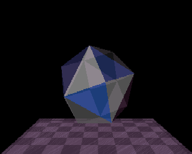 | 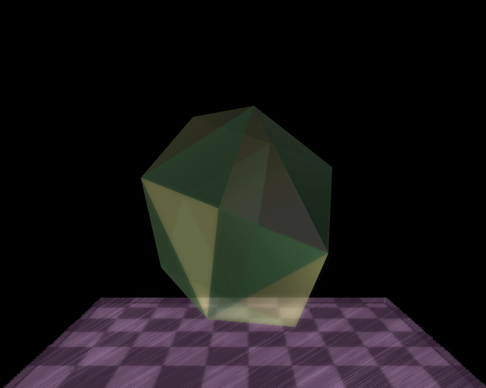 |
| 7 | Dot tunnel (TUNNELI) | 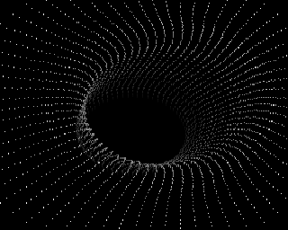 | 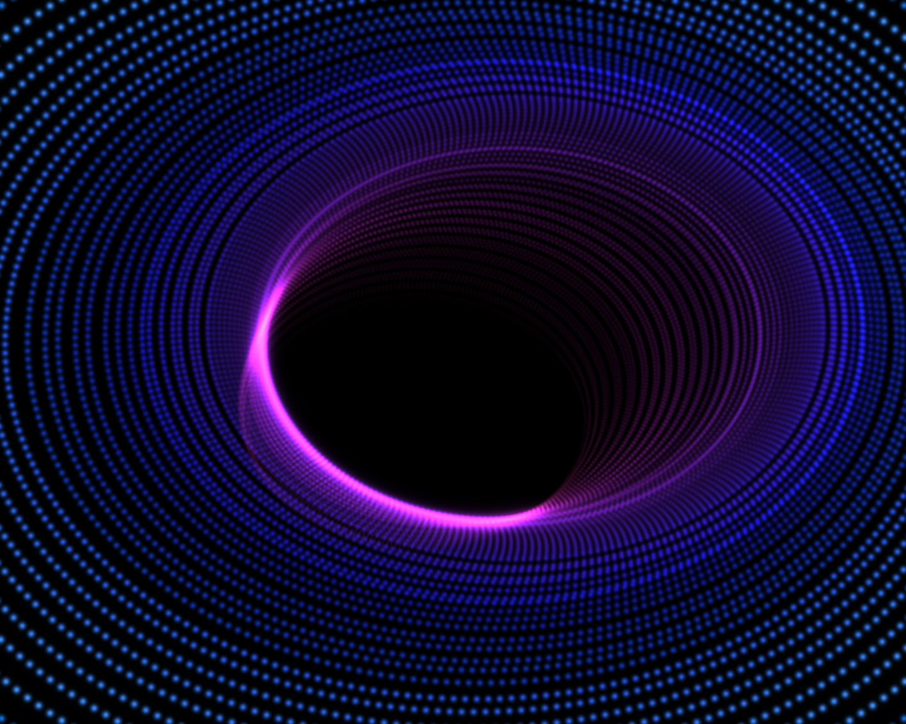 |
| 8 | Circle interference (TECHNO_CIRCLES) | 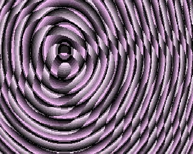 | 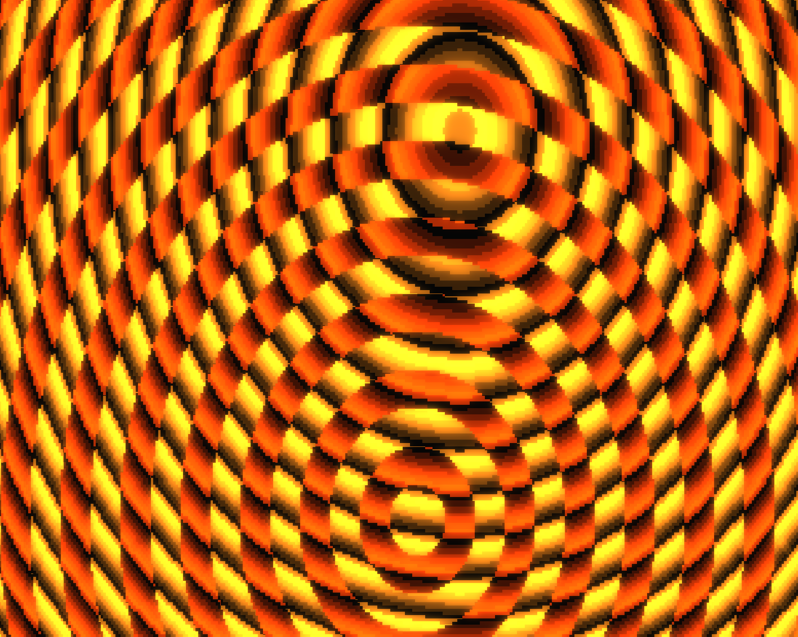 |
| 9 | Bars transition (TECHNO_BARS_TRANSITION) | | |
| 10 | Rotating bars (TECHNO_BARS) | | |
| 11 | Troll picture (TECHNO_TROLL) | | |
| 12 | Mountain scroller (FOREST) | | |
| 13 | Lens slide-in (LENS_TRANSITION) | | |
| 14 | Bouncing crystal ball (LENS) | | |
| 15 | Rotozoom (LENS_ROTO) | | |
| 16 | Plasma waves (PLZ_PLASMA) | 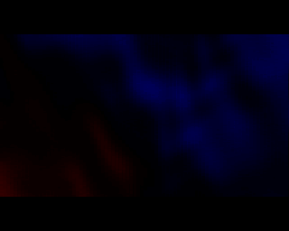 | 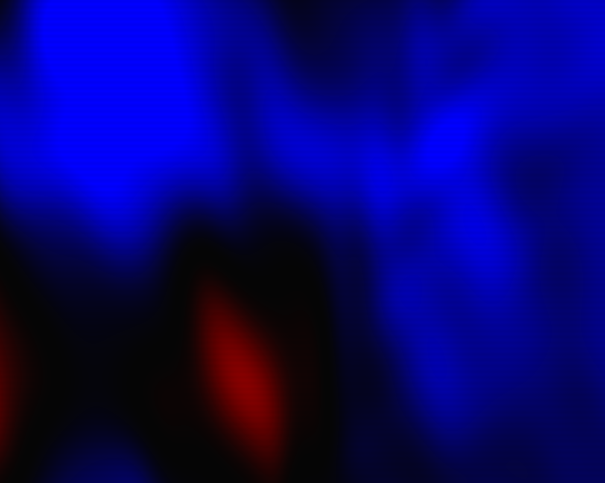 |
| 17 | Plasma cube (PLZ_CUBE) | 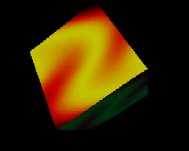 | 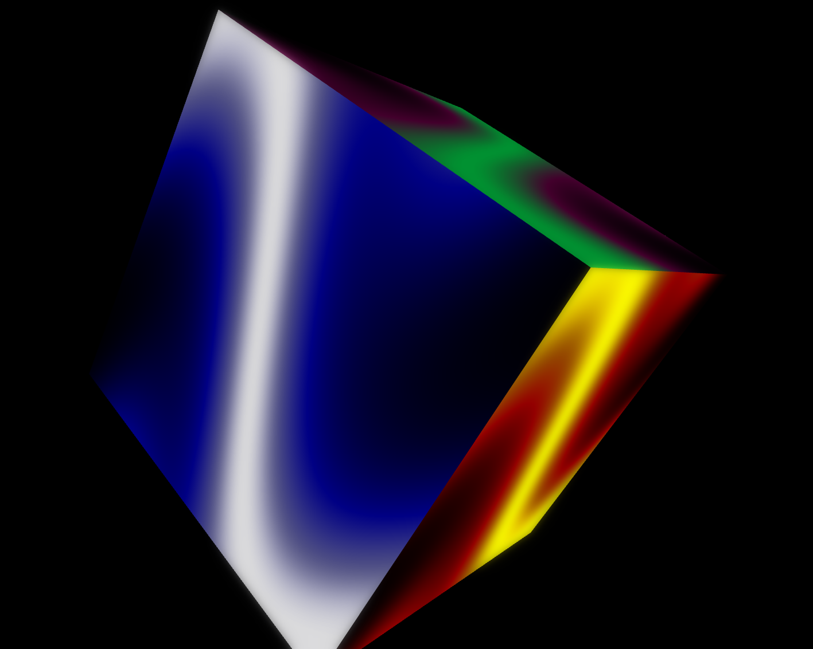 |
| 18 | Mini vector balls (DOTS) | 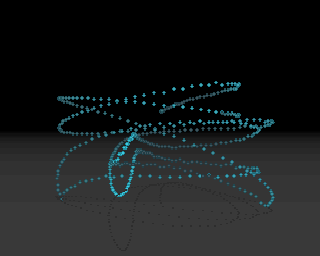 | 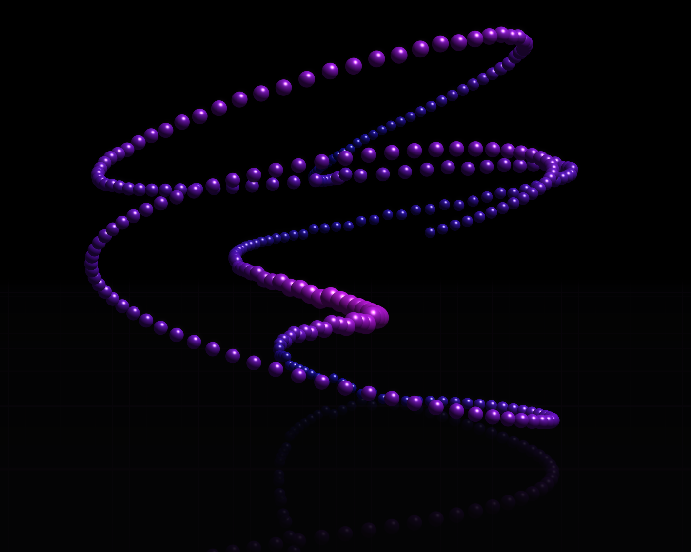 |
| 19 | Mirror ball scroller (WATER) | 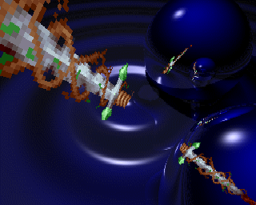 | 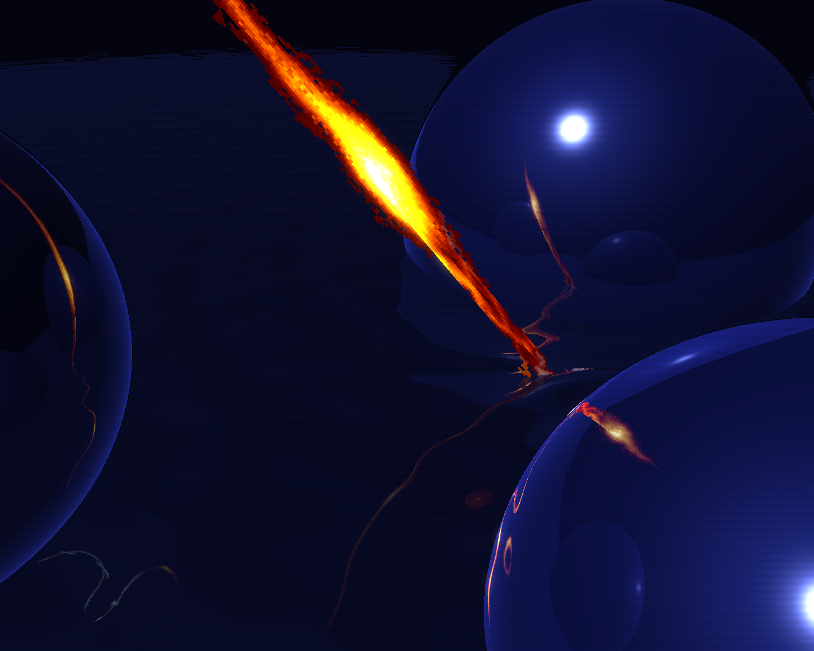 |
| 20 | 3D sinusfield (COMAN) | | |
| 21 | Jelly logo (JPLOGO) | | |
| 22 | 3D city flyover (U2E) | | |
| 23 | End picture (ENDLOGO) | | |
| 24 | Scrolling credits (CREDITS) | | |
| 25 | Greetings scroll (ENDSCRL) | | |

## Learning Guides

The `docs/learning/` directory contains deep-dive tutorials that use effects from this project to teach real-time graphics programming. Each guide is self-contained with inline code snippets — readable on GitHub without cloning the repo.

### [Dots Remastered Deep Dive](docs/learning/dots-remastered/00-overview.md)

A 7-layer walkthrough of the remastered DOTS effect. No prerequisites assumed.

| Layer | Topic | What You Will Learn |
|-------|-------|---------------------|
| 1 | [Simulation](docs/learning/dots-remastered/01-simulation.md) | Euler integration, seeded PRNG, deterministic replay |
| 2 | [Instancing](docs/learning/dots-remastered/02-instancing.md) | VAOs, attribute divisors, instanced draw calls |
| 3 | [Sphere Impostor](docs/learning/dots-remastered/03-sphere-impostor.md) | SDF on a quad, normal reconstruction, Phong lighting |
| 4 | [Projection](docs/learning/dots-remastered/04-projection.md) | Perspective division, NDC, fixed-point maths |
| 5 | [Reflections](docs/learning/dots-remastered/05-reflections.md) | Planar reflection, Fresnel, roughness blur |
| 6 | [Bloom](docs/learning/dots-remastered/06-bloom.md) | Bright extraction, separable Gaussian, ping-pong FBOs |
| 7 | [Render Loop](docs/learning/dots-remastered/07-render-loop.md) | Multi-pass rendering, MSAA, FBO management |
| 8 | [Exercises](docs/learning/dots-remastered/08-learning-path.md) | 10 hands-on experiments from beginner to advanced |

## Design Documents

Detailed technical design docs live in `docs/effects/`. Each effect has a classic doc and optionally a remastered doc:

| Doc | Effect |
|-----|--------|
| [01-alku.md](docs/effects/01-alku.md) | Opening credits landscape |
| [02-u2a.md](docs/effects/02-u2a.md) | 3D ships flyover |
| [03-pam.md](docs/effects/03-pam.md) | Pre-rendered explosion |
| [04-beglogo.md](docs/effects/04-beglogo.md) | Title card |
| [05-glenz-transition.md](docs/effects/05-glenz-transition.md) | Checkerboard fall |
| [06-glenz-3d.md](docs/effects/06-glenz-3d.md) | Glenz vectors (classic) |
| [06-glenz-3d-remastered.md](docs/effects/06-glenz-3d-remastered.md) | Glenz vectors (remastered) |
| [07-tunneli.md](docs/effects/07-tunneli.md) | Dot tunnel |
| [08-techno-circles.md](docs/effects/08-techno-circles.md) | Circle interference |
| [09-techno-bars-transition.md](docs/effects/09-techno-bars-transition.md) | Bars transition |
| [10-techno-bars.md](docs/effects/10-techno-bars.md) | Rotating bars |
| [11-techno-troll.md](docs/effects/11-techno-troll.md) | Troll picture |
| [12-forest.md](docs/effects/12-forest.md) | Mountain scroller |
| [13-lens-transition.md](docs/effects/13-lens-transition.md) | Lens slide-in |
| [14-lens-lens.md](docs/effects/14-lens-lens.md) | Bouncing crystal ball |
| [15-lens-roto.md](docs/effects/15-lens-roto.md) | Rotozoom |
| [16-plz-plasma.md](docs/effects/16-plz-plasma.md) | Plasma waves |
| [17-plz-cube.md](docs/effects/17-plz-cube.md) | Plasma cube |
| [18-dots.md](docs/effects/18-dots.md) | Mini vector balls (classic) |
| [18-dots-remastered.md](docs/effects/18-dots-remastered.md) | Mini vector balls (remastered) |
| [19-water.md](docs/effects/19-water.md) | Mirror ball scroller (classic) |
| [19-water-remastered.md](docs/effects/19-water-remastered.md) | Mirror ball scroller (remastered) |
| [20-coman.md](docs/effects/20-coman.md) | 3D sinusfield |
| [21-jplogo.md](docs/effects/21-jplogo.md) | Jelly logo |
| [22-u2e.md](docs/effects/22-u2e.md) | 3D city flyover |
| [23-endlogo.md](docs/effects/23-endlogo.md) | End picture |
| [24-credits.md](docs/effects/24-credits.md) | Scrolling credits |
| [25-endscrl.md](docs/effects/25-endscrl.md) | Greetings scroll |

Additional docs:

| Doc | Topic |
|-----|-------|
| [docs/patterns/lazy-bake-scrubbing.md](docs/patterns/lazy-bake-scrubbing.md) | Dual-mode engine pattern for delta-compressed animations |
| [docs/TRACKER.md](docs/TRACKER.md) | Master project tracker with implementation checklist |
| [docs/PROJECT_BRIEF.md](docs/PROJECT_BRIEF.md) | Original project brief and scope |

## Running

**Player** — open `src/player/index.html` in a browser (serve over HTTP for ES module support).

**Editor:**

```bash
cd src/editor
npm install
npm run dev
```

## Project Structure

```
src/
  core/           Shared runtime (orchestrator, clock, beatmap, modplayer, webgl)
  effects/        One subfolder per effect (classic + optional remastered variant)
  editor/         React + Vite editor UI
  player/         Standalone vanilla JS player
assets/
  project.json    Demo timeline definition (clips, transitions, beat map)
  MUSIC0.S3M      Original Skaven soundtrack (part 1)
  MUSIC1.S3M      Original Skaven soundtrack (part 2)
  effects/        Per-effect textures and sprite sheets
lib/
  webaudio-mod-player/   Vendored S3M playback engine (MIT)
tools/            Asset extraction and project generation scripts
docs/
  effects/        Per-effect design documents (classic + remastered)
  learning/       Learning guides and tutorials
  patterns/       Reusable engineering patterns
reference/        Code from the JS port used as implementation reference
```

## Credits

- **Original demo:** Future Crew (1993) — Psi, Trug, Wildfire, Gore, Marvel, Skaven
- **Music:** Skaven (Peter Hajba) — S3M tracker modules
- **JS reference port:** [covalichou/second-reality-js](https://github.com/covalichou/second-reality-js)
- **Code review:** [Fabien Sanglard's Second Reality series](https://fabiensanglard.net/second_reality/)

## License

This is a non-commercial fan recreation for educational and preservation purposes. The original Second Reality demo and its assets are the property of Future Crew / Futuremark.
