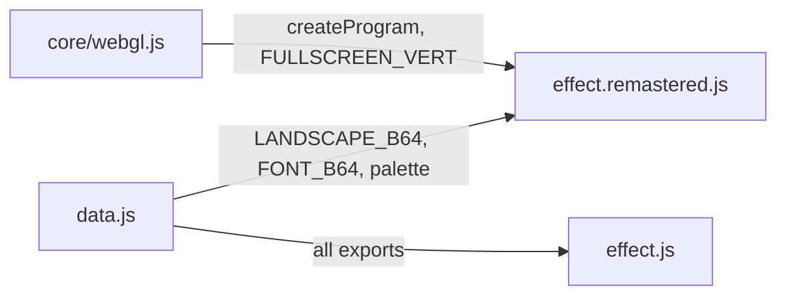
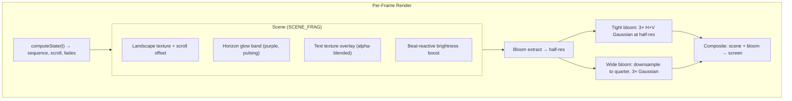

# Part 1 — ALKU Remastered: Atmospheric Opening Credits

**Status:** Complete  
**Source file:** `src/effects/alku/effect.remastered.js`  
**Classic doc:** [01-alku.md](01-alku.md)

---

## Overview

The remastered ALKU preserves the classic opening credits sequence
pixel-for-pixel — same landscape texture, same bitmap font, same timing —
while layering subtle atmospheric enhancements on top. NEAREST-neighbor
filtering keeps the pixel-art character intact; all additions are additive
and default to low intensity so casual viewers see the original intro.

Key upgrades over classic:

| Classic | Remastered |
|---------|------------|
| 320×200 palette-indexed rendering | Native display resolution via GPU |
| Palette-based text anti-aliasing (OR trick) | True alpha-blended text overlay |
| Palette interpolation fading | Shader-computed fade uniforms |
| No post-processing | Dual-tier bloom for organic glow |
| No audio reactivity | Beat-reactive brightness pulse |
| No atmosphere effects | Purple horizon glow band |
| No parameterization | 7 editor-tunable parameters |

---

## Architecture

No shared `animation.js` is needed. The sequence state machine
(`computeState`) is self-contained within the remastered module, computing
scroll offset, background fade, text fade, and active text screen index
from the current time.

---

## Rendering Pipeline

### Pass breakdown

| Pass | Program | Target | Resolution |
|------|---------|--------|------------|
| Scene compositing | `FULLSCREEN_VERT` + `SCENE_FRAG` | Scene FBO | Full |
| Bloom extract | `FULLSCREEN_VERT` + `BLOOM_EXTRACT_FRAG` | Bloom FBO 1 | Half |
| Tight blur (×3) | `FULLSCREEN_VERT` + `BLUR_FRAG` | Bloom FBO 1↔2 | Half |
| Wide downsample | `FULLSCREEN_VERT` + `BLOOM_EXTRACT_FRAG` | Wide FBO 1 | Quarter |
| Wide blur (×3) | `FULLSCREEN_VERT` + `BLUR_FRAG` | Wide FBO 1↔2 | Quarter |
| Final composite | `FULLSCREEN_VERT` + `COMPOSITE_FRAG` | Default FB | Full |

---

## Lighting/Shading Model

No geometric lighting — the effect is purely 2D compositing. The
"lighting" comes from the horizon glow and bloom post-processing:

- **Horizon glow**: A pulsing purple band (`vec3(0.3, 0.05, 0.4)`)
  positioned near the sky/landscape boundary. Intensity modulated by
  `sin(t × pulseSpeed) × 0.5 + 0.5`, plus a beat-reactive component
  `pow(1 - beat, 6) × beatReactivity × 0.3`.

- **Beat brightness**: `pow(1 - beat, 8) × beatReactivity` added as a
  multiplicative boost to the entire scene color, creating a subtle flash
  on each musical accent.

---

## Post-Processing

Same dual-tier bloom pipeline as other remastered effects:

1. Brightness extraction at half-res with `smoothstep(threshold, threshold + 0.3, brightness)`
2. 3 iterations of separable 9-tap Gaussian at half-res (tight bloom)
3. Downsample to quarter-res, 3 iterations of Gaussian (wide bloom)
4. Composite: `scene + tight × (bloomStr + beatPulse × 0.15) + wide × (bloomStr × 0.5 + beatPulse × 0.1)`

The bloom is deliberately subtle (default strength 0.15) — just enough to
soften bright text edges and the horizon glow into an organic halo.

---

## Beat Reactivity

| Effect | Formula | Visual result |
|--------|---------|---------------|
| Scene brightness | `color += color × pow(1 - beat, 8) × beatReactivity` | Entire image pulses brighter |
| Horizon glow | `pulse += pow(1 - beat, 6) × beatReactivity × 0.3` | Purple band intensifies |
| Bloom boost | `tight × (bloomStr + pow(1 - beat, 4) × beatReactivity × 0.15)` | Glow halo flares |

---

## Editor Parameters

| Key | Label | Range | Default | Controls |
|-----|-------|-------|---------|----------|
| `horizonGlow` | Horizon Glow | 0–1 | 0.08 | Intensity of the purple horizon band |
| `horizonPulseSpeed` | Horizon Pulse Speed | 0.2–5 | 1.2 | Sinusoidal pulse frequency |
| `glowY` | Glow Y Position | 0.1–0.9 | 0.62 | Vertical center of the glow band |
| `glowHeight` | Glow Spread | 0.01–0.4 | 0.12 | Vertical extent of the glow |
| `bloomThreshold` | Bloom Threshold | 0–1 | 0.4 | Brightness cutoff for bloom extraction |
| `bloomStrength` | Bloom Strength | 0–2 | 0.15 | Intensity of the bloom overlay |
| `beatReactivity` | Beat Reactivity | 0–1 | 0.12 | Strength of beat-driven brightness pulse |

---

## Shader Programs

| Program | Vertex | Fragment | Purpose |
|---------|--------|----------|---------|
| `sceneProg` | `FULLSCREEN_VERT` | `SCENE_FRAG` | Landscape + text compositing + horizon glow |
| `bloomExtractProg` | `FULLSCREEN_VERT` | `BLOOM_EXTRACT_FRAG` | Bright-pixel extraction |
| `blurProg` | `FULLSCREEN_VERT` | `BLUR_FRAG` | Separable 9-tap Gaussian |
| `compositeProg` | `FULLSCREEN_VERT` | `COMPOSITE_FRAG` | Scene + bloom composite |

All shaders use `FULLSCREEN_VERT` — no custom vertex shader needed.

---

## GPU Resources

| Resource | Count | Notes |
|----------|-------|-------|
| Shader programs | 4 | Scene, bloom extract, blur, composite |
| Textures | 14 | Landscape + 7 text screens + empty text + scene FBO + 2 tight bloom + 2 wide bloom |
| Framebuffers | 5 | Scene + bloom1 + bloom2 + wide1 + wide2 |

All resources are properly cleaned up in `destroy()`.

---

## What Changed From Classic

| Aspect | Classic approach | Remastered approach |
|--------|-----------------|---------------------|
| Resolution | 320×200 fixed (VGA Mode 13h) | Native display resolution |
| Text blending | OR-indexed palette trick (4 banks of 64) | True RGBA alpha compositing |
| Fading | Palette interpolation (256-entry LUT) | Shader uniform multiplication |
| Atmosphere | None | Purple horizon glow band with pulse |
| Post-processing | None | Dual-tier bloom |
| Audio sync | None | Beat-reactive brightness + glow |
| Parameterization | None | 7 tunable params for editor UI |

---

## Remaining Ideas (Not Yet Implemented)

From the classic doc's "Remastered Ideas" section:

- **Parallax landscape**: Split into 2–3 depth layers with differential scroll speeds
- **Atmospheric fog**: Distance-based haze between parallax layers
- **Particle system**: Gentle floating particles (fireflies, pollen) influenced by beat
- **Dynamic lighting**: Color temperature shifts over time (dawn-to-morning feel)
- **SDF text rendering**: Signed distance field text for crisp rendering at any resolution
- **Text animation**: Characters fading in individually with a subtle wave
- **Film grain**: Light procedural noise overlay for cinematic quality
- **Vignette**: Gentle darkening at screen edges

---

## References

- Classic doc: [01-alku.md](01-alku.md)
- Remastered rule: `.cursor/rules/remastered-effects.mdc`
