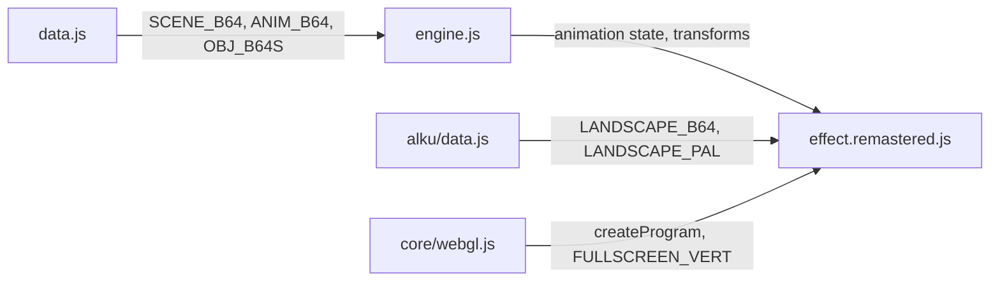
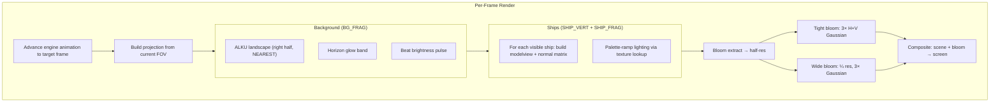
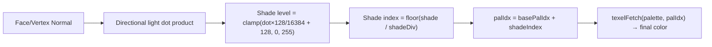

# Part 2 — U2A Remastered: GPU Polygon Ships Flyover

**Status:** Complete  
**Source file:** `src/effects/u2a/effect.remastered.js`  
**Shared animation:** `src/effects/u2a/engine.js`  
**Classic doc:** [02-u2a.md](02-u2a.md)

---

## Overview

The remastered U2A replaces the classic's CPU software rasterizer with
native WebGL polygon rendering while reusing the original U2 engine
exclusively for animation playback. Ship geometry is extracted into GPU
VAOs at init time; per-frame rendering uses the engine only to advance
transforms, visibility, camera, and FOV. The ALKU landscape background
is rendered at native resolution with the same purple horizon glow ported
from the ALKU remaster.

Key upgrades over classic:

| Classic | Remastered |
|---------|------------|
| CPU software rasterizer (320×200) | Native WebGL vertex pipeline at display resolution |
| Flat/Gouraud shading via palette ramps | GPU-lit polygon shading with palette-ramp texture lookup |
| 256-color indexed framebuffer | Full RGBA rendering |
| No depth buffer (painter's algorithm) | Hardware depth buffer |
| Landscape at fixed 320×200 | Landscape at native resolution (NEAREST) |
| No atmosphere | Purple horizon glow (ported from ALKU remaster) |
| No post-processing | Dual-tier bloom |
| No audio reactivity | Beat-reactive brightness + bloom |
| No parameterization | 7 editor-tunable parameters |

---

## Architecture

The shared `engine.js` is the single source of truth for choreography —
frame-by-frame animation decoding, object transforms, camera matrices, FOV
changes, and object visibility. The remastered module never modifies engine
state; it reads transforms and builds GPU-compatible matrices from them.

---

## Rendering Pipeline

### Pass breakdown

| Pass | Program | Target | Resolution |
|------|---------|--------|------------|
| Background + glow | `FULLSCREEN_VERT` + `BG_FRAG` | Scene FBO | Full |
| 3D ship meshes | `SHIP_VERT` + `SHIP_FRAG` | Scene FBO (depth) | Full |
| Bloom extract | `FULLSCREEN_VERT` + `BLOOM_EXTRACT_FRAG` | Bloom FBO 1 | Half |
| Tight blur (×3) | `FULLSCREEN_VERT` + `BLUR_FRAG` | Bloom FBO 1↔2 | Half |
| Wide downsample | `FULLSCREEN_VERT` + `BLOOM_EXTRACT_FRAG` | Wide FBO 1 | Quarter |
| Wide blur (×3) | `FULLSCREEN_VERT` + `BLUR_FRAG` | Wide FBO 1↔2 | Quarter |
| Final composite | `FULLSCREEN_VERT` + `COMPOSITE_FRAG` | Default FB | Full |

---

## Lighting/Shading Model

The ship fragment shader replicates the original's palette-ramp lighting
using a 256×1 palette texture:

- **Light direction**: `[12118, 10603, 3030] / 16384` — same fixed directional
  light as the original engine
- **Shade divisions**: Per-polygon material flag controls the palette ramp
  width (8, 16, or 32 shades)
- **Gouraud vs flat**: Polygons flagged as Gouraud use per-vertex normals;
  others use the face normal — determined at geometry extraction time

---

## Post-Processing

Same dual-tier bloom pipeline as ALKU remastered:

1. Brightness extraction at half-res with `smoothstep` threshold
2. 3 iterations of separable 9-tap Gaussian at half-res (tight bloom)
3. Downsample to quarter-res, 3 iterations of Gaussian (wide bloom)
4. Composite: scene + tight + wide, beat-reactive intensity

---

## Beat Reactivity

| Effect | Formula | Visual result |
|--------|---------|---------------|
| Background brightness | `color += color × pow(1 - beat, 8) × beatReactivity` | Landscape pulses brighter |
| Horizon glow | `pulse += pow(1 - beat, 6) × beatReactivity × 0.3` | Purple band intensifies |
| Bloom boost | `tight × (bloomStr + pow(1 - beat, 4) × beatReactivity × 0.15)` | Glow halo flares |

---

## Editor Parameters

| Key | Label | Range | Default | Controls |
|-----|-------|-------|---------|----------|
| `horizonGlow` | Horizon Glow | 0–1 | 0.08 | Intensity of the purple horizon band |
| `horizonPulseSpeed` | Horizon Pulse Speed | 0.2–5 | 1.2 | Sinusoidal pulse frequency |
| `glowY` | Glow Y Position | 0.1–0.9 | 0.62 | Vertical center of the glow band |
| `glowHeight` | Glow Spread | 0.01–0.4 | 0.12 | Vertical extent of the glow |
| `bloomThreshold` | Bloom Threshold | 0–1 | 0.35 | Brightness cutoff for bloom extraction |
| `bloomStrength` | Bloom Strength | 0–2 | 0.2 | Intensity of the bloom overlay |
| `beatReactivity` | Beat Reactivity | 0–1 | 0.15 | Strength of beat-driven brightness pulse |

---

## Shader Programs

| Program | Vertex | Fragment | Purpose |
|---------|--------|----------|---------|
| `bgProg` | `FULLSCREEN_VERT` | `BG_FRAG` | Landscape background + horizon glow |
| `shipProg` | `SHIP_VERT` (custom) | `SHIP_FRAG` | 3D ship meshes with palette-ramp lighting |
| `bloomExtractProg` | `FULLSCREEN_VERT` | `BLOOM_EXTRACT_FRAG` | Bright-pixel extraction |
| `blurProg` | `FULLSCREEN_VERT` | `BLUR_FRAG` | Separable 9-tap Gaussian |
| `compositeProg` | `FULLSCREEN_VERT` | `COMPOSITE_FRAG` | Scene + bloom composite |

The custom `SHIP_VERT` transforms `aPosition` and `aNormal` through
`uModelView` and `uProjection` matrices, passing the interpolated normal,
base palette index, and shade divisor to the fragment shader.

---

## GPU Resources

| Resource | Count | Notes |
|----------|-------|-------|
| Shader programs | 5 | Background, ship, bloom extract, blur, composite |
| VAOs | 3 | One per ship object (is01, Sippi, moottori) |
| Textures | 7 | Landscape + palette (256×1) + scene FBO + 2 tight bloom + 2 wide bloom |
| Framebuffers | 5 | Scene (with depth) + bloom1 + bloom2 + wide1 + wide2 |
| Renderbuffers | 1 | Depth attachment on scene FBO |

All resources are properly cleaned up in `destroy()`.

---

## What Changed From Classic

| Aspect | Classic approach | Remastered approach |
|--------|-----------------|---------------------|
| Rendering | CPU software rasterizer to 320×200 indexed buffer | GPU vertex pipeline at native resolution |
| Shading | Palette ramp lookup in software | Palette texture lookup in fragment shader |
| Depth ordering | Painter's algorithm (back-to-front sort) | Hardware depth buffer |
| Background | ALKU landscape blit at fixed resolution | Full-screen shader at native resolution |
| Atmosphere | None | Purple horizon glow with pulse |
| Post-processing | None | Dual-tier bloom |
| Audio sync | None | Beat-reactive brightness + bloom |
| Parameterization | None | 7 tunable params for editor UI |

---

## Remaining Ideas (Not Yet Implemented)

From the classic doc's "Remastered Ideas" section:

- **Higher-resolution models**: Subdivide ship polygons or use smooth-shaded higher-poly versions
- **Phong shading**: Replace flat/Gouraud with per-pixel Phong for smoother specular highlights
- **Environment mapping**: Subtle landscape reflections on metallic ship surfaces
- **Particle trails**: Engine exhaust particles trailing behind each ship, synced to beat
- **Motion blur**: Temporal accumulation or velocity-buffer blur for fast-moving ships
- **Depth of field**: Gentle blur on landscape with ships in sharp focus
- **Camera shake**: Subtle vibration synced to bass hits
- **Lens flare**: Bright flash as ships pass close to the viewer

---

## References

- Classic doc: [02-u2a.md](02-u2a.md)
- Remastered rule: `.cursor/rules/remastered-effects.mdc`
- Shared animation engine: `src/effects/u2a/engine.js`
