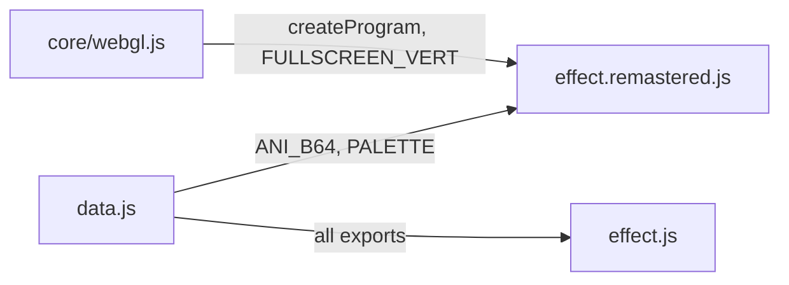
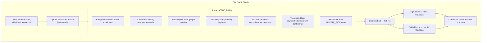
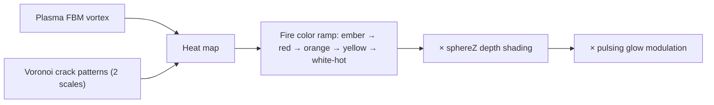
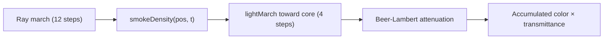

# Part 3 — PAM Remastered: Volumetric Lava Explosion

**Status:** Complete  
**Source file:** `src/effects/pam/effect.remastered.js`  
**Classic doc:** [03-pam.md](03-pam.md)

---

## Overview

The remastered PAM transforms the classic's 40-frame pre-rendered explosion
into a fully procedural, GPU-driven volcanic event. The original animation
frames (0–6) are retained as a subtle ambient glow reference, but the
primary visual is built from three layered shader effects: a molten lava
core with plasma and voronoi crack patterns, a raymarched volumetric smoke
blast with Beer-Lambert attenuation and self-shadowing, and atmospheric
overlays (horizon glow + twinkling stars).

Key upgrades over classic:

| Classic | Remastered |
|---------|------------|
| 40-frame pre-rendered FLI animation | Procedural lava core + volumetric blast |
| Static baked explosion frames | Real-time raymarched smoke with self-shadowing |
| 320×200 indexed palette | Native resolution full HDR rendering |
| Palette fade (white flash) | Shader-computed white flash from PALETTE_FADE curve |
| No post-processing | Dual-tier bloom |
| No audio reactivity | Beat-reactive blast intensity + bloom |
| No parameterization | 28 editor-tunable parameters |

---

## Architecture

No shared animation module — the only data reuse is decoding frames 0–6
from `ANI_B64` for the background and core-glow reference textures. All
procedural effects (lava, blast, horizon, stars) are computed entirely in
the fragment shader.

---

## Rendering Pipeline

### Pass breakdown

| Pass | Program | Target | Resolution |
|------|---------|--------|------------|
| Scene compositing | `FULLSCREEN_VERT` + `SCENE_FRAG` | Scene FBO | Full |
| Bloom extract | `FULLSCREEN_VERT` + `BLOOM_EXTRACT_FRAG` | Bloom FBO 1 | Half |
| Tight blur (×3) | `FULLSCREEN_VERT` + `BLUR_FRAG` | Bloom FBO 1↔2 | Half |
| Wide downsample | `FULLSCREEN_VERT` + `BLOOM_EXTRACT_FRAG` | Wide FBO 1 | Quarter |
| Wide blur (×3) | `FULLSCREEN_VERT` + `BLUR_FRAG` | Wide FBO 1↔2 | Quarter |
| Final composite | `FULLSCREEN_VERT` + `COMPOSITE_FRAG` | Default FB | Full |

---

## Lighting/Shading Model

The effect has two distinct lighting contexts:

### Lava Core

- **Plasma**: Multi-scale FBM noise with vortex swirl that intensifies toward center
- **Cracks**: Two-scale voronoi patterns creating lava vein networks
- **Heat ramp**: 5-stop gradient from dark ember `(0.08, 0.02, 0)` through white-hot `(1, 0.97, 0.8)`
- **Embers**: Two tiers of orbiting particles (24 small + 10 large) on randomly-tilted orbital planes

### Volumetric Blast

- **Density field**: 3D FBM noise shaped by radial + vertical falloff creating a flat expanding disc
- **Self-shadowing**: 4-step light march toward core with Beer-Lambert extinction (`absorption = 9.0`)
- **Color**: `hueShift`-able smoke base mixed with warm core tones based on proximity
- **Core warmth**: `exp(-dist² × 8)` provides bright inner illumination

---

## Post-Processing

Same dual-tier bloom pipeline as other remastered effects:

1. Brightness extraction at half-res with `smoothstep` threshold
2. 3 iterations of separable 9-tap Gaussian at half-res (tight bloom)
3. Downsample to quarter-res, 3 iterations of Gaussian (wide bloom)
4. Composite: `scene + tight × (bloomStr + beatPulse × 0.25) + wide × (bloomStr × 0.5 + beatPulse × 0.15)`

---

## Beat Reactivity

| Effect | Formula | Visual result |
|--------|---------|---------------|
| Blast intensity | `accumulated × (1 + pow(1 - beat, 4) × beatReactivity × 0.15)` | Smoke brightens on beat |
| Bloom boost | `tight × (bloomStr + pow(1 - beat, 4) × beatReactivity × 0.25)` | Glow halo flares |

---

## Editor Parameters

| Key | Label | Range | Default | Controls |
|-----|-------|-------|---------|----------|
| `centerX` | Center X | 0–1 | 0.5 | Horizontal explosion center |
| `centerY` | Center Y | 0–1 | 0.565 | Vertical explosion center |
| `explosionSpeed` | Explosion Speed | 0.3–5 | 1.26 | Time scale of blast expansion |
| `coreIntensity` | Core Intensity | 0–4 | 2.72 | Brightness of the lava core |
| `smokeDetail` | Smoke Detail | 0–1 | 0.73 | Density threshold for smoke features |
| `shockwaveWidth` | Shockwave Width | 0.02–0.5 | 0.26 | Width of the initial shockwave |
| `smokeHue` | Smoke Hue | -π–π | -1.80 | Hue rotation of smoke color |
| `smokeWarmth` | Smoke Warmth | 0–1 | 0.48 | Core warmth bleeding into smoke |
| `plasmaIntensity` | Plasma Intensity | 0–2 | 1.0 | Core plasma brightness |
| `plasmaSpeed` | Plasma Speed | 0–5 | 1.5 | Core plasma animation speed |
| `emberIntensity` | Ember Intensity | 0–3 | 0.8 | Brightness of orbiting embers |
| `emberHue` | Ember Hue | -π–π | 0.0 | Hue rotation of ember color |
| `emberSmSize` | Size (Small) | 0.1–3 | 1.0 | Small ember particle size |
| `emberSmDensity` | Density (Small) | 0–1 | 1.0 | Fraction of small embers visible |
| `emberSmScatter` | Scatter (Small) | 0.1–3 | 1.0 | Orbital radius of small embers |
| `emberSmSpeed` | Orbit Speed (Small) | 0–3 | 1.0 | Angular velocity of small embers |
| `emberLgSize` | Size (Large) | 0.1–3 | 1.0 | Large spark particle size |
| `emberLgDensity` | Density (Large) | 0–1 | 1.0 | Fraction of large sparks visible |
| `emberLgScatter` | Scatter (Large) | 0.1–3 | 1.0 | Orbital radius of large sparks |
| `emberLgSpeed` | Orbit Speed (Large) | 0–3 | 1.0 | Angular velocity of large sparks |
| `horizonGlow` | Horizon Glow | 0–1 | 0.15 | Purple horizon band intensity |
| `horizonPulseSpeed` | Horizon Pulse Speed | 0.2–5 | 1.5 | Horizon glow pulse frequency |
| `starDensity` | Star Density | 0–1 | 0.0 | Twinkling star density |
| `starTwinkleSpeed` | Star Twinkle Speed | 0–5 | 2.0 | Star twinkle animation speed |
| `starBrightness` | Star Brightness | 0–2 | 0.8 | Star intensity |
| `bloomThreshold` | Bloom Threshold | 0–1 | 0.25 | Brightness cutoff for bloom |
| `bloomStrength` | Bloom Strength | 0–2 | 0.45 | Bloom overlay intensity |
| `beatReactivity` | Beat Reactivity | 0–1 | 0.3 | Beat-driven intensity pulse |

---

## Shader Programs

| Program | Vertex | Fragment | Purpose |
|---------|--------|----------|---------|
| `sceneProg` | `FULLSCREEN_VERT` | `SCENE_FRAG` | All visual layers: background, core, blast, atmosphere |
| `bloomExtractProg` | `FULLSCREEN_VERT` | `BLOOM_EXTRACT_FRAG` | Bright-pixel extraction |
| `blurProg` | `FULLSCREEN_VERT` | `BLUR_FRAG` | Separable 9-tap Gaussian |
| `compositeProg` | `FULLSCREEN_VERT` | `COMPOSITE_FRAG` | Scene + bloom composite |

All shaders use `FULLSCREEN_VERT`. The `SCENE_FRAG` is the most complex
shader in the project — it contains noise primitives (hash, value noise,
3D FBM, voronoi), the lava core renderer with two tiers of orbiting
embers, the volumetric raymarcher with light marching, horizon glow,
and star field generation.

---

## GPU Resources

| Resource | Count | Notes |
|----------|-------|-------|
| Shader programs | 4 | Scene, bloom extract, blur, composite |
| Textures | 7 | Background + core frame + scene FBO + 2 tight bloom + 2 wide bloom |
| Framebuffers | 5 | Scene + bloom1 + bloom2 + wide1 + wide2 |

Core frame texture is updated via `texSubImage2D` when the animation
frame changes (frames 0–6 only). All resources are properly cleaned up
in `destroy()`.

---

## What Changed From Classic

| Aspect | Classic approach | Remastered approach |
|--------|-----------------|---------------------|
| Explosion | 40-frame pre-rendered FLI animation | Procedural lava core + volumetric raymarched blast |
| Core visuals | Baked 3D Studio frames | Plasma FBM vortex + voronoi crack patterns + orbiting embers |
| Smoke/blast | Rasterized shockwave rings in frames | Raymarched 3D density field with Beer-Lambert attenuation |
| White flash | Palette interpolation with white | Shader uniform from PALETTE_FADE curve |
| Resolution | 320×200 fixed | Native display resolution |
| Atmosphere | None | Purple horizon glow + twinkling star field |
| Post-processing | None | Dual-tier bloom |
| Audio sync | None | Beat-reactive blast + bloom intensity |
| Parameterization | None | 28 tunable params for editor UI |

---

## Remaining Ideas (Not Yet Implemented)

From the classic doc's "Remastered Ideas" section:

- **Camera shake**: Screen shake synced to the explosion impact
- **Debris trails**: Persistent particle trails from explosion fragments
- **Shockwave distortion**: Radial UV displacement/ripple emanating from center
- **Sound design**: Bass-heavy explosion sound effect synced to the flash peak

---

## References

- Classic doc: [03-pam.md](03-pam.md)
- Remastered rule: `.cursor/rules/remastered-effects.mdc`
