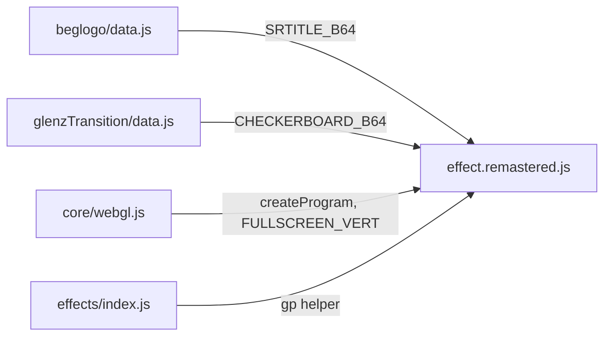
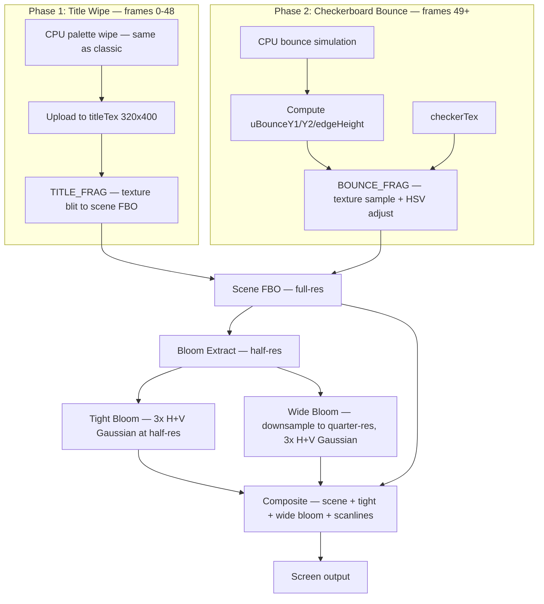

# Part 5 — GLENZ_TRANSITION Remastered: GPU Checkerboard Bounce

**Status:** Complete  
**Source file:** `src/effects/glenzTransition/effect.remastered.js`  
**Classic doc:** [05-glenz-transition.md](05-glenz-transition.md)

---

## Overview

The remastered GLENZ_TRANSITION replaces the classic's CPU-side checkerboard
rendering with a GPU fragment shader while keeping the same two-phase structure
and identical bounce physics. Phase 1 (title wipe) remains CPU-rendered
since the RLE-decoded indexed palette manipulation is inherently CPU work.
Phase 2 moves to a fullscreen fragment shader that renders the bouncing
checkerboard with HSV color adjustments and a dual-tier bloom pipeline.

Key upgrades over classic:

| Classic | Remastered |
|---------|------------|
| CPU indexed framebuffer + palette lookup | GPU fragment shader with texture sampling |
| `texSubImage2D` upload per frame | Single fullscreen draw per phase |
| 320x200 fixed resolution | Native display resolution |
| No post-processing | Dual-tier bloom + scanlines |
| No parameterization | 8 editor-tunable parameters |
| Fixed checkerboard colors | Configurable hue/saturation/brightness |

---

## Architecture



The effect is self-contained — no shared animation module. Phase 1 reuses the
title picture data from Part 4 (BEGLOGO). Phase 2 uses the same checkerboard
image that GLENZ_3D reads for its ground plane, ensuring visual continuity
at the transition boundary.

---

## Rendering Pipeline



### Pass breakdown

| Pass | Program | Target | Resolution |
|------|---------|--------|------------|
| Phase 1 scene | `FULLSCREEN_VERT` + `TITLE_FRAG` | Scene FBO | Full |
| Phase 2 scene | `FULLSCREEN_VERT` + `BOUNCE_FRAG` | Scene FBO | Full |
| Bloom extract | `FULLSCREEN_VERT` + `BLOOM_EXTRACT_FRAG` | Bloom FBO 1 | 1/2 |
| Tight blur (x3) | `FULLSCREEN_VERT` + `BLUR_FRAG` | Bloom FBO 1<->2 | 1/2 |
| Wide downsample | `FULLSCREEN_VERT` + `BLOOM_EXTRACT_FRAG` | Wide FBO 1 | 1/4 |
| Wide blur (x3) | `FULLSCREEN_VERT` + `BLUR_FRAG` | Wide FBO 1<->2 | 1/4 |
| Final composite | `FULLSCREEN_VERT` + `COMPOSITE_FRAG` | Default FB | Full |

---

## Phase 1 — Title Wipe

Identical to the classic implementation. The CPU decodes the readp-compressed
320x400 title picture, applies a progressive wipe from top and bottom edges,
and fades the first 128 palette entries toward gray over 32 frames. The RGBA
result is uploaded via `texSubImage2D` and rendered through a simple Y-flip
texture lookup shader.

This phase lasts only ~0.69 seconds, so the CPU approach adds no overhead
and avoids the complexity of porting the RLE decoder and indexed palette
manipulation to GLSL.

---

## Phase 2 — Checkerboard Bounce

### Physics

The bounce simulation is identical to the classic — replayed from frame 0
on each render for scrub support:

```
velocity += 1                    (gravity)
position += velocity             (integrate)
if position > 768:               (hit floor)
  position -= velocity           (undo overshoot)
  velocity = -velocity * 2/3     (2/3 restitution)
  if |velocity| < 4: settled     (stop)
```

### GPU Rendering

The CPU computes the bounce position and converts it to normalized screen
coordinates, then passes three uniforms to the `BOUNCE_FRAG` shader:

- `uBounceY1` — top of the checkerboard face (0.65 at start, ~0.77 when settled)
- `uBounceY2` — bottom of face (~0.65 at start, ~1.01 when settled)
- `uEdgeHeight` — front edge height (constant 0.04 = 8/200)

The shader samples the checkerboard texture with the same UV mapping as the
classic:

- **Face region** (y1..y2): Source rows 0-99 (top 50% of texture), vertically
  scaled by `(uv.y - y1) / (y2 - y1)`
- **Edge region** (y2..y2+edgeHeight): Source rows 100-107 (50%-54%) at 1:1
- **Elsewhere**: Black

### HSV Color Adjustment

After texture sampling, the shader converts RGB to HSV, applies the three
configurable transforms, and converts back:

```
hsv.x = fract(hsv.x + hue / 360.0)          (hue rotation)
hsv.y = clamp(hsv.y * saturation, 0, 1)      (saturation scale)
hsv.z *= brightness                           (value scale)
```

This uses the same parameter keys (`checkerHue`, `checkerSaturation`,
`checkerBrightness`) as GLENZ_3D's ground plane, so clips can share
consistent checkerboard styling across the transition boundary.

---

## Bloom Post-Processing

Same dual-tier pipeline as GLENZ_3D remastered:

### Tight bloom (half resolution)

1. **Extract**: Luminance threshold with `smoothstep(threshold, threshold+0.3, brightness)`
2. **Blur**: 3 iterations of separable 9-tap Gaussian, ping-ponging between two FBOs

### Wide bloom (quarter resolution)

1. **Downsample**: Tight bloom re-extracted with threshold 0
2. **Blur**: Same 3-iteration Gaussian at quarter resolution

### Composite

```
beatPulse = pow(1 - beat, 6)
color = scene + tight * (tightStr + beatPulse * beatBloom)
              + wide  * (wideStr  + beatPulse * beatBloom * 0.6)
color *= scanline
```

---

## Editor Parameters

| Key | Label | Group | Range | Default | Controls |
|-----|-------|-------|-------|---------|----------|
| `checkerHue` | Hue Shift | Ground | 0-360 | 0 | Hue rotation for checkerboard |
| `checkerSaturation` | Saturation | Ground | 0-2 | 1 | Saturation multiplier |
| `checkerBrightness` | Brightness | Ground | 0.5-3 | 1 | Brightness multiplier |
| `bloomThreshold` | Bloom Threshold | Post-Processing | 0-1 | 0.2 | Brightness cutoff for bloom |
| `bloomTightStr` | Bloom Tight | Post-Processing | 0-2 | 0.5 | Half-res bloom intensity |
| `bloomWideStr` | Bloom Wide | Post-Processing | 0-2 | 0.35 | Quarter-res bloom intensity |
| `beatBloom` | Beat Bloom | Post-Processing | 0-1 | 0.25 | Bloom pulse on beat |
| `scanlineStr` | Scanlines | Post-Processing | 0-0.5 | 0.05 | CRT scanline overlay |

The Ground parameters use the same keys as GLENZ_3D remastered for
cross-clip consistency.

---

## Shader Programs

| Program | Vertex | Fragment | Purpose |
|---------|--------|----------|---------|
| `titleProg` | `FULLSCREEN_VERT` | `TITLE_FRAG` | Phase 1 title texture blit |
| `bounceProg` | `FULLSCREEN_VERT` | `BOUNCE_FRAG` | Phase 2 checkerboard bounce + HSV |
| `bloomExtractProg` | `FULLSCREEN_VERT` | `BLOOM_EXTRACT_FRAG` | Bright-pixel extraction |
| `blurProg` | `FULLSCREEN_VERT` | `BLUR_FRAG` | Separable 9-tap Gaussian |
| `compositeProg` | `FULLSCREEN_VERT` | `COMPOSITE_FRAG` | Scene + bloom + scanlines |

All shaders use `FULLSCREEN_VERT` — no custom vertex pipeline needed since
this effect has no 3D geometry.

---

## GPU Resources

| Resource | Count | Notes |
|----------|-------|-------|
| Shader programs | 5 | Title, bounce, bloom extract, blur, composite |
| Textures | 7 | Title + checker + scene FBO + 2 tight bloom + 2 wide bloom |
| Framebuffers | 5 | Scene + bloom1 + bloom2 + wide1 + wide2 |

No MSAA needed — all rendering is 2D fullscreen quads.

---

## What Changed From Classic

| Aspect | Classic approach | Remastered approach |
|--------|-----------------|---------------------|
| Phase 2 rendering | CPU scanline fill + palette lookup | GPU fragment shader |
| Texture upload | `texSubImage2D` every frame (Phase 2) | Static texture, shader computes position |
| Resolution | 320x200 fixed | Native display resolution |
| Post-processing | None | Dual-tier bloom + CRT scanlines |
| Checkerboard colors | Fixed VGA palette | HSV hue/saturation/brightness control |
| Phase 1 rendering | CPU + `texSubImage2D` | Same (no change) |
| Parameterization | None | 8 tunable params across 2 groups |

---

## Remaining Ideas (Not Yet Implemented)

From the classic doc's "Remastered Ideas" section:

- **Title wipe**: Blur/dissolve or particle disintegration instead of hard line clearing
- **Palette fade**: Transition through sepia or desaturated blue before gray
- **Checkerboard bounce**: Motion blur during fast falls, camera shake on impact, dust particles
- **3D checkerboard**: Re-render at higher resolution with reflections and parallax
- **Sound sync**: Impact sounds synced to each bounce frame
- **AI-upscaled texture**: 320x200 checkerboard upscaled to 4K

---

## References

- Classic doc: [05-glenz-transition.md](05-glenz-transition.md)
- GLENZ_3D remastered: [06-glenz-3d-remastered.md](06-glenz-3d-remastered.md)
- Remastered rule: `.cursor/rules/remastered-effects.mdc`
