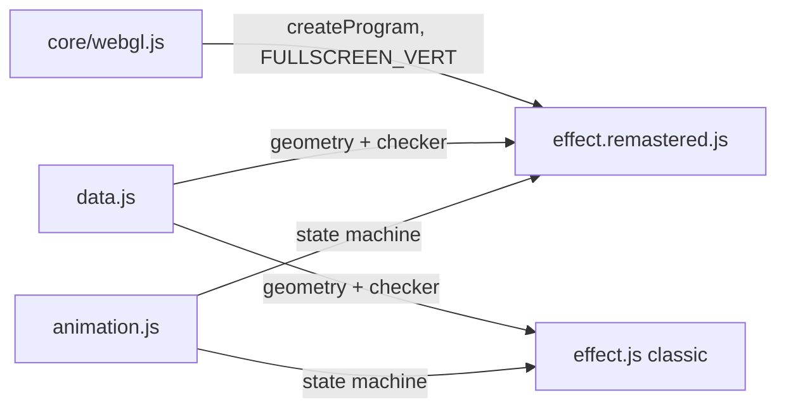
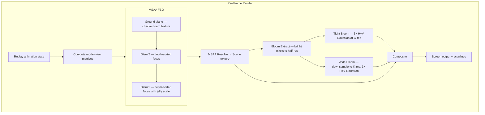
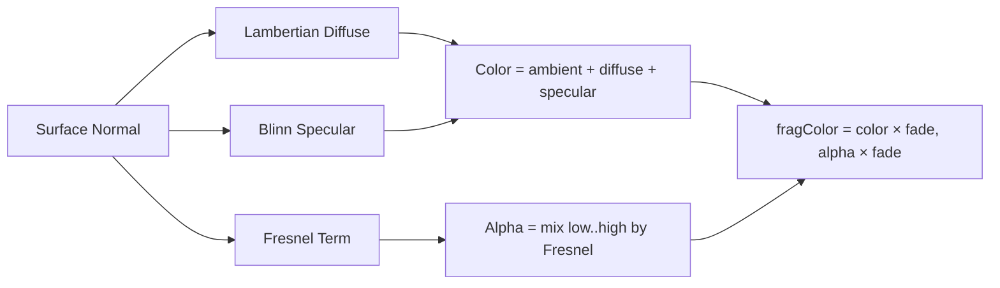

# Part 6 — GLENZ_3D Remastered: GPU Translucent Polyhedra

**Status:** Complete  
**Source file:** `src/effects/glenzVectors/effect.remastered.js`  
**Shared animation:** `src/effects/glenzVectors/animation.js`  
**Classic doc:** [06-glenz-3d.md](06-glenz-3d.md)

---

## Overview

The remastered GLENZ_3D replaces the classic's CPU software rasterizer with a
full GPU vertex-and-fragment pipeline while preserving frame-perfect behavioral
sync via the shared `animation.js` state machine. This is the project's first
effect to use a custom vertex shader — all other effects use only the
`FULLSCREEN_VERT` passthrough.

Key upgrades over classic:

| Classic | Remastered |
|---------|------------|
| OR-indexed palette transparency | True per-pixel alpha blending |
| Flat face shading | Phong/Blinn specular + Fresnel glass |
| 320×200 fixed resolution | Native display resolution + MSAA |
| No post-processing | Dual-tier bloom + scanlines |
| No audio reactivity | Beat-reactive scale pulse + bloom |
| No parameterization | 13 editor-tunable parameters |

---

## Architecture



The shared `animation.js` module is the single source of truth for all
choreography — bounce physics, jelly deformation, scaling, translation, palette
fades. Both variants replay state from frame 0 on every render call, making
scrubbing O(N) with zero persistent state.

---

## Rendering Pipeline



### Pass breakdown

| Pass | Program | Target | Resolution |
|------|---------|--------|------------|
| Ground plane | `FULLSCREEN_VERT` + `GROUND_FRAG` | MSAA FBO | Full |
| 3D meshes | `MESH_VERT` + `MESH_FRAG` | MSAA FBO | Full |
| MSAA resolve | Blit | Scene FBO | Full |
| Bloom extract | `FULLSCREEN_VERT` + `BLOOM_EXTRACT_FRAG` | Bloom FBO 1 | ½ |
| Tight blur (×3) | `FULLSCREEN_VERT` + `BLUR_FRAG` | Bloom FBO 1↔2 | ½ |
| Wide downsample | `FULLSCREEN_VERT` + `BLOOM_EXTRACT_FRAG` | Wide FBO 1 | ¼ |
| Wide blur (×3) | `FULLSCREEN_VERT` + `BLUR_FRAG` | Wide FBO 1↔2 | ¼ |
| Final composite | `FULLSCREEN_VERT` + `COMPOSITE_FRAG` | Default FB | Full |

---

## Lighting Model

The fragment shader implements a physically-motivated glass shading model:



### Components

- **Ambient**: `baseColor × 0.15` — minimal fill light
- **Diffuse**: Lambertian `max(N·L, 0)` with directional light at `(0.5, 0.8, 0.6)`
- **Specular**: Blinn half-vector `pow(max(N·H, 0), specPow)` — `specPow` pulses +32 on beat
- **Fresnel**: `pow(1 - max(N·V, 0), fresnelExp)` — edges are opaque, face centers are transparent, producing the stained-glass look
- **Back faces**: Normal is flipped, alpha reduced to 35% of front face for see-through depth

### Face color mapping

The original's OR-blending palette trick is replaced with explicit RGBA per face:

| Object | Front face | Back face |
|--------|-----------|-----------|
| Glenz1 (odd color) | Blue `(0.2, 0.5, 1.0)` α=0.55 | Blue `(0.15, 0.25, 0.9)` α=0.25 |
| Glenz1 (even color) | White `(0.85, 0.9, 1.0)` α=0.45 | Transparent (skip) |
| Glenz2 (color bit 1) | Red `(1.0, 0.25, 0.15)` α=0.45 | — |
| Glenz2 (other) | — | Dark red `(0.7, 0.1, 0.08)` α=0.3 |

---

## Transparency & Depth Sorting

True alpha blending requires correct draw order. The classic used the palette
trick to avoid this; the remastered uses painter's algorithm:

1. Each object's 24 triangular faces are sorted by view-space centroid depth (back-to-front)
2. Faces are drawn individually with `gl.drawArrays(TRIANGLES, idx*3, 3)` — separate draws for front and back
3. `SRC_ALPHA / ONE_MINUS_SRC_ALPHA` blending is enabled for the entire mesh pass

With only 48 total faces across both objects, the per-frame sort and draw-call
overhead is negligible.

---

## Bloom Post-Processing

A dual-tier bloom creates both a tight sharp glow and a wide soft halo:

### Tight bloom (half resolution)

1. **Extract**: Luminance threshold with `smoothstep(threshold, threshold+0.3, brightness)` — default threshold 0.2
2. **Blur**: 3 iterations of separable 9-tap Gaussian (σ ≈ 4 pixels) at half resolution, ping-ponging between two FBOs

### Wide bloom (quarter resolution)

1. **Downsample**: Tight bloom result re-extracted with threshold 0 to quarter-res FBO
2. **Blur**: Same 3-iteration Gaussian at quarter resolution for a broader spread

### Composite

Both bloom layers are additively combined with the scene:

```
color = scene + tight × (tightStr + beatPulse × beatBloom)
              + wide  × (wideStr  + beatPulse × beatBloom × 0.6)
color *= scanline
```

The beat pulse `pow(1 - beat, 6)` creates a sharp spike at each beat that
amplifies bloom intensity, making specular highlights flare on musical accents.

---

## Resolution Independence

All rendering scales to the current canvas size:

- `gl.drawingBufferWidth` / `gl.drawingBufferHeight` are read each frame
- FBOs are recreated when dimensions change (tracked via `fboW`/`fboH`)
- Bloom FBOs scale proportionally: half-res and quarter-res
- MSAA samples capped to `gl.MAX_SAMPLES` (target: 4×)
- The projection matrix replicates the classic's anisotropic mapping (`Sx=1.6, Sy=2.13`) for visual fidelity

---

## Beat Reactivity

Two beat-driven effects layer on top of the animation state machine:

| Effect | Formula | Visual result |
|--------|---------|---------------|
| Scale pulse | `1 + pow(1-beat, 6) × beatScale` | Objects swell slightly on each beat |
| Specular boost | `specPow + pow(1-beat, 6) × 32` | Sharper highlights on beat |
| Bloom boost | `bloomStr + pow(1-beat, 6) × beatBloom` | Glow intensifies on beat |

The `pow(1-beat, 6)` curve creates a sharp attack that decays quickly,
keeping the pulse tight and musical.

---

## Editor Parameters

| Key | Label | Group | Range | Default | Controls |
|-----|-------|-------|-------|---------|----------|
| `palette` | Theme | Palette | 0–20 (select) | 9 | Color palette for polyhedra faces |
| `brightness` | Brightness | Lighting | 0.5–3 | 2.9 | Overall lighting brightness |
| `specularPower` | Specular | Lighting | 4–256 | 75 | Sharpness of specular highlights |
| `fresnelExp` | Fresnel | Lighting | 0.5–8 | 2.2 | Edge-vs-center transparency falloff |
| `checkerHue` | Hue Shift | Ground | 0–360 | 0 | Hue rotation for checkerboard ground |
| `checkerSaturation` | Saturation | Ground | 0–2 | 1 | Saturation multiplier for ground |
| `checkerBrightness` | Brightness | Ground | 0.5–3 | 1 | Brightness multiplier for ground |
| `bloomThreshold` | Bloom Threshold | Post-Processing | 0–1 | 0.2 | Brightness cutoff for bloom extraction |
| `bloomTightStr` | Bloom Tight | Post-Processing | 0–2 | 0.5 | Intensity of half-res bloom |
| `bloomWideStr` | Bloom Wide | Post-Processing | 0–2 | 0.35 | Intensity of quarter-res bloom |
| `beatScale` | Beat Scale | Post-Processing | 0–0.2 | 0.02 | Object scale pulse on beat |
| `beatBloom` | Beat Bloom | Post-Processing | 0–1 | 0.25 | Bloom intensity pulse on beat |
| `scanlineStr` | Scanlines | Post-Processing | 0–0.5 | 0.05 | CRT scanline overlay intensity |

---

## Shader Programs

| Program | Vertex | Fragment | Purpose |
|---------|--------|----------|---------|
| `meshProg` | `MESH_VERT` (custom) | `MESH_FRAG` | 3D polyhedra with Phong/Fresnel |
| `groundProg` | `FULLSCREEN_VERT` | `GROUND_FRAG` | Checkerboard ground strip |
| `bloomExtractProg` | `FULLSCREEN_VERT` | `BLOOM_EXTRACT_FRAG` | Bright-pixel extraction |
| `blurProg` | `FULLSCREEN_VERT` | `BLUR_FRAG` | Separable 9-tap Gaussian |
| `compositeProg` | `FULLSCREEN_VERT` | `COMPOSITE_FRAG` | Scene + bloom + scanlines |

The custom `MESH_VERT` transforms `aPosition` and `aNormal` through
`uModelView` and `uProjection` matrices, passing view-space position and
normal to the fragment shader. This is the project's only non-passthrough
vertex shader.

---

## GPU Resources

| Resource | Count | Notes |
|----------|-------|-------|
| Shader programs | 5 | Mesh, ground, bloom extract, blur, composite |
| VAOs | 2 | Glenz1 (24 tris), Glenz2 (24 tris) — static geometry |
| Textures | 7 | Checkerboard + scene FBO + 2 tight bloom + 2 wide bloom + MSAA resolve |
| Framebuffers | 7 | MSAA + scene + bloom1 + bloom2 + wide1 + wide2 |
| Renderbuffers | 1 | MSAA color attachment |

All resources are properly cleaned up in `destroy()`.

---

## What Changed From Classic

| Aspect | Classic approach | Remastered approach |
|--------|-----------------|---------------------|
| Transparency | OR-indexed palette trick | True `SRC_ALPHA/ONE_MINUS_SRC_ALPHA` |
| Shading | Flat per-face color (palette index) | Phong/Blinn + Fresnel per fragment |
| Resolution | 320×200 fixed | Native display + 4× MSAA |
| Post-processing | None | Dual-tier bloom + CRT scanlines |
| Ground plane | CPU framebuffer blit | Textured fullscreen quad with HSV color control |
| Depth ordering | Not needed (OR is commutative) | Painter's algorithm face sorting |
| Audio sync | None | Beat-reactive scale, specular, bloom |
| Parameterization | None | 13 tunable params across 4 groups |

---

## Remaining Ideas (Not Yet Implemented)

These were listed in the classic doc's "Remastered Ideas" but not implemented in the current version:

- **Higher polygon count**: Geodesic polyhedra or smooth sphere
- **Environment mapping**: Real-time reflections on glass surfaces
- **Motion blur**: Temporal accumulation during fast rotation
- **Particle effects**: Glass shards or sparkles on bounce impact
- **Chromatic aberration**: Color fringing on glass edges
- **AI-upscaled checkerboard**: 4K background texture with depth-of-field

---

## References

- Classic doc: [06-glenz-3d.md](06-glenz-3d.md)
- Remastered rule: `.cursor/rules/remastered-effects.mdc`
- Shared animation: `src/effects/glenzVectors/animation.js`
