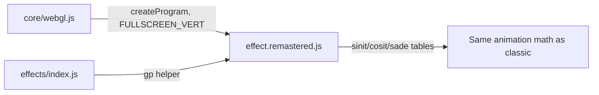
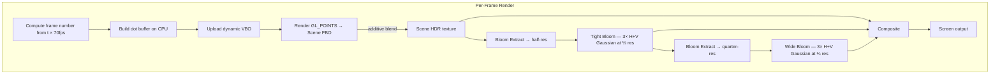

# Part 7 — TUNNELI Remastered: Neon Dot Tunnel

**Status:** Complete
**Source file:** `src/effects/tunneli/effect.remastered.js`
**Classic doc:** [07-tunneli.md](07-tunneli.md)

---

## Overview

The remastered TUNNELI replaces the classic's single-pixel dots on a 320×200
indexed framebuffer with anti-aliased Gaussian-splat point sprites rendered at
native resolution via `GL_POINTS`. Additive blending lets overlapping dots
create natural hotspots, and a dual-tier bloom pipeline wraps the tunnel in
neon glow. Depth-based HSL color gradients replace the monochrome white palette.

Key upgrades over classic:

| Classic | Remastered |
|---------|------------|
| 64 dots per ring | 64–512 configurable dots per ring |
| Single-pixel dots | Anti-aliased Gaussian splats |
| Monochrome white palette | HSL neon gradients with depth-based hue shift |
| Palette-index depth fade | Smooth alpha × size depth attenuation |
| 320×200 indexed framebuffer | Native resolution, RGBA16F HDR |
| No post-processing | Dual-tier bloom (tight + wide) |
| No audio reactivity | Beat-reactive dot size + bloom intensity |
| No parameterization | 8 editor-tunable parameters |

---

## Architecture



No shared animation module — the remastered embeds the same precomputed
lookup tables (sinit, cosit, sade) directly. All state derives from the frame
number, preserving the classic's O(1) scrubbing.

---

## Rendering Pipeline



### Pass breakdown

| Pass | Program | Target | Resolution |
|------|---------|--------|------------|
| Dot rendering | `DOT_VERT` + `DOT_FRAG` | Scene FBO | Full |
| Bloom extract | `FULLSCREEN_VERT` + `BLOOM_EXTRACT_FRAG` | Bloom FBO 1 | ½ |
| Tight blur (×3) | `FULLSCREEN_VERT` + `BLUR_FRAG` | Bloom FBO 1↔2 | ½ |
| Wide downsample | `FULLSCREEN_VERT` + `BLOOM_EXTRACT_FRAG` | Wide FBO 1 | ¼ |
| Wide blur (×3) | `FULLSCREEN_VERT` + `BLUR_FRAG` | Wide FBO 1↔2 | ¼ |
| Final composite | `FULLSCREEN_VERT` + `COMPOSITE_FRAG` | Default FB | Full |

---

## Dot Rendering

Each frame, the CPU computes all visible dot positions using the same math
as the classic, but with floating-point precision (no `Math.trunc`) and a
configurable number of dots per ring.

### Per-dot data (4 floats)

| Field | Type | Range | Description |
|-------|------|-------|-------------|
| x | float | ~-20 to ~340 | Horizontal position in 320×200 space |
| y | float | ~-20 to ~220 | Vertical position in 320×200 space |
| brightness | float | 0–1 | Classic palette brightness, depth-attenuated |
| depth | float | 0–1 | 0 = nearest ring, 1 = farthest ring |

The vertex shader maps positions from 320×200 space to NDC and computes
`gl_PointSize` proportional to display resolution and inversely proportional
to depth, giving near dots a larger screen footprint.

### Gaussian splat fragment shader

```
alpha = exp(-r² × 3.5)   where r = distance from point center in [0,1]
alpha *= mix(1.0, 0.3, depth)   depth fog
color = hsl2rgb(hueBase + depth × hueSpread, saturation, brightness)
```

The exponential falloff produces soft-edged dots. Fragments beyond the unit
circle are discarded. Additive blending (`SRC_ALPHA, ONE`) lets overlapping
dot halos accumulate into bright convergence points.

---

## Color Model

The classic uses a monochrome palette with two brightness levels (bright at
palette 64, dark at 128). The remastered replaces this with HSL color:

| Parameter | Near dots (depth=0) | Far dots (depth=1) |
|-----------|--------------------|--------------------|
| Hue | `hueNear` (default 190° cyan) | `hueFar` (default 190° cyan) |
| Saturation | 0.85 | 0.60 |
| Lightness | `brightness × 0.55` | faded by depth × alpha |
| Alpha | Full (×1.0) | Faded (×0.3) |

Hue is interpolated between `hueNear` and `hueFar` using shortest-path
interpolation around the HSL color wheel. For example, setting near=350° (red)
and far=30° (orange) traverses 40° through red, not 320° the long way around.
Both default to 190° for uniform cyan; adjust `hueFar` to create a
depth-based color gradient.

The classic's bright/dark alternation (every 8 frames) maps to the brightness
channel: bright circles get lightness ~1.0, dark circles ~0.75, both further
attenuated by depth index.

---

## Bloom Post-Processing

Same dual-tier architecture as other remastered effects:

### Tight bloom (half resolution)

1. **Extract**: Luminance threshold with `smoothstep(threshold, threshold+0.3, brightness)` — default threshold 0.15 (lower than most effects to capture the scattered dots)
2. **Blur**: 3 iterations of separable 9-tap Gaussian at half resolution

### Wide bloom (quarter resolution)

1. **Downsample**: Tight bloom result re-extracted with threshold 0
2. **Blur**: Same 3-iteration Gaussian at quarter resolution for broad diffusion

### Composite

```
color = scene + tight × (bloomStr + beatPulse × 0.3)
              + wide  × (bloomStr × 0.6 + beatPulse × 0.2)
```

The lower bloom threshold (0.15 vs typical 0.3) and higher bloom strength
(0.6 vs typical 0.45) are tuned for the sparse dot field — the tunnel needs
stronger bloom to fill the gaps between dots with glow.

---

## Beat Reactivity

| Effect | Formula | Visual result |
|--------|---------|---------------|
| Dot size pulse | `gl_PointSize × (1 + beatPulse × 0.3)` | Dots swell on beat |
| Bloom boost | `bloomStr + beatPulse × 0.3` (tight), `× 0.2` (wide) | Glow flares on beat |
| Brightness boost | `lightness × (0.55 + beatPulse × 0.15)` | Dots brighten on beat |

Beat pulse: `pow(1 - beat, 4)` — sharp attack with moderate decay.

---

## Editor Parameters

| Key | Label | Group | Range | Default | Controls |
|-----|-------|-------|-------|---------|----------|
| `dotsPerRing` | Dots per Ring | Tunnel | 64–512 | 256 | Number of dots on each elliptical ring |
| `dotSize` | Dot Size | Tunnel | 0.5–8 | 3.0 | Base point size before depth/resolution scaling |
| `hueNear` | Near Hue | Color | 0–360 | 190 | Hue for nearest dots (190 = cyan) |
| `hueFar` | Far Hue | Color | 0–360 | 190 | Hue for farthest dots; shortest-path HSL interpolation with near |
| `bloomThreshold` | Bloom Threshold | Post-Processing | 0–1 | 0.15 | Brightness cutoff for bloom extraction |
| `bloomStrength` | Bloom Strength | Post-Processing | 0–2 | 0.6 | Intensity of bloom overlay |
| `beatReactivity` | Beat Reactivity | Post-Processing | 0–1 | 0.5 | Strength of beat-driven effects |
| `scanlineStr` | Scanlines | Post-Processing | 0–0.5 | 0 | CRT scanline overlay intensity |

---

## Shader Programs

| Program | Vertex | Fragment | Purpose |
|---------|--------|----------|---------|
| `dotProg` | `DOT_VERT` (custom) | `DOT_FRAG` | Gaussian-splat point sprites |
| `bloomExtractProg` | `FULLSCREEN_VERT` | `BLOOM_EXTRACT_FRAG` | Bright-pixel extraction |
| `blurProg` | `FULLSCREEN_VERT` | `BLUR_FRAG` | Separable 9-tap Gaussian |
| `compositeProg` | `FULLSCREEN_VERT` | `COMPOSITE_FRAG` | Scene + bloom + scanlines |

The custom `DOT_VERT` maps 320×200 pixel coordinates to NDC, computes
resolution-proportional `gl_PointSize`, and passes brightness/depth to the
fragment shader.

---

## GPU Resources

| Resource | Count | Notes |
|----------|-------|-------|
| Shader programs | 4 | Dot, bloom extract, blur, composite |
| VAOs | 2 | Dot points (dynamic) + fullscreen quad (static) |
| Buffers | 2 | Dynamic dot VBO + quad VBO |
| Textures | 5 | Scene + 2 tight bloom + 2 wide bloom |
| Framebuffers | 5 | Scene + bloom1 + bloom2 + wide1 + wide2 |

FBOs use `RGBA16F` for HDR accumulation from additive blending.
All resources are properly cleaned up in `destroy()`.

---

## What Changed From Classic

| Aspect | Classic approach | Remastered approach |
|--------|-----------------|---------------------|
| Resolution | 320×200 indexed framebuffer | Native display resolution |
| Dot rendering | Single pixel writes to RAM | `GL_POINTS` with Gaussian fragment shader |
| Dot density | 64 dots per ring (fixed) | 64–512 configurable |
| Anti-aliasing | None (pixel-perfect dots) | Gaussian falloff + additive blending |
| Color | Monochrome white (two brightness levels) | HSL neon gradient (hue shifts with depth) |
| Depth fade | Palette index → darker entry | Alpha × size attenuation + desaturation |
| Blending | Overwrite (painter's, back-to-front) | Additive (`SRC_ALPHA, ONE`) |
| Post-processing | None | Dual-tier bloom pipeline |
| Audio sync | None | Beat pulses dot size, brightness, bloom |
| Parameterization | None | 8 tunable params for editor UI |
| Framebuffer format | 8-bit indexed | RGBA16F (HDR-capable) |

---

## Remaining Ideas (Not Yet Implemented)

From the classic doc's "Remastered Ideas":

- **Particle trails**: Motion blur on dots as they move between frames (temporal accumulation buffer)
- **Rainbow palette cycling**: Animated hue offset over time rather than static depth-based gradient
- **Sub-pixel motion blur**: Stretch dots into short lines along their velocity vector

---

## References

- Classic doc: [07-tunneli.md](07-tunneli.md)
- Remastered rule: `.cursor/rules/remastered-effects.mdc`
