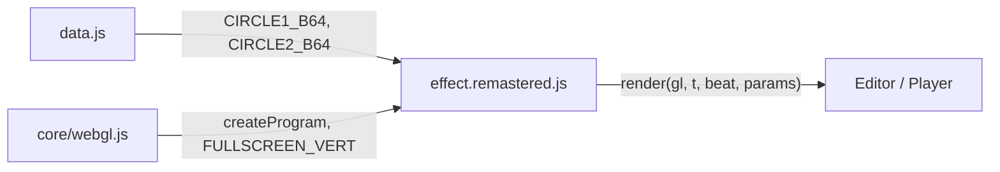
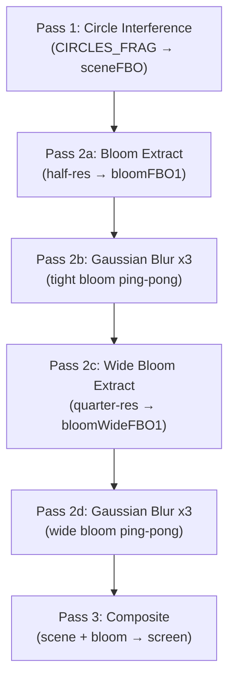

# Part 8 — TECHNO_CIRCLES Remastered: GPU Circle Interference

**Status:** Complete
**Source file:** `src/effects/technoCircles/effect.remastered.js`
**Classic doc:** [08-techno-circles.md](08-techno-circles.md)

---

## Overview

The remastered variant uploads the original EGA circle bitmaps as GPU
textures and performs all interference computation, palette animation,
sinusoidal distortion, and orbital motion in GLSL. This preserves the
exact ring patterns of the classic while rendering at native resolution.
A tunable Color Smoothing parameter blends between discrete pixel-perfect
palette steps and smooth gradient interpolation at ring edges. A dual-tier
bloom pipeline and beat reactivity complete the modern treatment.

| Classic | Remastered |
|---------|------------|
| 320x200 fixed resolution | Native display resolution |
| CPU framebuffer, per-pixel palette lookup | GPU fragment shader, texture-sampled circles |
| Per-frame texSubImage2D upload | Static circle textures, all computation in shader |
| Discrete 16-color palette only | Tunable smooth/discrete palette interpolation |
| No post-processing | Dual-tier bloom (tight + wide) |
| No audio reactivity | Beat-reactive bloom and distortion |
| No parameterization | 9 editor-tunable parameters |

---

## Architecture



The remastered variant imports `data.js` to decode the same EGA circle
bitmaps used by the classic. At init, the decoded 640x400 circle images
are uploaded as R8 GPU textures (NEAREST filtering). The fragment shader
samples these textures at sub-pixel precision, computes the OR interference,
and applies the palette — all on the GPU.

---

## Rendering Pipeline



| Pass | Program | Target | Resolution |
|------|---------|--------|------------|
| Circle interference | `circlesProg` | `sceneFBO` | Full |
| Bloom extract (tight) | `bloomExtractProg` | `bloomFBO1` | Half |
| Gaussian blur (tight) | `blurProg` | `bloomFBO1`/`bloomFBO2` ping-pong | Half |
| Bloom extract (wide) | `bloomExtractProg` | `bloomWideFBO1` | Quarter |
| Gaussian blur (wide) | `blurProg` | `bloomWideFBO1`/`bloomWideFBO2` ping-pong | Quarter |
| Composite | `compositeProg` | Screen (null FBO) | Full |

---

## Circle Interference Shader

### Texture Sampling

The original EGA circle bitmaps are decoded at init into 640x400 images
(quarter-circle mirrored, same as classic) and uploaded as R8 textures.
The fragment shader converts screen UV → 320x200 pixel coordinates, adds
the orbital offset, and samples the circle texture in 640x400 pixel space:

```glsl
vec2 circleCoord = vec2(screenPos.x + offsetX, screenPos.y + offsetY);
float ring = texture(uCircle, circleCoord / vec2(640.0, 400.0)).r * 255.0;
```

NEAREST filtering preserves pixel-exact ring boundaries at all resolutions.

### Phase 1 (frames 0-255, ~3.66s)

Samples circle1 centered at the viewport center (offset 160, 100 into the
640x400 image). The palette sweeps a bright cyan-blue ring through the
radii using the same `palfader` and `shft` logic as the classic.

### Phase 2 (frames 256+)

Samples both circles with independent sinusoidal orbital motion (same
formulas as classic). The shader computes the bitwise-OR-equivalent
combination by rounding each sample to its integer value and adding:

```glsl
float ci = floor(ring1 + 0.5) + floor(ring2 + 0.5);  // 0-15
```

A `colorSmooth` parameter blends between this discrete result and the
raw fractional sum for controllable anti-aliasing at ring edges.

### Per-Scanline Distortion

Identical to classic — circle 2 receives a horizontal per-scanline shift:

```
sinroty = (sinurot + 9 * y) mod 1024
powr = floor(sin1024(sinroty)/8 as ubyte * sinuspower / 15)
```

`sinuspower` ramps from 0 to 15 after frame 606. The `distortionScale`
parameter multiplies this for artistic control.

### Palette System

**Phase 1:** PAL0 — sparse cyan-blue pulse, one non-black entry rotating
through 8 positions per frame.

**Phase 2:** PAL1 (indices 0-7, warm gray gradient, `g = v * 8/9`) +
PAL2 (indices 8-15, cool gradient, `g = v * 7/9`). Both stored as GLSL
`const float[8]` arrays. The `phase2Pal` function performs discrete lookup
with optional smooth blending controlled by the `colorSmooth` parameter.

---

## Post-Processing

### Bloom

Dual-tier bloom matching the established pattern:

1. **Tight bloom** — half-resolution, 9-tap Gaussian, 3 iterations
2. **Wide bloom** — quarter-resolution, 9-tap Gaussian, 3 iterations

The tight bloom catches bright ring edges; the wide bloom creates a soft
atmospheric glow around the entire interference pattern.

### Composite

```
color = scene + tight * bloomStr + wide * (bloomStr * 0.5)
```

Beat reactivity adds `pow(1 - beat, 4) * beatReactivity` to bloom strength,
creating subtle pulse on downbeats.

---

## Beat Reactivity

| Effect | Formula |
|--------|---------|
| Bloom pulse (tight) | `bloomStr + beatPulse * 0.25` |
| Bloom pulse (wide) | `bloomStr * 0.5 + beatPulse * 0.15` |
| Color boost | `brightness + beatPulse * 0.15` |
| Phase 1 brightness | `+beatPulse * 0.08` |
| Phase 2 brightness | `+beatPulse * 0.06` |

Where `beatPulse = pow(1.0 - beat, 4.0) * beatReactivity`.

---

## Editor Parameters

| Key | Label | Type | Min | Max | Step | Default | Description |
|-----|-------|------|-----|-----|------|---------|-------------|
| `colorSmooth` | Color Smoothing | float | 0 | 1 | 0.01 | 0.3 | 0 = pixel-exact classic look, 1 = smooth gradients at ring edges |
| `distortionScale` | Distortion Scale | float | 0 | 3 | 0.05 | 1.0 | Multiplier on Phase 2 sinusoidal distortion |
| `bloomThreshold` | Bloom Threshold | float | 0 | 1 | 0.01 | 0.2 | Brightness cutoff for bloom extraction |
| `bloomStrength` | Bloom Strength | float | 0 | 2 | 0.01 | 0.5 | Bloom intensity in composite |
| `beatReactivity` | Beat Reactivity | float | 0 | 1 | 0.01 | 0.4 | Strength of beat-driven pulses |
| `hueShift` | Hue Shift | float | 0 | 360 | 1 | 0 | Global hue rotation in degrees |
| `saturationBoost` | Saturation Boost | float | -0.5 | 1 | 0.01 | 0.25 | Saturation adjustment |
| `brightness` | Brightness | float | 0.5 | 2 | 0.01 | 1.15 | Global brightness multiplier |
| `scanlineStr` | Scanlines | float | 0 | 0.5 | 0.01 | 0.02 | CRT scanline overlay intensity |

---

## Shader Programs

| Program | Vertex | Fragment | Purpose |
|---------|--------|----------|---------|
| `circlesProg` | `FULLSCREEN_VERT` | `CIRCLES_FRAG` | Analytical circle interference |
| `bloomExtractProg` | `FULLSCREEN_VERT` | `BLOOM_EXTRACT_FRAG` | Bright pixel extraction |
| `blurProg` | `FULLSCREEN_VERT` | `BLUR_FRAG` | 9-tap separable Gaussian blur |
| `compositeProg` | `FULLSCREEN_VERT` | `COMPOSITE_FRAG` | Scene + bloom + scanlines |

---

## GPU Resources

| Resource | Count | Notes |
|----------|-------|-------|
| Shader programs | 4 | Circles, bloom extract, blur, composite |
| Fullscreen quad VAO | 1 | Shared across all passes |
| Circle textures | 2 | R8 640x400 NEAREST, uploaded once at init |
| FBOs | 5 | sceneFBO (full), bloomFBO1/2 (half), bloomWideFBO1/2 (quarter) |
| Textures (FBO) | 5 | One per FBO (RGBA8, LINEAR filtering) |

All FBOs are recreated when the canvas resizes.

---

## What Changed From Classic

| Aspect | Classic | Remastered |
|--------|---------|------------|
| Resolution | 320x200 fixed | Native display resolution |
| Circle data | Decoded to CPU array, per-frame indexed FB | Decoded once, uploaded as R8 GPU textures |
| Color depth | 16 discrete VGA colors | Discrete + tunable smooth blending at edges |
| Rendering | CPU indexed FB → texSubImage2D per frame | GPU fragment shader, texture sampling |
| Post-processing | None | Dual-tier bloom |
| Beat reactivity | None | Bloom + brightness pulse |
| Parameters | None | 9 tunable controls |
| Data dependency | `data.js` | `data.js` (same circle bitmaps, GPU-uploaded) |

---

## Remaining Ideas

From the classic doc's "Remastered Ideas" not yet implemented:

- **AI-upscaled circles**: Replace 640x400 circle textures with 4K AI-upscaled versions for smoother rings at high resolution
- **3D depth**: Parallax or depth-of-field between interference layers
- **Chromatic aberration**: Slight RGB offset on the interference for prismatic look
- **Bilinear circle sampling**: Expose a parameter to switch circle textures from NEAREST to LINEAR filtering for softer ring edges
