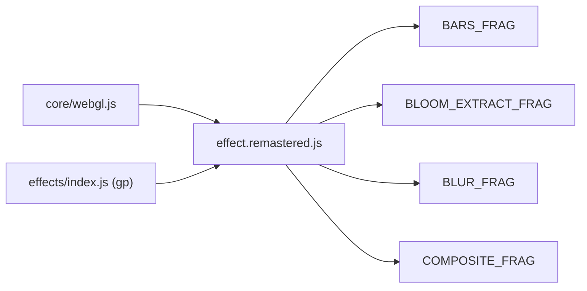
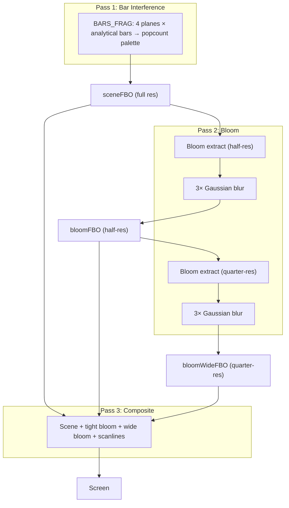

# Part 10 — TECHNO_BARS Remastered: GPU Analytical Bar Interference

**Status:** Complete
**Source file:** `src/effects/technoBars/effect.remastered.js`
**Classic doc:** [10-techno-bars.md](10-techno-bars.md)

## Overview

The remastered variant moves the classic's CPU-rendered 320x200 indexed-color bar effect to a fully GPU-accelerated, resolution-independent GLSL implementation. The original 8-page × 4-plane EGA compositing system is faithfully reproduced by evaluating 4 planes of analytical bar geometry per pixel in the fragment shader.

| Aspect | Classic | Remastered |
|--------|---------|------------|
| Resolution | 320×200 | Native display |
| Rendering | CPU scanline fill per quad | GLSL analytical parallelogram test |
| Bar testing | 11 quads drawn sequentially | Single modular-distance computation |
| Color depth | 4-bit indexed (16 palette entries) | Continuous float overlap (0.0–4.0) |
| Anti-aliasing | None (pixel-snapped) | smoothstep + fwidth() AA |
| Palette | Hardcoded popcount ramp | 21 selectable presets with lo/hi tint |
| Post-processing | None | Dual-tier bloom + scanlines |
| Beat reactivity | Palette flash every ~35 frames | Configurable bloom/color pulse |

## Architecture



No `data.js` or `animation.js` — all bar geometry is computed analytically and the classic state machine is embedded directly in the module.

## Rendering Pipeline



| Pass | Program | Target | Resolution |
|------|---------|--------|------------|
| Bar interference | barsProg | sceneFBO | Full |
| Bloom extract (tight) | bloomExtractProg | bloomFBO1 | Half |
| Blur (tight, 3 passes) | blurProg | bloomFBO1 ↔ bloomFBO2 | Half |
| Bloom extract (wide) | bloomExtractProg | bloomWideFBO1 | Quarter |
| Blur (wide, 3 passes) | blurProg | bloomWideFBO1 ↔ bloomWideFBO2 | Quarter |
| Composite | compositeProg | Screen | Full |

## Analytical Bar Evaluation

The key optimization: all 11 bars in a frame share the same rotation and size — they differ only by a spacing offset along the perpendicular axis. The shader projects each pixel into the bar coordinate system:

- **s** — projection along bar length axis (shared by all bars)
- **t** — projection along perpendicular spacing axis

Bar centers in t-space sit at multiples of 4 (positions −20, −16, …, 20), so containment for all 11 bars reduces to a single modular-distance test:

```
nearest = round(t / 4.0) * 4.0
covered = |s| ≤ 1 AND |t − nearest| ≤ 1 AND |nearest| ≤ 20
```

Anti-aliased edges use `smoothstep(1.0 − fw, 1.0 + fw, ...)` where `fw = fwidth() * 1.5`.

## Temporal Plane Compositing

For display frame N, the 4 bit-planes of the current page were last written at:

| Plane | Written at frame | Offset from N |
|-------|-----------------|---------------|
| K (current) | N | 0 |
| K−1 | N−8 | −8 |
| K−2 | N−16 | −16 |
| K−3 | N−24 | −24 |

where K = ⌊N/8⌋ mod 4. The JS state machine stores bar parameters in a 32-frame circular buffer. On phase transitions, historical entries from before the transition are marked inactive (planes show as empty).

## Post-Processing

Dual-tier bloom identical to the TECHNO_CIRCLES remaster:

1. **Tight bloom** — Half-resolution, 3-pass separable 9-tap Gaussian blur
2. **Wide bloom** — Quarter-resolution, 3-pass separable 9-tap Gaussian blur
3. **Composite** — Scene + tight × strength + wide × strength × 0.5 + beat pulse modulation

## Beat Reactivity

| Effect | Formula | Default strength |
|--------|---------|-----------------|
| Color pulse | `pow(1 − beat, 4) × reactivity × 0.05 × overlap` | 0.4 |
| Bloom pulse (tight) | `bloomStr + pow(1 − beat, 4) × reactivity × 0.25` | 0.4 |
| Bloom pulse (wide) | `bloomStr × 0.5 + pow(1 − beat, 4) × reactivity × 0.15` | 0.4 |
| Brightness pulse | `brightness + pow(1 − beat, 4) × reactivity × 0.12` | 0.4 |
| Palette flash | `curpal` jumps to 15 on beat, decays by 1 per frame | Always on |

## Editor Parameters

| Key | Label | Type | Range | Default | Description |
|-----|-------|------|-------|---------|-------------|
| palette | Theme | select | 0–20 | 1 (Ember) | Palette preset |
| hueShift | Hue Shift | float | 0–360 | 0 | Post-palette hue rotation in degrees |
| saturationBoost | Saturation Boost | float | −0.5–1.0 | 0.69 | Saturation multiplier adjustment |
| brightness | Brightness | float | 0.5–2.0 | 1.19 | Overall brightness multiplier |
| colorSmooth | Color Smoothing | float | 0–1 | 0.50 | Blend between hard/smooth bar edges |
| bloomThreshold | Bloom Threshold | float | 0–1 | 0.24 | Minimum brightness for bloom extraction |
| bloomStrength | Bloom Strength | float | 0–2 | 0.50 | Bloom composite intensity |
| beatReactivity | Beat Reactivity | float | 0–1 | 0.40 | Amplitude of beat-driven effects |
| scanlineStr | Scanlines | float | 0–0.5 | 0.26 | CRT scanline overlay strength |

## Shader Programs

| Program | Vertex | Fragment | Purpose |
|---------|--------|----------|---------|
| barsProg | FULLSCREEN_VERT | BARS_FRAG | 4-plane analytical bar evaluation + palette |
| bloomExtractProg | FULLSCREEN_VERT | BLOOM_EXTRACT_FRAG | Brightness threshold extraction |
| blurProg | FULLSCREEN_VERT | BLUR_FRAG | 9-tap separable Gaussian blur |
| compositeProg | FULLSCREEN_VERT | COMPOSITE_FRAG | Scene + bloom + scanlines composite |

## GPU Resources

| Resource | Type | Count | Notes |
|----------|------|-------|-------|
| Shader programs | Program | 4 | bars, bloom extract, blur, composite |
| FBOs | Framebuffer + Texture | 5 | scene (full), bloom×2 (half), bloomWide×2 (quarter) |
| VAO | Fullscreen quad | 1 | Shared across all passes |

## What Changed From Classic

| Aspect | Classic | Remastered |
|--------|---------|------------|
| Bar rendering | CPU fillConvex() per quad into Uint8Array | GLSL analytical parallelogram SDF |
| Page/plane system | 8 Uint8Array pages with bitwise OR | 4 vec4 uniforms from 32-frame history buffer |
| Palette | 16×16 pre-computed table, popcount-indexed | Continuous lo/hi tint interpolation by overlap |
| Color depth | 4-bit per pixel (16 levels) | Float per pixel (smooth 0–4 range) |
| Resolution | Fixed 320×200 | Dynamic drawingBufferWidth × drawingBufferHeight |
| Texture upload | Full RGBA frame each render | No textures — purely analytical |
| Post-processing | None | Dual-tier bloom + configurable scanlines |
| Beat response | curpal flash (palette brightness) | Palette flash + bloom pulse + brightness pulse |

## Remaining Ideas

From the classic doc's "Remastered Ideas":

- **3D depth**: Give each plane layer a slight Z offset for parallax
- **Particle trails**: Bars leave particle trails as they rotate

## References

- Classic doc: [10-techno-bars.md](10-techno-bars.md)
- TECHNO_CIRCLES remaster (reference implementation): `src/effects/technoCircles/effect.remastered.js`
- Remastered standards rule: `.cursor/rules/remastered-effects.mdc`
