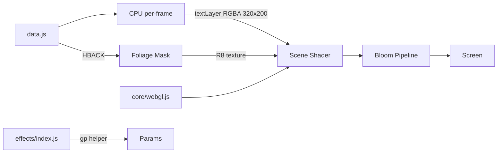
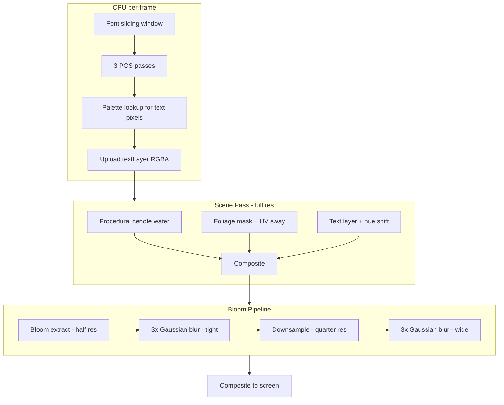

# Part 12 — FOREST Remastered: Cenote Mountain Scroller

**Status:** Complete
**Source file:** `src/effects/forest/effect.remastered.js`
**Classic doc:** [12-forest.md](12-forest.md)

## Overview

The remastered FOREST replaces the static indexed-color mountain landscape with a GPU-driven scene while preserving the original POS-table text mapping. The flat VGA background becomes an animated cenote water surface with undulating caustics, the foliage silhouettes sway organically, and the scrolling text gains a configurable hue shift.

| Aspect | Classic | Remastered |
|--------|---------|------------|
| Resolution | 320×200 | Native display |
| Background | Static HBACK indexed image | Procedural animated cenote water |
| Foliage | Static palette-indexed silhouettes | UV-distorted swaying shadows |
| Text | Additive palette blend | Palette-looked-up RGBA with hue shift |
| Rendering | CPU palette lookup → single texture | CPU POS mapping + GPU 4-pass pipeline |
| Post-processing | None | Dual-tier bloom + scanlines |

## Architecture

The CPU retains the POS-table text mapping from the classic variant — these are arbitrary pixel-to-pixel lookup tables that encode the terrain contour projection and cannot be replicated on the GPU. The CPU produces a 320×200 RGBA text layer each frame which the GPU composites over the procedural water.

## Rendering Pipeline

| Pass | Program | Target | Resolution |
|------|---------|--------|------------|
| Scene | `sceneProg` | `sceneFBO` | Full |
| Bloom extract | `bloomExtractProg` | `bloomFBO1` | Half |
| Tight blur (3×) | `blurProg` | `bloomFBO1`↔`bloomFBO2` | Half |
| Wide downsample | `bloomExtractProg` | `bloomWideFBO1` | Quarter |
| Wide blur (3×) | `blurProg` | `bloomWideFBO1`↔`bloomWideFBO2` | Quarter |
| Composite | `compositeProg` | Screen | Full |

## Scene Shader Layers

### 1. Cenote Water

Multi-octave value noise drives the water undulation. The color palette models a Mexican cenote: crystal-clear turquoise/emerald at the center (light shaft from above) fading to deep blue-teal at the edges.

- **Undulation**: Two FBM noise layers with different scales and animation speeds, mixed 50/50
- **Wave displacement**: Low-frequency sinusoidal UV distortion before noise sampling
- **Color gradient**: Four colors interpolated by radial distance from center (deep → mid → bright → surface)
- **Caustics**: Voronoi-based caustic pattern with animated cell centers, intensity modulated by center light
- **Specular ripples**: High-frequency sinusoidal highlights on top

### 2. Foliage Shadows

The foliage mask is precomputed at init from HBACK palette indices (32–127 and 160–255 = foliage). At render time, the mask is sampled with time-varying UV distortion to create organic swaying motion.

UV distortion formula:
- `swayX = sin(y * 6 + t * speed) * amp * 0.01 + sin(y * 12 + t * speed * 1.7 + 1.5) * amp * 0.004 + sin(y * 3 + t * speed * 0.4) * amp * 0.006`
- `swayY = sin(x * 4 + t * speed * 0.6) * amp * 0.003`

Three frequency layers (6, 12, 3 cycles/screen) create a natural, wind-driven look.

During the leaf fade-in phase, foliage renders as additive green glow on dark water. During the full scene phase, it transitions to dark shadow overlay on bright water.

### 3. Text with Hue Shift

The CPU runs the classic POS-table mapping to determine where text pixels appear and what their composite palette index is (`hback[dest] + fontPix`). These are looked up in the original VGA palette and uploaded as RGBA.

The GPU applies HSV hue rotation: `rgb → hsv → shift H by uHueShift/360 → hsv → rgb`. The text is additively blended over the water+foliage base, preserving the original compositing feel.

## Fade Timing

Preserved from classic, expressed as three uniforms:

| Phase | Frames | `uFadeLeaves` | `uFadeFull` | `uFade` |
|-------|--------|---------------|-------------|---------|
| Leaf fade-in | 0–63 | 0→1 | 0 | 1 |
| Full cross-fade | 63–191 | 1 | 0→1 | 1 |
| Steady state | 191–fadeOut | 1 | 1 | 1 |
| Fade out | last 63 | 1 | 1 | 1→0 |

Water visibility = `max(0.15 * fadeLeaves, fadeFull)` — the water is dimly visible during the leaf phase so the foliage glow has a backdrop.

## Beat Reactivity

Beat-driven bloom in the composite pass: `beatPulse = pow(1 - beat, 6)` scales tight and wide bloom intensity.

## Editor Parameters

| Group | Key | Label | Type | Range | Default |
|-------|-----|-------|------|-------|---------|
| Text | `hueShift` | Hue Shift | float | 0–360 | 0 |
| Text | `textBrightness` | Brightness | float | 0.3–3.0 | 1.0 |
| Water | `waterSpeed` | Undulation Speed | float | 0.1–3.0 | 0.8 |
| Water | `waterDepth` | Depth | float | 0.1–1.5 | 1.0 |
| Water | `causticIntensity` | Caustic Intensity | float | 0–2.0 | 0.8 |
| Water | `waterBrightness` | Brightness | float | 0.3–3.0 | 1.2 |
| Foliage | `foliageSway` | Sway Amount | float | 0–5.0 | 1.5 |
| Foliage | `foliageSwaySpeed` | Sway Speed | float | 0.1–4.0 | 1.2 |
| Foliage | `foliageOpacity` | Shadow Opacity | float | 0–1.0 | 0.85 |
| Post-Processing | `bloomThreshold` | Bloom Threshold | float | 0–1 | 0.4 |
| Post-Processing | `bloomTightStr` | Bloom Tight | float | 0–3 | 0.35 |
| Post-Processing | `bloomWideStr` | Bloom Wide | float | 0–3 | 0.25 |
| Post-Processing | `scanlineStr` | Scanlines | float | 0–0.5 | 0.02 |
| Post-Processing | `beatBloom` | Beat Bloom | float | 0–1.5 | 0.3 |

## Shader Programs

| Program | Vertex | Fragment | Purpose |
|---------|--------|----------|---------|
| `sceneProg` | `FULLSCREEN_VERT` | `SCENE_FRAG` | Cenote water + foliage + text composite |
| `bloomExtractProg` | `FULLSCREEN_VERT` | `BLOOM_EXTRACT_FRAG` | Brightness threshold extraction |
| `blurProg` | `FULLSCREEN_VERT` | `BLUR_FRAG` | 9-tap separable Gaussian blur |
| `compositeProg` | `FULLSCREEN_VERT` | `COMPOSITE_FRAG` | Scene + tight/wide bloom + scanlines |

## GPU Resources

| Resource | Type | Size | Lifetime |
|----------|------|------|----------|
| `textLayerTex` | RGBA texture | 320×200 | Per-frame upload |
| `foliageMaskTex` | R8 texture | 320×200 | Static (init) |
| `sceneFBO` | FBO + RGBA texture | Full res | Dynamic resize |
| `bloomFBO1`, `bloomFBO2` | FBO + RGBA texture | Half res | Dynamic resize |
| `bloomWideFBO1`, `bloomWideFBO2` | FBO + RGBA texture | Quarter res | Dynamic resize |
| 4 shader programs | Program | — | Static (init) |
| 1 VAO + VBO | Fullscreen quad | — | Static (init) |

## What Changed From Classic

| Aspect | Classic | Remastered |
|--------|---------|------------|
| Background | Static HBACK (320×200 indexed) | Procedural cenote water at native res |
| Foliage | Static palette-keyed silhouettes | UV-distorted swaying shadows |
| Text rendering | CPU palette lookup, additive blend | CPU POS mapping → GPU hue-shifted composite |
| Color space | VGA 6-bit palette (256 entries) | Full 8-bit RGB with HDR bloom |
| Resolution | Fixed 320×200 | Native display, FBOs resize dynamically |
| Post-processing | None | Dual-tier bloom, scanlines, beat reactivity |
| Parameterization | None | 14 editor-tunable parameters |

## Remaining Ideas

From the classic doc's remastered ideas list:

- **Parallax layers**: Multiple mountain layers at different scroll speeds
- **High-res text**: AI-upscaled or vector-rendered text at 4K
- **Dynamic lighting**: Day/night cycle, shadows following sun position
- **Particle leaves**: Animated falling leaves over the landscape
- **Smooth scrolling**: Sub-pixel text movement for smoother animation
- **Fog/atmosphere**: Distance fog between mountain layers
