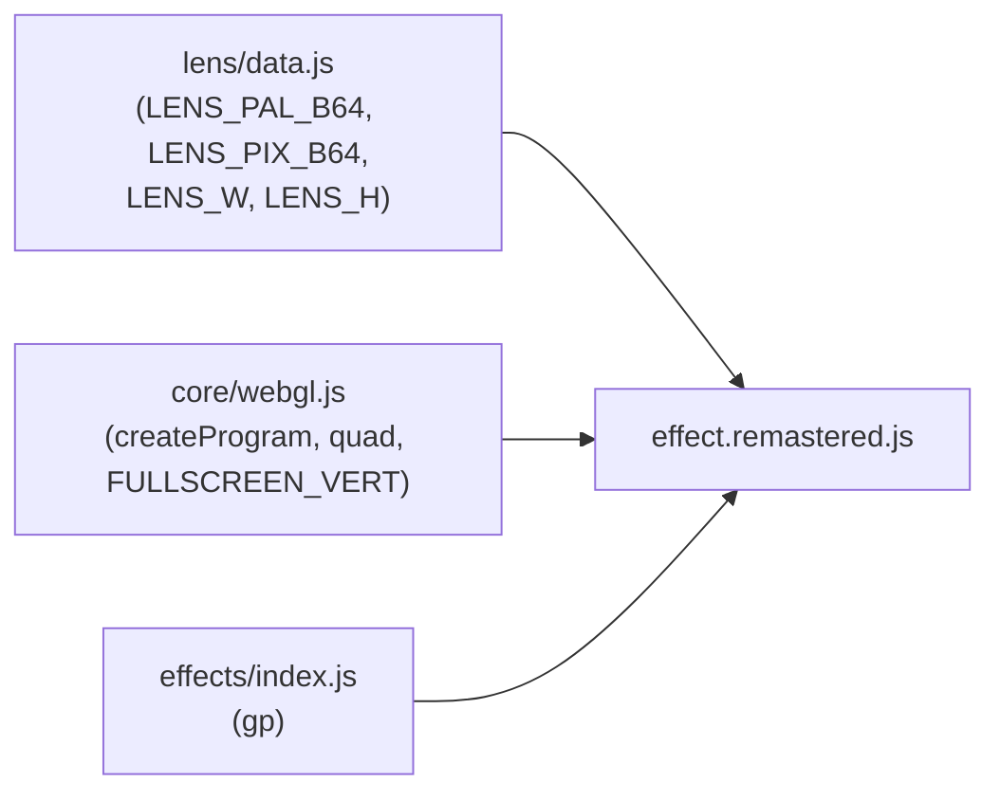

# Part 14 — LENS_LENS Remastered: Shader-Driven Crystal Ball

**Status:** Complete  
**Source file:** `src/effects/lens/effect.remastered.js`  
**Classic doc:** [14-lens-lens.md](14-lens-lens.md)

---

## Overview

The remastered LENS_LENS replaces the pre-computed pixel lookup tables
(EX1-EX4) with an analytical refraction shader. The bouncing crystal ball
is rendered as a virtual sphere using Snell's law refraction, Blinn-Phong
specular, Fresnel rim glow, environment reflection, and chromatic
aberration — all in a single fragment shader pass.

The KOE background receives identical visual treatment to LENS_ROTO
remastered (same color grading, eye glow, procedural nebula, and default
parameter values), ensuring seamless visual continuity between the two
consecutive effects.

Key upgrades over classic:

| Classic | Remastered |
|---------|------------|
| 320x200 CPU framebuffer with pixel lookup tables | Native resolution GPU refraction shader |
| Pre-computed distortion maps (EX1-EX4, 34 KB) | Analytical Snell's law refraction |
| Palette-based transparency (OR masking into 3 blocks) | Per-pixel Fresnel blending with soft edges |
| 3 fixed lens tint colors from EX0 header | Configurable IOR, hue, specular, Fresnel, reflection |
| No post-processing | Dual-tier bloom + optional scanlines + beat reactivity |
| Background is flat indexed image | Color-graded KOE with procedural nebula and eye glow |
| 20 editor-tunable parameters across 5 groups |

---

## Architecture



The remastered module imports the KOE picture and palette from `data.js`
(same as the classic). It does **not** use the EX0-EX4 lookup maps — the
lens distortion is computed analytically. Only `LENS_W` and `LENS_H` are
used to size the sphere in screen space.

---

## Rendering Pipeline

```mermaid
flowchart TD
  subgraph perFrame ["Per-Frame Render"]
    A["Replay bouncing physics → lens position"] --> B["Compute lens opacity fade-in"]
    B --> C["Scene pass → sceneFBO"]

    subgraph C ["Scene (SCENE_FRAG)"]
      C1["Procedural nebula background (4-octave FBM)"]
      C2["Sample 320x200 KOE texture (bilinear)"]
      C3["Color grading: hue shift, saturation, brightness"]
      C4["Blend nebula through dark areas (luma key)"]
      C5["Eye glow at 320x200 eye positions"]
      C6["Crystal ball: sphere normal → Snell refraction"]
      C7["Chromatic aberration (R/B channel shift)"]
      C8["Ball specular + Fresnel rim + environment reflection"]
      C9["Soft-edge blend ball over background"]
    end

    C --> D["Bloom extract → half-res"]
    D --> E["Tight bloom: 3x H+V Gaussian"]
    D --> F["Wide bloom: 1/4 res, 3x Gaussian"]
    E --> G["Composite: scene + bloom + scanlines → screen"]
    F --> G
  end
```



### Pass breakdown

| Pass | Program | Target | Resolution |
|------|---------|--------|------------|
| Scene rendering | `FULLSCREEN_VERT` + `SCENE_FRAG` | Scene FBO | Full |
| Bloom extract | `FULLSCREEN_VERT` + `BLOOM_EXTRACT_FRAG` | Bloom FBO 1 | Half |
| Tight blur (x3) | `FULLSCREEN_VERT` + `BLUR_FRAG` | Bloom FBO 1/2 | Half |
| Wide downsample | `FULLSCREEN_VERT` + `BLOOM_EXTRACT_FRAG` | Wide FBO 1 | Quarter |
| Wide blur (x3) | `FULLSCREEN_VERT` + `BLUR_FRAG` | Wide FBO 1/2 | Quarter |
| Final composite | `FULLSCREEN_VERT` + `COMPOSITE_FRAG` | Default FB | Full |

---

## Lens Refraction Model

For each fragment inside the lens circle:

1. **Local coordinates**: `d = (fragUV - lensCenter) / lensRadius`, creating a unit disc
2. **Sphere normal**: `N = normalize(d.x, d.y, sqrt(1 - r^2))`
3. **Refraction**: `refracted = refract((0,0,-1), N, 1/IOR)` using GLSL built-in
4. **UV offset**: `offset = refracted.xy * (1 - nz) * 0.5` scaled by lens radius
5. **Background sample**: read KOE at `bgUV + offset` (with color grading applied)

### Chromatic aberration

R and B channels are sampled at slightly offset UVs:

```
caOff = N.xy * chromaticAberration * (1 - nz) * 0.02
refImg.r = sample(refUV + caOff)
refImg.g = sample(refUV)
refImg.b = sample(refUV - caOff)
```

The shift increases toward the lens edges (where `nz` approaches 0).

### Lens material

- **Specular**: Blinn-Phong with configurable power/intensity, light from upper-right
- **Fresnel rim**: `pow(1 - N.V, fresnelExponent) * fresnelIntensity`
- **Environment reflection**: procedural FBM noise map blended via reflectivity
- **Hue tint**: optional hue rotation applied to the refracted image inside the ball
- **Soft edge**: `smoothstep(1.0, 0.92, r)` prevents hard circle boundary

---

## Bouncing Physics

Identical to classic — replayed from frame 0 each render call:

```
Initial: lx=65*64, ly=-50*64, lxa=64, lya=64
Per frame:
  lx += lxa; ly += lya
  if x out of bounds: lxa = -lxa
  if y > 150*64 && frame < 600:
    first bounce: lya = -lya * 2/3
    subsequent:   lya = -lya * 9/10
  lya += 2 (gravity)
```

The lens center and radius are passed as normalized uniforms. The lens
fades in over frames 32-96 via the `uLensOpacity` uniform.

---

## Visual Consistency with LENS_ROTO

The KOE background shares identical treatment across both effects:

| Shared aspect | Key | Default |
|---------------|-----|---------|
| Hue shift | `hueShift` | 0 |
| Saturation | `saturationBoost` | 0.11 |
| Brightness | `brightness` | 0.77 |
| Eye glow intensity | `eyeGlowIntensity` | 0.22 |
| Eye glow radius | `eyeGlowRadius` | 0.05 |
| Eye glow hue | `eyeGlowHue` | 6 |
| Background nebula | `bgIntensity` | 0.27 |
| Background speed | `bgSpeed` | 0.50 |
| Bloom threshold | `bloomThreshold` | 0.20 |
| Bloom strength | `bloomStrength` | 0.50 |
| Beat reactivity | `beatReactivity` | 0.40 |
| Scanlines | `scanlineStr` | 0.08 |

The nebula FBM, color grading functions, and eye glow logic are identical.

---

## Post-Processing

Standard dual-tier bloom pipeline (identical to LENS_ROTO remastered):

1. Brightness extraction at half-res with `smoothstep` threshold
2. 3 iterations of separable 9-tap Gaussian at half-res (tight bloom)
3. Downsample to quarter-res, 3 iterations of Gaussian (wide bloom)
4. Composite: scene + tight + wide, beat-reactive intensity
5. Scanline overlay

---

## Beat Reactivity

| Effect | Formula | Visual result |
|--------|---------|---------------|
| Eye glow pulse | `glow *= 1 + pow(1-beat, 4) * beatReactivity * 1.5` | Eyes flare brighter |
| Background pulse | `bg *= 1 + pow(1-beat, 4) * beatReactivity * 0.3` | Nebula brightens |
| Bloom boost | `tight * (bloomStr + pow(1-beat, 4) * beatReactivity * 0.25)` | Glow halo flares |

---

## Editor Parameters

| Key | Label | Group | Range | Default | Controls |
|-----|-------|-------|-------|---------|----------|
| `hueShift` | Hue Shift | Palette | 0-360 | 0 | Global hue rotation |
| `saturationBoost` | Saturation | Palette | -0.5-1 | 0.11 | Saturation adjustment |
| `brightness` | Brightness | Palette | 0.5-2 | 0.77 | Brightness multiplier |
| `eyeGlowIntensity` | Eye Glow | Eyes | 0-3 | 0.22 | Eye glow brightness |
| `eyeGlowRadius` | Glow Radius | Eyes | 0.01-0.15 | 0.05 | Eye glow falloff size |
| `eyeGlowHue` | Glow Color | Eyes | 0-360 | 6 | Eye glow hue |
| `bgIntensity` | Background Intensity | Background | 0-1 | 0.27 | Nebula visibility |
| `bgSpeed` | Background Speed | Background | 0.1-2 | 0.50 | Nebula animation speed |
| `lensIOR` | Refraction (IOR) | Ball | 1.0-2.5 | 1.45 | Index of refraction (distortion amount) |
| `lensHue` | Ball Hue | Ball | 0-360 | 0 | Hue tint on refracted image |
| `lensSpecularPower` | Specular Power | Ball | 2-128 | 57 | Specular highlight sharpness |
| `lensSpecularIntensity` | Specular Intensity | Ball | 0-1.5 | 0.35 | Specular brightness |
| `lensFresnelExponent` | Fresnel Exponent | Ball | 0.5-5 | 1.2 | Rim glow falloff curve |
| `lensFresnelIntensity` | Fresnel Intensity | Ball | 0-1 | 0.25 | Rim glow brightness |
| `lensReflectivity` | Reflectivity | Ball | 0-0.5 | 0.09 | Environment reflection blend |
| `lensChromaticAberration` | Chromatic Aberration | Ball | 0-3 | 0.8 | RGB channel separation at edges |
| `bloomThreshold` | Bloom Threshold | Post-Processing | 0-1 | 0.20 | Bloom extraction cutoff |
| `bloomStrength` | Bloom Strength | Post-Processing | 0-2 | 0.50 | Bloom overlay intensity |
| `beatReactivity` | Beat Reactivity | Post-Processing | 0-1 | 0.40 | Beat-driven pulse strength |
| `scanlineStr` | Scanlines | Post-Processing | 0-0.5 | 0.08 | CRT scanline intensity |

---

## Shader Programs

| Program | Vertex | Fragment | Purpose |
|---------|--------|----------|---------|
| `sceneProg` | `FULLSCREEN_VERT` | `SCENE_FRAG` | Background + KOE + lens refraction + eye glow |
| `bloomExtractProg` | `FULLSCREEN_VERT` | `BLOOM_EXTRACT_FRAG` | Bright-pixel extraction |
| `blurProg` | `FULLSCREEN_VERT` | `BLUR_FRAG` | Separable 9-tap Gaussian |
| `compositeProg` | `FULLSCREEN_VERT` | `COMPOSITE_FRAG` | Scene + bloom + scanlines |

---

## GPU Resources

| Resource | Count | Notes |
|----------|-------|-------|
| Shader programs | 4 | Scene, bloom extract, blur, composite |
| Textures | 6 | 1 KOE source (320x200) + 5 FBO textures |
| Framebuffers | 5 | Scene + bloom1 + bloom2 + wide1 + wide2 |

The 320x200 KOE texture uses `LINEAR` filtering and `CLAMP_TO_EDGE`
wrapping (unlike the 256x256 `REPEAT` texture in LENS_ROTO).

---

## What Changed From Classic

| Aspect | Classic approach | Remastered approach |
|--------|-----------------|---------------------|
| Resolution | 320x200 (VGA Mode 13h) | Native display resolution |
| Lens distortion | Pre-computed lookup tables (EX1-EX4) | Analytical Snell's law refraction |
| Transparency | Palette-based OR masking (3 fixed tint levels) | Per-pixel Fresnel blending with continuous falloff |
| Lens material | 3 fixed colors from EX0 header | Configurable specular, Fresnel, reflection, IOR, hue |
| Chromatic aberration | None | Configurable RGB channel separation |
| Background | Flat indexed pixel copy | Color-graded with nebula and eye glow |
| Scrubbing | O(frame) physics replay | O(frame) physics replay (unchanged) |
| Post-processing | None | Dual-tier bloom + scanlines |
| Parameterization | None | 20 tunable params across 5 groups |

---

## Remaining Ideas (Not Yet Implemented)

From the classic doc's "Remastered Ideas" section:

- **Caustics**: Light patterns cast by the lens onto the background
- **Physics improvements**: More realistic bounce with rotation
- **Multiple lenses**: Several bouncing lenses with interaction

---

## References

- Classic doc: [14-lens-lens.md](14-lens-lens.md)
- LENS_ROTO remastered: [15-lens-roto-remastered.md](15-lens-roto-remastered.md)
- Remastered rule: `.cursor/rules/remastered-effects.mdc`
