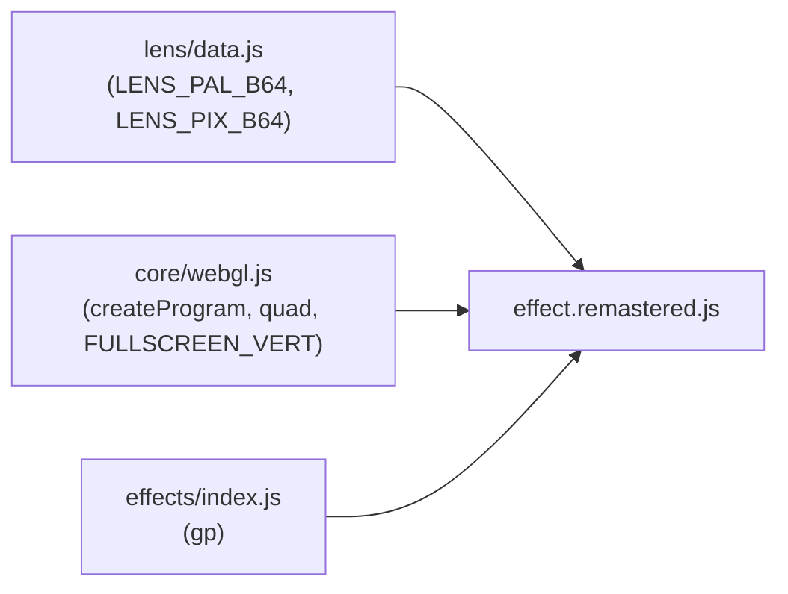

# Part 15 — LENS_ROTO Remastered: GPU Rotozoom with Lens Material

**Status:** Complete  
**Source file:** `src/effects/rotozoom/effect.remastered.js`  
**Classic doc:** [15-lens-roto.md](15-lens-roto.md)

---

## Overview

The remastered LENS_ROTO moves the rotozoom computation entirely to the
GPU at native display resolution. The 256x256 KOE texture is uploaded
once and sampled with hardware bilinear filtering, replacing the classic's
CPU per-pixel loop and pixel-doubling. A shader-based lens material model
adds specular highlights, Fresnel rim glow, and environment reflection to
simulate the KOE picture projected on a curved glass surface. The demon
face's golden eyes glow with a beat-reactive radial bloom, and a subtle
procedural nebula fills the dark background areas.

Key upgrades over classic:

| Classic | Remastered |
|---------|------------|
| 160x100 CPU rotozoom, pixel-doubled to 320x200 | Native resolution GPU rotozoom |
| Nearest-neighbor texture sampling (`& 0xFF` bitmask) | Bilinear filtering via hardware `GL_LINEAR` |
| Flat 256-color indexed palette | Continuous RGB with hue/saturation/brightness controls |
| No material effects | Blinn-Phong specular, Fresnel rim, environment reflection |
| No eye emphasis | Beat-reactive eye glow with tunable color and radius |
| Black background | Procedural animated nebula blended through dark areas |
| No post-processing | Dual-tier bloom + optional scanlines |
| No audio reactivity | Beat-reactive bloom, eye glow, and background pulse |
| No parameterization | 17 editor-tunable parameters across 4 groups |

---

## Architecture



The remastered module imports the shared KOE picture and palette from
`lens/data.js` (same data the classic uses). At init time it decodes the
indexed pixels, applies the VGA palette, remaps to 256x256 with aspect
correction, and uploads as a single RGBA texture with `REPEAT` wrapping.

Animation arrays (`animD1`, `animD2`, `animScale`, `animFade`) are
pre-computed with the same per-frame physics as the classic, ensuring
frame-perfect choreography sync during scrubbing.

---

## Rendering Pipeline

```mermaid
flowchart TD
  subgraph perFrame ["Per-Frame Render"]
    A["Compute frame → interpolate d1, d2, scale, fade"] --> B["Derive rotozoom UV transform"]
    B --> C["Scene pass → sceneFBO"]

    subgraph C ["Scene (SCENE_FRAG)"]
      C1["Procedural nebula background (4-octave FBM)"]
      C2["GPU rotozoom: linear UV transform + bilinear sample"]
      C3["Color grading: hue shift, saturation, brightness"]
      C4["Blend background through dark areas (luma key)"]
      C5["Lens material: Blinn-Phong specular + Fresnel rim"]
      C6["Environment reflection (procedural noise map)"]
      C7["Eye glow: toroidal distance to eye centers, radial falloff"]
      C8["Fade to/from white"]
    end

    C --> D["Bloom extract → half-res"]
    D --> E["Tight bloom: 3x H+V Gaussian"]
    D --> F["Wide bloom: 1/4 res, 3x Gaussian"]
    E --> G["Composite: scene + bloom + scanlines → screen"]
    F --> G
  end
```



### Pass breakdown

| Pass | Program | Target | Resolution |
|------|---------|--------|------------|
| Scene rendering | `FULLSCREEN_VERT` + `SCENE_FRAG` | Scene FBO | Full |
| Bloom extract | `FULLSCREEN_VERT` + `BLOOM_EXTRACT_FRAG` | Bloom FBO 1 | Half |
| Tight blur (x3) | `FULLSCREEN_VERT` + `BLUR_FRAG` | Bloom FBO 1/2 | Half |
| Wide downsample | `FULLSCREEN_VERT` + `BLOOM_EXTRACT_FRAG` | Wide FBO 1 | Quarter |
| Wide blur (x3) | `FULLSCREEN_VERT` + `BLUR_FRAG` | Wide FBO 1/2 | Quarter |
| Final composite | `FULLSCREEN_VERT` + `COMPOSITE_FRAG` | Default FB | Full |

---

## Lighting/Shading Model

The lens material treats the screen as a virtual hemisphere to derive
per-pixel surface normals. This creates a "crystal ball" lighting effect
over the rotozoom image.

### Surface normal derivation

```
sc = screenUV * 2.0 - 1.0     // [-1, 1] screen coords
r2 = dot(sc, sc)
if r2 < 1.0:
  nz = sqrt(1.0 - r2)
  N = normalize(sc.x, sc.y, nz)
```

### Blinn-Phong specular

```
V = (0, 0, 1)                 // viewer direction
L = normalize(0.3, 0.5, 1.0)  // upper-right light
H = normalize(L + V)
specular = pow(max(N . H, 0), specularPower) * specularIntensity
```

### Fresnel rim

```
NdV = max(N . V, 0)
fresnel = pow(1.0 - NdV, fresnelExponent) * fresnelIntensity
```

The Fresnel term produces a bright rim at the edges of the virtual sphere,
fading smoothly to zero at the center. A `sphereMask` smoothstep prevents
hard clipping at the sphere boundary.

### Environment reflection

```
R = reflect(-V, N)
envColor = mix(darkBlue, purple, fbm(R.xy + time * 0.1))
color = mix(color, envColor, reflectivity * sphereMask * (1 - NdV))
```

The "environment" is a procedurally generated noise pattern, adding subtle
shifting reflections that vary with the virtual surface curvature.

---

## Eye Glow

The KOE demon face has golden eyes at known positions in the 256x256
texture:

| Eye | Pixel coords | Normalized UV |
|-----|-------------|---------------|
| Left (viewer) | (98, 139) | (0.384, 0.543) |
| Right (viewer) | (169, 139) | (0.661, 0.543) |

For each fragment, the shader computes the rotozoom UV, then measures the
**toroidal distance** to each eye center (handling texture wrap correctly):

```
dx = min(abs(fract(texUV.x) - eyeU), 1.0 - abs(fract(texUV.x) - eyeU))
dy = min(abs(fract(texUV.y) - eyeV), 1.0 - abs(fract(texUV.y) - eyeV))
dist = sqrt(dx*dx + dy*dy)
glow = exp(-dist^2 / radius^2) * intensity
```

The glow color is user-configurable via a hue angle (default: 45 = golden
amber, matching the original eye color). Beat reactivity amplifies the
glow by `1 + beatPulse * 1.5`, creating an eerie pulsing effect.

---

## Background

A 4-octave FBM (fractal Brownian motion) noise function generates a
slowly drifting nebula in deep blue/purple/magenta tones. The background
blends through the dark areas of the rotozoom image using a luma key:

```
imgLuma = dot(img, vec3(0.299, 0.587, 0.114))
color = mix(background, image, clamp(imgLuma * 4.0 + 0.15, 0, 1))
```

This means dark skin and the black background of the KOE face let the
nebula show through, while the bright areas (eyes, highlights) remain
fully opaque. The `bgIntensity` parameter controls the overall effect
(0 = pure black like classic).

---

## Post-Processing

Dual-tier bloom plus optional scanlines (identical to the standard
remastered pipeline):

1. Brightness extraction at half-res with `smoothstep` threshold
2. 3 iterations of separable 9-tap Gaussian at half-res (tight bloom)
3. Downsample to quarter-res, 3 iterations of Gaussian (wide bloom)
4. Composite: scene + tight + wide, beat-reactive intensity
5. Scanline overlay: `(1 - scanlineStr) + scanlineStr * sin(y * pi)`

---

## Beat Reactivity

| Effect | Formula | Visual result |
|--------|---------|---------------|
| Eye glow pulse | `glow *= 1 + pow(1-beat, 4) * beatReactivity * 1.5` | Eyes flare brighter on beat |
| Background pulse | `bg *= 1 + pow(1-beat, 4) * beatReactivity * 0.3` | Nebula brightens subtly |
| Bloom boost | `tight * (bloomStr + pow(1-beat, 4) * beatReactivity * 0.25)` | Glow halo flares |

---

## Editor Parameters

| Key | Label | Group | Range | Default | Controls |
|-----|-------|-------|-------|---------|----------|
| `hueShift` | Hue Shift | Palette | 0-360 | 0 | Global hue rotation in degrees |
| `saturationBoost` | Saturation | Palette | -0.5-1 | 0.15 | Color saturation adjustment |
| `brightness` | Brightness | Palette | 0.5-2 | 1.1 | Overall brightness multiplier |
| `specularPower` | Specular Power | Lens | 2-128 | 32 | Sharpness of specular highlight |
| `specularIntensity` | Specular Intensity | Lens | 0-1.5 | 0.4 | Brightness of specular highlight |
| `fresnelExponent` | Fresnel Exponent | Lens | 0.5-5 | 2.0 | Rim glow falloff curve |
| `fresnelIntensity` | Fresnel Intensity | Lens | 0-1 | 0.25 | Rim glow brightness |
| `reflectivity` | Reflectivity | Lens | 0-0.5 | 0.1 | Environment reflection blend |
| `eyeGlowIntensity` | Eye Glow | Eyes | 0-3 | 1.0 | Eye glow brightness |
| `eyeGlowRadius` | Glow Radius | Eyes | 0.01-0.15 | 0.05 | Eye glow falloff size |
| `eyeGlowHue` | Glow Color | Eyes | 0-360 | 45 | Eye glow hue (45=golden, 200=blue) |
| `bgIntensity` | Background Intensity | Background | 0-1 | 0.3 | Nebula background visibility |
| `bgSpeed` | Background Speed | Background | 0.1-2 | 0.5 | Nebula animation speed |
| `bloomThreshold` | Bloom Threshold | Post-Processing | 0-1 | 0.2 | Brightness cutoff for bloom extraction |
| `bloomStrength` | Bloom Strength | Post-Processing | 0-2 | 0.5 | Bloom overlay intensity |
| `beatReactivity` | Beat Reactivity | Post-Processing | 0-1 | 0.4 | Beat-driven eye glow + bloom pulse |
| `scanlineStr` | Scanlines | Post-Processing | 0-0.5 | 0.02 | CRT scanline overlay intensity |

---

## Shader Programs

| Program | Vertex | Fragment | Purpose |
|---------|--------|----------|---------|
| `sceneProg` | `FULLSCREEN_VERT` | `SCENE_FRAG` | GPU rotozoom + lens material + eye glow + background |
| `bloomExtractProg` | `FULLSCREEN_VERT` | `BLOOM_EXTRACT_FRAG` | Bright-pixel extraction |
| `blurProg` | `FULLSCREEN_VERT` | `BLUR_FRAG` | Separable 9-tap Gaussian |
| `compositeProg` | `FULLSCREEN_VERT` | `COMPOSITE_FRAG` | Scene + bloom + scanlines |

The `SCENE_FRAG` is the most complex shader, containing:
- 4-octave FBM noise for background generation
- Linear UV rotozoom computation
- Hue rotation and saturation boost color utilities
- HSL-to-RGB for eye glow color
- Blinn-Phong specular and Fresnel rim lighting
- Toroidal distance computation for wrapped eye glow

---

## GPU Resources

| Resource | Count | Notes |
|----------|-------|-------|
| Shader programs | 4 | Scene, bloom extract, blur, composite |
| Textures | 6 | 1 KOE source + 5 FBO textures |
| Framebuffers | 5 | Scene + bloom1 + bloom2 + wide1 + wide2 |

The 256x256 KOE texture is uploaded once during `init()` and persists
for the lifetime of the effect. FBOs are recreated dynamically when the
canvas resizes. All resources are cleaned up in `destroy()`.

---

## What Changed From Classic

| Aspect | Classic approach | Remastered approach |
|--------|-----------------|---------------------|
| Resolution | 160x100, pixel-doubled to 320x200 | Native display resolution |
| Computation | CPU per-pixel loop with integer bitmask wrapping | GPU fragment shader with linear UV transform |
| Texture filtering | Nearest-neighbor (pixel art) | Bilinear (smooth gradients) |
| Color depth | 256-color VGA palette (6-bit per channel) | Full float RGB with color grading |
| Color control | None | Hue shift, saturation boost, brightness |
| Material effects | None (flat colors) | Blinn-Phong specular, Fresnel rim, reflection |
| Eye emphasis | None (inherent bright pixels) | Beat-reactive glow with configurable color/radius |
| Background | Black (from KOE image border) | Procedural animated nebula (FBM noise) |
| Post-processing | None | Dual-tier bloom + CRT scanlines |
| Audio sync | None | Beat-reactive eye glow, background, bloom |
| Parameterization | None | 17 tunable params across 4 groups |

---

## Remaining Ideas (Not Yet Implemented)

From the classic doc's "Remastered Ideas" section:

- **Continuous zoom**: Smooth scale curves instead of the stepped parameter changes
- **Color cycling**: Dynamic palette shifts during rotation (partially addressed by hue shift)
- **Multi-texture**: Blend between different source images during the effect
- **Beat sync**: Rotation speed tied to music beat (currently only bloom/glow are beat-reactive)

---

## References

- Classic doc: [15-lens-roto.md](15-lens-roto.md)
- Remastered rule: `.cursor/rules/remastered-effects.mdc`
