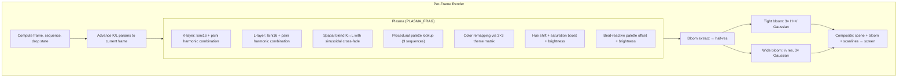

# Part 16 — PLZ_PLASMA Remastered: GPU Multi-Harmonic Plasma

**Status:** Complete  
**Source file:** `src/effects/plasma/effect.remastered.js`  
**Classic doc:** [16-plz-plasma.md](16-plz-plasma.md)

---

## Overview

The remastered PLZ_PLASMA computes the same multi-harmonic sine formulas
as the classic variant natively in GLSL at full display resolution. The
256-entry indexed palette lookup is replaced with continuous procedural
palette functions that produce smooth color gradients without banding.
21 selectable palette themes (Classic, Ember, Ocean, Synthwave, etc.)
transform the effect's look via 3×3 color remapping matrices applied in
the shader.

Key upgrades over classic:

| Classic | Remastered |
|---------|------------|
| 320×200 at 70 fps (CPU sine tables) | Native resolution (GPU GLSL computation) |
| 256-color indexed palette lookup | Continuous procedural palette with smooth interpolation |
| 3 hardcoded palette sequences | 21 selectable color themes via editor |
| Checkerboard interleave (two plasma layers) | Smooth spatial blending between K and L layers |
| No post-processing | Dual-tier bloom + optional scanlines |
| No audio reactivity | Beat-reactive palette cycling + bloom |
| No parameterization | 8 editor-tunable parameters |

---

## Architecture


No external data modules — the sine table formulas, palette generation
functions, parameter animation, and drop-transition logic are all
self-contained in the remastered module. The INITTABLE and SYNC_FRAMES
arrays replicate the classic's sequence structure.

---

## Rendering Pipeline



### Pass breakdown

| Pass | Program | Target | Resolution |
|------|---------|--------|------------|
| Plasma rendering | `FULLSCREEN_VERT` + `PLASMA_FRAG` | Scene FBO | Full |
| Bloom extract | `FULLSCREEN_VERT` + `BLOOM_EXTRACT_FRAG` | Bloom FBO 1 | Half |
| Tight blur (×3) | `FULLSCREEN_VERT` + `BLUR_FRAG` | Bloom FBO 1↔2 | Half |
| Wide downsample | `FULLSCREEN_VERT` + `BLOOM_EXTRACT_FRAG` | Wide FBO 1 | Quarter |
| Wide blur (×3) | `FULLSCREEN_VERT` + `BLUR_FRAG` | Wide FBO 1↔2 | Quarter |
| Final composite | `FULLSCREEN_VERT` + `COMPOSITE_FRAG` | Default FB | Full |

---

## Lighting/Shading Model

No geometric lighting — the effect is purely procedural color generation.
The visual depth comes from the multi-harmonic sine wave combination:

### Sine table functions (GLSL equivalents)

| Function | Formula | Output range |
|----------|---------|-------------|
| `lsini4(a)` | `(sin(a/4096×2π) × 55 + sin(5a) × 8 + sin(15a) × 2 + 64) × 8` | ~0–1024 |
| `lsini16(a)` | `(sin(a/4096×2π) × 55 + sin(4a) × 5 + sin(17a) × 3 + 64) × 16` | ~0–2048 |
| `psini(a)` | `sin(a/4096×2π) × 55 + sin(6a) × 5 + sin(21a) × 4 + 64` | ~0–128 |
| `ptau(k)` | `cos(clamp(k, 0, 128) × 2π/128 + π) × 31 + 32` | 1–63 |

### Per-pixel computation

```
K-layer: kBx1 = lsini16(y + k2 + rx×4), kVal = psini(x×8 + k1 + kBx1)
         kBx2 = lsini4(y + k4 + x×16), kVal2 = psini(kBx2 + y×2 + k3 + rx×4)
         kCi = (kVal + kVal2) mod 256

L-layer: same structure with l1..l4 params

blend = 0.5 + 0.2×sin(y×π/140) + 0.2×sin(x×π×3)
ci = mix(kCi, lCi, blend)
```

The smooth blend replaces the classic's binary checkerboard interleave.

---

## Post-Processing

Dual-tier bloom plus optional scanlines:

1. Brightness extraction at half-res with `smoothstep` threshold
2. 3 iterations of separable 9-tap Gaussian at half-res (tight bloom)
3. Downsample to quarter-res, 3 iterations of Gaussian (wide bloom)
4. Composite: scene + tight + wide, beat-reactive intensity
5. Scanline overlay: `(1 - scanlineStr) + scanlineStr × sin(gl_FragCoord.y × π)`

---

## Beat Reactivity

| Effect | Formula | Visual result |
|--------|---------|---------------|
| Palette offset | `ci += pow(1 - beat, 4) × beatReactivity × 30` | Colors cycle on beat |
| Brightness boost | `color × (brightness + pow(1 - beat, 4) × beatReactivity × 0.15)` | Plasma brightens |
| Bloom boost | `tight × (bloomStr + pow(1 - beat, 4) × beatReactivity × 0.25)` | Glow halo flares |

---

## Editor Parameters

| Key | Label | Range | Default | Controls |
|-----|-------|-------|---------|----------|
| `palette` | Theme | select (21 options) | 0 (Classic) | Color theme: Classic, Ember, Ocean, Toxic, Infrared, Aurora, Monochrome, Sunset, Matrix, Gruvbox, Monokai, Dracula, Solarized, Nord, One Dark, Catppuccin, Tokyo Night, Synthwave, Kanagawa, Everforest, Rose Pine |
| `hueShift` | Hue Shift | 0–360 | 0 | Global hue rotation in degrees |
| `saturationBoost` | Saturation Boost | -0.5–1 | 0.2 | Color saturation adjustment |
| `brightness` | Brightness | 0.5–2 | 1.1 | Overall brightness multiplier |
| `bloomThreshold` | Bloom Threshold | 0–1 | 0.25 | Brightness cutoff for bloom extraction |
| `bloomStrength` | Bloom Strength | 0–2 | 0.45 | Bloom overlay intensity |
| `beatReactivity` | Beat Reactivity | 0–1 | 0.4 | Beat-driven palette cycling + brightness |
| `scanlineStr` | Scanlines | 0–0.5 | 0.02 | CRT scanline overlay intensity |

---

## Shader Programs

| Program | Vertex | Fragment | Purpose |
|---------|--------|----------|---------|
| `plasmaProg` | `FULLSCREEN_VERT` | `PLASMA_FRAG` | Multi-harmonic plasma with procedural palette |
| `bloomExtractProg` | `FULLSCREEN_VERT` | `BLOOM_EXTRACT_FRAG` | Bright-pixel extraction |
| `blurProg` | `FULLSCREEN_VERT` | `BLUR_FRAG` | Separable 9-tap Gaussian |
| `compositeProg` | `FULLSCREEN_VERT` | `COMPOSITE_FRAG` | Scene + bloom + scanlines |

All shaders use `FULLSCREEN_VERT`. The `PLASMA_FRAG` is the most complex,
containing 3 procedural palette functions (`palette0`, `palette1`,
`palette2`), hue rotation and saturation boost utilities, and the
dual-layer plasma computation with spatial blending.

---

## GPU Resources

| Resource | Count | Notes |
|----------|-------|-------|
| Shader programs | 4 | Plasma, bloom extract, blur, composite |
| Textures | 5 | Scene FBO + 2 tight bloom + 2 wide bloom |
| Framebuffers | 5 | Scene + bloom1 + bloom2 + wide1 + wide2 |

No input textures are needed — the plasma is entirely procedural. All
resources are properly cleaned up in `destroy()`.

---

## What Changed From Classic

| Aspect | Classic approach | Remastered approach |
|--------|-----------------|---------------------|
| Resolution | 320×200 (VGA tweaked mode) | Native display resolution |
| Computation | CPU sine lookup tables | GLSL sine functions (per-pixel) |
| Color depth | 256-entry indexed palette | Continuous procedural palette (float RGB) |
| Layer blending | Binary checkerboard interleave (even/odd) | Smooth sinusoidal spatial cross-fade |
| Palette themes | 3 hardcoded sequences (red, rainbow, gray) | 21 selectable themes via color remapping matrix |
| Color control | None | Hue shift, saturation boost, brightness controls |
| Post-processing | None | Dual-tier bloom + CRT scanlines |
| Audio sync | None | Beat-reactive palette offset + brightness + bloom |
| Parameterization | None | 8 tunable params for editor UI |

---

## Remaining Ideas (Not Yet Implemented)

From the classic doc's "Remastered Ideas" section:

- **3D depth**: Map plasma onto a curved surface with parallax
- **Multi-octave noise**: Add Perlin noise layers for more organic patterns
- **Dynamic palette generation**: Procedural palette based on music mood analysis

---

## References

- Classic doc: [16-plz-plasma.md](16-plz-plasma.md)
- Remastered rule: `.cursor/rules/remastered-effects.mdc`
