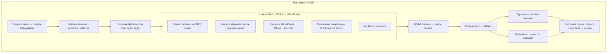
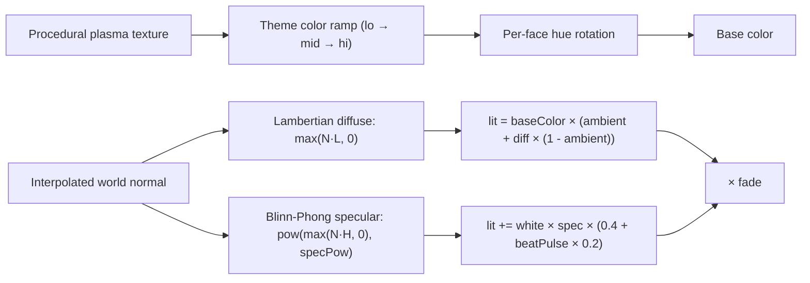

# Part 17 — PLZ_CUBE Remastered: GPU Plasma-Textured Cube

**Status:** Complete  
**Source file:** `src/effects/plzCube/effect.remastered.js`  
**Classic doc:** [17-plz-cube.md](17-plz-cube.md)

---

## Overview

The remastered PLZ_CUBE replaces the classic's CPU polygon filler with a
proper GPU vertex pipeline, rendering the plasma-textured cube at native
display resolution with MSAA anti-aliasing. Per-pixel Blinn-Phong lighting
replaces the original's flat per-face shading, and perspective-correct
texture interpolation fixes the UV warping visible on large faces in the
original. The camera path follows the same B-spline interpolated control
points for choreography sync. Twelve selectable palette themes give each
face-pair a distinct visual character.

Key upgrades over classic:

| Classic | Remastered |
|---------|------------|
| CPU polygon fill at 320×134 | GPU vertex pipeline at native resolution |
| Flat per-face diffuse lighting | Per-pixel Blinn-Phong with specular highlights |
| Linear UV interpolation (warped) | Perspective-correct GPU texturing |
| 3 fixed palette ramps (blue, red, purple) | 12 selectable themes with per-face hue control |
| No post-processing | Dual-tier bloom + optional scanlines + MSAA |
| No audio reactivity | Beat-reactive specular + bloom |
| No parameterization | 11 editor-tunable parameters |

---

## Architecture


Fully self-contained — no external data modules. Cube geometry (6 faces ×
4 vertices with position, UV, normal, and theme index), spline
coefficients, animation control points, and palette definitions are all
embedded in the source. The `getspl()` function replicates the classic's
B-spline interpolation for camera path, rotation angles, and light source
position.

---

## Rendering Pipeline



### Pass breakdown

| Pass | Program | Target | Resolution |
|------|---------|--------|------------|
| Cube rendering | `CUBE_VERT` + `CUBE_FRAG` | MSAA FBO | Full |
| MSAA resolve | Blit | Scene FBO | Full |
| Bloom extract | `FULLSCREEN_VERT` + `BLOOM_EXTRACT_FRAG` | Bloom FBO 1 | Half |
| Tight blur (×3) | `FULLSCREEN_VERT` + `BLUR_FRAG` | Bloom FBO 1↔2 | Half |
| Wide downsample | `FULLSCREEN_VERT` + `BLOOM_EXTRACT_FRAG` | Wide FBO 1 | Quarter |
| Wide blur (×3) | `FULLSCREEN_VERT` + `BLUR_FRAG` | Wide FBO 1↔2 | Quarter |
| Final composite | `FULLSCREEN_VERT` + `COMPOSITE_FRAG` | Default FB | Full |

---

## Lighting/Shading Model



### Procedural texture

The classic's sine-wave plasma is computed per-pixel in the fragment shader:

```
dist = sini((distortionOffset + v) × 8) / 3 × distortion
du = (u + dist) mod 256
plasmaVal = sini(v × 4 + sini(du × 2)) / 4 + 32
```

Where `sini(a) = sin(a/1024 × 4π) × 127`. The `distortionOffset` advances
each frame (`frame & 63`), creating the animated wobble.

### Color themes

Three face themes (front/back, right/left, top/bottom) each use a 3-stop
color ramp (lo → mid → hi). The `plasmaVal` indexes into the ramp via
linear interpolation. Each theme can be independently hue-rotated via
Rodrigues rotation in RGB space.

### Light source

The light direction orbits via spline-interpolated angles `ls_kx` and
`ls_ky`, matching the classic's orbiting light path.

---

## Post-Processing

Dual-tier bloom plus optional scanlines:

1. Brightness extraction at half-res with `smoothstep` threshold
2. 3 iterations of separable 9-tap Gaussian at half-res (tight bloom)
3. Downsample to quarter-res, 3 iterations of Gaussian (wide bloom)
4. Composite: scene + tight + wide, beat-reactive intensity
5. Optional scanline overlay: `(1 - scanlineStr) + scanlineStr × sin(y × π)`

---

## Beat Reactivity

| Effect | Formula | Visual result |
|--------|---------|---------------|
| Color boost | `baseColor × (1 + pow(1 - beat, 4) × beatReactivity × 0.15)` | Face colors brighten |
| Specular boost | `specPow + pow(1 - beat, 4) × beatReactivity × 16` | Sharper highlights on beat |
| Specular intensity | `0.4 + pow(1 - beat, 4) × beatReactivity × 0.2` | Specular spots flare |
| Bloom boost | `tight × (bloomStr + pow(1 - beat, 4) × beatReactivity × 0.25)` | Glow halo flares |

---

## Editor Parameters

| Key | Label | Range | Default | Controls |
|-----|-------|-------|---------|----------|
| `palette` | Theme | select (12 options) | 0 (Classic) | Color theme: Classic, Gruvbox, Monokai, Dracula, Solarized, Nord, One Dark, Catppuccin, Tokyo Night, Synthwave, Kanagawa, Everforest, Rose Pine |
| `hueA` | Hue Shift (Face A) | -180–180 | 0 | Hue rotation for front/back faces |
| `hueB` | Hue Shift (Face B) | -180–180 | 0 | Hue rotation for right/left faces |
| `hueC` | Hue Shift (Face C) | -180–180 | 0 | Hue rotation for top/bottom faces |
| `distortion` | Distortion | 0–3 | 1.0 | Horizontal sine displacement intensity |
| `specularPower` | Specular Power | 4–128 | 32 | Sharpness of specular highlights |
| `ambient` | Ambient | 0–0.8 | 0.45 | Minimum ambient light level |
| `bloomThreshold` | Bloom Threshold | 0–1 | 0.3 | Brightness cutoff for bloom extraction |
| `bloomStrength` | Bloom Strength | 0–2 | 0.45 | Bloom overlay intensity |
| `beatReactivity` | Beat Reactivity | 0–1 | 0.4 | Beat-driven specular + bloom boost |
| `scanlineStr` | Scanlines | 0–0.5 | 0 | CRT scanline overlay intensity |

---

## Shader Programs

| Program | Vertex | Fragment | Purpose |
|---------|--------|----------|---------|
| `cubeProg` | `CUBE_VERT` (custom) | `CUBE_FRAG` | 3D cube with plasma textures + Phong lighting |
| `bloomExtractProg` | `FULLSCREEN_VERT` | `BLOOM_EXTRACT_FRAG` | Bright-pixel extraction |
| `blurProg` | `FULLSCREEN_VERT` | `BLUR_FRAG` | Separable 9-tap Gaussian |
| `compositeProg` | `FULLSCREEN_VERT` | `COMPOSITE_FRAG` | Scene + bloom + scanlines |

The custom `CUBE_VERT` transforms `aPosition` through the combined MVP
matrix, passes `aUV` and `aNormal` (transformed by the normal matrix) to
the fragment shader, and forwards the `aTheme` index as a flat integer
for per-face color ramp selection.

---

## GPU Resources

| Resource | Count | Notes |
|----------|-------|-------|
| Shader programs | 4 | Cube, bloom extract, blur, composite |
| VAOs | 1 | Cube (6 faces × 4 verts, indexed) |
| Buffers | 2 | VBO (interleaved pos+uv+normal+theme) + IBO (36 indices) |
| Textures | 5 | Scene FBO + 2 tight bloom + 2 wide bloom |
| Framebuffers | 6 | MSAA + scene + bloom1 + bloom2 + wide1 + wide2 |
| Renderbuffers | 2 | MSAA color + MSAA depth |

MSAA samples capped to `gl.MAX_SAMPLES` (target: 4×). No input textures
needed — the plasma pattern is entirely procedural. All resources are
properly cleaned up in `destroy()`.

---

## What Changed From Classic

| Aspect | Classic approach | Remastered approach |
|--------|-----------------|---------------------|
| Rendering | CPU polygon fill at 320×134 | GPU vertex pipeline at native resolution |
| Shading | Flat per-face diffuse (`light/64`) | Per-pixel Blinn-Phong diffuse + specular |
| Texturing | Linear UV interpolation (affine warping) | Perspective-correct hardware interpolation |
| Anti-aliasing | None (aliased edges) | 4× MSAA |
| Resolution | 320×134 (VGA tripled scanlines) | Native display resolution |
| Color themes | 3 hardcoded palette ramps | 12 selectable themes + per-face hue control |
| Post-processing | None | Dual-tier bloom + optional CRT scanlines |
| Audio sync | None | Beat-reactive specular + color + bloom |
| Parameterization | None | 11 tunable params for editor UI |

---

## Remaining Ideas (Not Yet Implemented)

From the classic doc's "Remastered Ideas" section:

- **Environment mapping**: Add reflection mapping for a metallic look
- **Animated textures**: Plasma texture evolves over time independently of distortion offset
- **Particle explosion**: Cube shatters into textured particles at the end

---

## References

- Classic doc: [17-plz-cube.md](17-plz-cube.md)
- Remastered rule: `.cursor/rules/remastered-effects.mdc`
