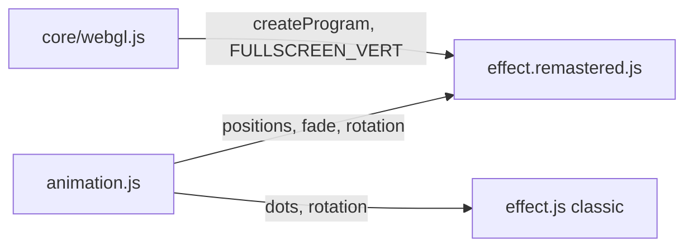
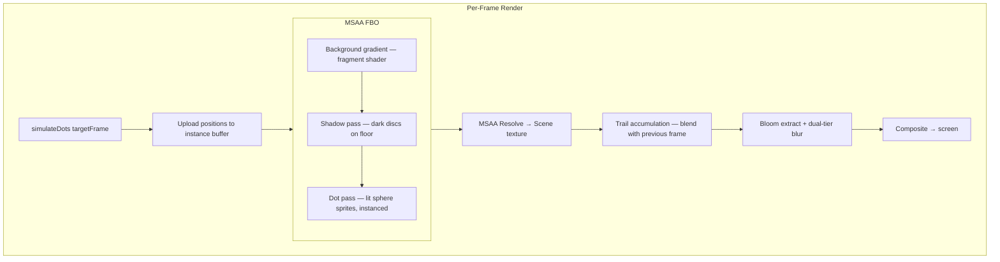
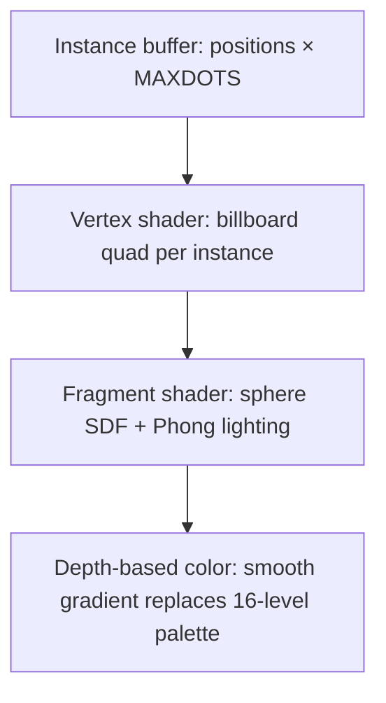
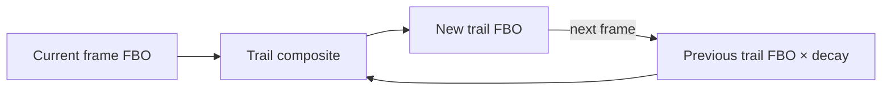

# Part 18 — DOTS Remastered: GPU-Instanced Vector Balls

**Status:** In progress (shared animation extracted, remastered variant not yet started)  
**Source file:** `src/effects/dots/effect.remastered.js` (planned)  
**Shared animation:** `src/effects/dots/animation.js`  
**Classic doc:** [18-dots.md](18-dots.md)

---

## Overview

The remastered DOTS will replace the classic's CPU pixel-sprite renderer with a
fully GPU-driven particle system using instanced rendering. The same shared
`animation.js` state machine guarantees frame-perfect choreography sync — spawn
patterns, physics, rotation, and palette transitions remain identical.

Key upgrades over classic:

| Classic | Remastered |
|---------|------------|
| 512 dots, CPU-rasterized 4×3 sprites | 4096+ dots via GPU instancing |
| Depth-indexed palette colors (16 levels) | Smooth anti-aliased sphere sprites |
| Fixed floor-level shadow projection | Real shadow mapping |
| 320×200 fixed resolution | Native display resolution |
| No post-processing | Bloom + particle trails |
| No audio reactivity | Beat-reactive spawn energy + bloom |
| No parameterization | Editor-tunable parameters |

---

## Preparation: Shared Animation Module

The `animation.js` module has already been extracted from the classic variant.
It exposes:

```javascript
simulateDots(targetFrame) → {
  positions,   // Float32Array(MAXDOTS * 3) — world-space (x, y, z)
  rotSin,      // Current rotation sine (pre-scaled)
  rotCos,      // Current rotation cosine (pre-scaled)
  frame,       // Clamped simulation frame (0–2450)
  fade,        // 0..1 brightness (handles fade-in, flash, fade-out)
}
```

The simulation replays from frame 0 every call (seeded PRNG for deterministic
random positions), supporting arbitrary scrubbing with no persistent state.

The remastered variant will import `simulateDots` directly, consuming the
`positions` Float32Array to feed GPU instance buffers.

---

## Planned Architecture



Following the pattern established by GLENZ_3D remastered:



---

## Rendering Strategy

### Instanced sphere sprites

Each dot is rendered as a camera-facing quad (billboard) with a sphere SDF
in the fragment shader:



- **Vertex shader**: Reads per-instance world position, applies the classic
  Y-rotation, projects, then expands to a screen-space quad sized by depth
- **Fragment shader**: Computes a sphere SDF from the quad UV, discards pixels
  outside the sphere, derives a surface normal from the SDF for per-pixel
  Phong lighting
- **Instancing**: `gl.drawArraysInstanced` with a single quad VAO and a
  dynamic instance buffer updated each frame — scales to 4096+ dots trivially

### Depth-based coloring

The classic uses 16 discrete depth levels × 4 color shades. The remastered
replaces this with a continuous depth-to-color gradient:

```
depth = (z × rotCos - x × rotSin + 9000) / 18000    // normalized 0..1
color = mix(darkCyan, brightWhite, depth)
```

Near dots are brighter (cyan-white), far dots dimmer (dark cyan), matching
the classic's visual intent with smooth interpolation.

### Shadow rendering

The classic projects shadows to a fixed floor Y-level. The remastered will:

1. Render a shadow pass before the dot pass
2. Each shadow is a dark, semi-transparent disc on the floor plane
3. Shadow position uses the same projection as classic: `shadow_y = 0x80000 / bp + 100`
4. Shadow opacity attenuates with distance for a soft-shadow approximation

### Background gradient

The classic's 100-shade gray gradient floor is reproduced as a simple
fragment shader gradient — no texture needed.

---

## Particle Trails

A trail accumulation buffer blends the current frame with a faded version of
the previous frame:



- **Decay factor**: Tunable 0.85–0.98 (lower = shorter trails)
- The trail buffer is at full resolution, blended before bloom
- Trails should only apply to the dots, not the background

---

## Bloom Pipeline

Reuses the dual-tier bloom pattern from GLENZ_3D remastered:

1. **Extract** bright pixels above threshold from the scene texture
2. **Tight bloom**: 3 iterations of separable 9-tap Gaussian at half resolution
3. **Wide bloom**: Downsample tight result to quarter resolution, 3 more blur iterations
4. **Composite**: Additive blend of scene + tight bloom + wide bloom, with beat-reactive intensity

---

## Beat Reactivity

| Effect | Mechanism | Visual result |
|--------|-----------|---------------|
| Spawn energy | Scale initial `yadd` by beat pulse | Dots launch higher on beat |
| Bloom pulse | Amplify bloom strength on beat | Bright dots flare rhythmically |
| Dot glow | Increase sphere emissive on beat | Dots brighten on musical accents |

The animation state machine itself is not modified — beat reactivity is applied
purely in the rendering layer to preserve sync with classic.

---

## Planned Parameters

Following the parameterization standard from `remastered-effects.mdc`:

| Key | Label | Range | Default | Controls |
|-----|-------|-------|---------|----------|
| `dotCount` | Dot Count | 512–8192 | 4096 | Number of instanced dots |
| `dotSize` | Dot Size | 0.5–4.0 | 1.0 | Base sphere sprite radius |
| `trailDecay` | Trail Decay | 0.8–1.0 | 0.92 | Persistence of motion trails |
| `bloomThreshold` | Bloom Threshold | 0–1 | 0.3 | Brightness cutoff for glow |
| `bloomTightStr` | Bloom Tight | 0–2 | 0.4 | Tight bloom intensity |
| `bloomWideStr` | Bloom Wide | 0–2 | 0.3 | Wide bloom intensity |
| `specularPower` | Specular | 4–128 | 32 | Sphere highlight sharpness |
| `beatSpawn` | Beat Spawn | 0–1 | 0.3 | Beat pulse on spawn energy |
| `beatBloom` | Beat Bloom | 0–1 | 0.2 | Beat pulse on bloom intensity |
| `shadowOpacity` | Shadow Opacity | 0–1 | 0.4 | Floor shadow darkness |

---

## Planned Shader Programs

| Program | Vertex | Fragment | Purpose |
|---------|--------|----------|---------|
| `dotProg` | Custom instanced billboard | Sphere SDF + Phong | Lit sphere sprites |
| `shadowProg` | Custom instanced billboard | Disc falloff | Floor shadows |
| `bgProg` | `FULLSCREEN_VERT` | Gradient | Gray floor background |
| `trailProg` | `FULLSCREEN_VERT` | Blend | Trail accumulation composite |
| `bloomExtractProg` | `FULLSCREEN_VERT` | Threshold | Bright-pixel extraction |
| `blurProg` | `FULLSCREEN_VERT` | Gaussian | Separable 9-tap blur |
| `compositeProg` | `FULLSCREEN_VERT` | Additive | Scene + bloom + trails |

---

## Scaling: From 512 to 4096+ Dots

The classic's 512-dot limit was a CPU constraint. With GPU instancing:

- **Instance buffer**: `Float32Array(dotCount × 3)` updated from `simulateDots` output each frame
- **Buffer upload**: `gl.bufferSubData` for the position data (~48 KB at 4096 dots)
- **Draw call**: Single `gl.drawArraysInstanced(TRIANGLE_STRIP, 0, 4, dotCount)`
- The `simulateDots` function's `MAXDOTS` (512) remains the simulation limit;
  additional dots can be interpolated or spawned with procedural jitter around
  the simulated positions

---

## Implementation Checklist

- [x] Extract shared animation module (`animation.js`)
- [x] Classic variant imports from shared module
- [ ] Create `effect.remastered.js` with instanced sphere pipeline
- [ ] Implement sphere SDF fragment shader with Phong lighting
- [ ] Implement shadow pass
- [ ] Implement trail accumulation buffer
- [ ] Add dual-tier bloom pipeline
- [ ] Add beat reactivity layer
- [ ] Export params array and register with `registerEffect`
- [ ] Validate visual sync with classic variant in editor compare mode

---

## References

- Classic doc: [18-dots.md](18-dots.md)
- GLENZ_3D remastered (reference implementation): [06-glenz-3d-remastered.md](06-glenz-3d-remastered.md)
- Remastered rule: `.cursor/rules/remastered-effects.mdc`
- Shared animation: `src/effects/dots/animation.js`
