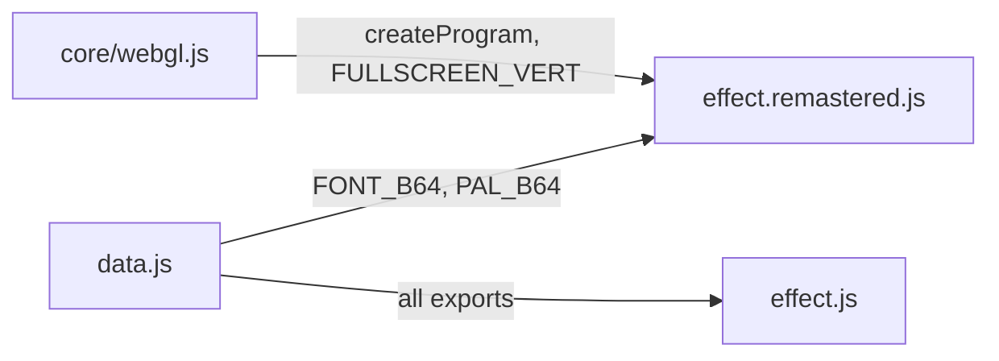
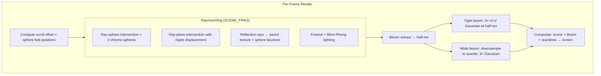
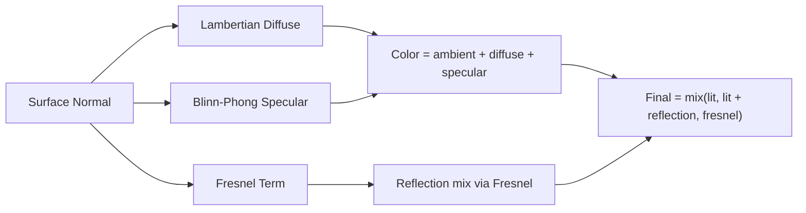

# Part 19 — WATER Remastered: Raymarched Chrome Spheres & Water

**Status:** Complete  
**Source file:** `src/effects/water/effect.remastered.js`  
**Classic doc:** [19-water.md](19-water.md)

---

## Overview

The remastered WATER replaces the classic's static baked background and
pre-computed POS table reflections with a fully GPU-raymarched scene:
procedural chrome spheres bobbing over an animated water surface with
real-time ripples and reflections. The original 400×34 sword texture is
preserved in its lo-fi pixel-art form, reflected on the chrome surfaces
and water via NEAREST-filtered environment mapping.

Key upgrades over classic:

| Classic | Remastered |
|---------|------------|
| Static baked 320×200 background | Procedural raymarched scene at native resolution |
| Pre-computed POS table reflections | Real-time ray-traced reflections (sphere + water) |
| Fixed sphere positions | Animated spheres with sinusoidal bobbing + easing |
| No water animation | Procedural ripples emanating from sphere positions |
| 256-color indexed palette | Full HDR rendering with dual-tier bloom |
| No audio reactivity | Beat-reactive bob, specular, and bloom |
| No parameterization | 18 editor-tunable parameters |

---

## Architecture



No shared `animation.js` is needed. The only shared choreography is the
scroll offset, trivially computed as `min(floor(floor(t * 70) / 3), 390)`.
Sphere bobbing and water animation are remastered-only.

---

## Scene Composition

Sphere positions derived from POS table analysis of the original WAT1/WAT2/WAT3 data:

| Sphere | World Position (base) | Radius | Screen Region (original) |
|--------|----------------------|--------|--------------------------|
| Large (left) | (-1.8, 0.85, -0.5) | 1.3 | Upper-left, partially clipped |
| Small (center) | (0.0, 0.55, 0.8) | 0.45 | Center-top |
| Large (right) | (2.5, 0.7, -0.3) | 1.1 | Lower-right, partially clipped |

The camera is positioned at `(0.3, cameraHeight, -4.5)` looking at the
origin, matching the original's oblique elevated angle.

---

## Rendering Pipeline



### Raymarching details

- **SDF scene**: union of 3 spheres + water plane with ripple displacement
- **Max 80 steps**, max distance 50 units, surface threshold 0.002
- **Object identification**: separate `hitObject()` determines which surface was hit
- **Normals**: central-difference gradient for SDF; analytical gradient for water ripples
- **Reflection depth**: one bounce — sphere reflects sword; water reflects spheres + sword

### Ripple function

Each sphere generates circular ripples on the water surface:

```
ripple(xz) = Σᵢ sin(|xz - sphere_i.xz| × freq - t × speed + phaseᵢ) × amp × proximity / (1 + |xz - sphere_i.xz| × damping)
```

Plus a subtle background wave pattern for ambient water motion. Ripple
amplitude is modulated by sphere proximity to the water surface — spheres
closer to the water create stronger ripples.

---

## Sword Texture Handling

The sword stays lo-fi:

1. `FONT_B64` (400×34 indexed) decoded to RGBA using `PAL_B64` at init time
2. Uploaded with `gl.NEAREST` filtering — preserves chunky pixel blocks on curved surfaces
3. Scroll offset passed as `uScrollOffset` uniform; UV offset computed in shader
4. Reflection mapping: `u = reflDir.x × 0.35 + 0.5 - scrollOffset/400`, `v = reflDir.y × 0.8 + 0.5`
5. Zero/dark pixels treated as transparent environment (no contribution)

---

## Lighting Model



- **Chrome spheres**: high reflectivity, dark blue base `(0.12, 0.14, 0.35)`, strong specular
- **Water**: very dark base `(0.01, 0.02, 0.08)`, Fresnel-dominated (reflective at grazing angles)
- **Light direction**: `(0.4, 0.8, -0.3)` normalized
- **Specular boost on beat**: `specPow + pow(1-beat, 6) × 32`

---

## Beat Reactivity

| Effect | Formula | Visual result |
|--------|---------|---------------|
| Bob pulse | `amplitude × (1 + pow(1-beat, 6) × beatScale)` | Spheres bob more on beat |
| Specular boost | `specPow + pow(1-beat, 6) × 32` | Chrome highlights sharpen |
| Bloom boost | `bloomStr + pow(1-beat, 6) × beatBloom` | Glow intensifies on beat |

---

## Post-Processing

Same dual-tier bloom pipeline as GLENZ_3D remastered:

1. Brightness extraction at half-res with `smoothstep` threshold
2. 3 iterations of separable 9-tap Gaussian at half-res (tight bloom)
3. Downsample to quarter-res, 3 iterations of Gaussian (wide bloom)
4. Composite: scene + tight + wide, beat-reactive intensity, optional scanlines

---

## Fade In/Out

Matches classic timing: linear fade over first 63 frames (~0.9s) and last
63 frames before scroll completion. Implemented via `uFade` uniform that
multiplies the raymarched scene output.

---

## Editor Parameters

| Key | Label | Range | Default | Controls |
|-----|-------|-------|---------|----------|
| `bobAmplitude` | Bob Amplitude | 0–2 | 0.5 | Sphere vertical bob range |
| `bobSpeed` | Bob Speed | 0.1–4 | 0.7 | Sphere bob frequency |
| `rippleFreq` | Ripple Frequency | 1–30 | 8.0 | Spatial frequency of water ripples |
| `rippleSpeed` | Ripple Speed | 0.2–6 | 2.0 | Temporal speed of ripple propagation |
| `rippleAmp` | Ripple Amplitude | 0.001–0.15 | 0.03 | Height of water ripples |
| `waterDarkness` | Water Darkness | 0–1 | 0.5 | Darkens the water base color |
| `specularPower` | Specular Power | 8–512 | 128 | Sharpness of specular highlights |
| `fresnelExp` | Fresnel Exponent | 0.5–10 | 3.5 | Edge-vs-center reflectivity falloff |
| `chromeReflect` | Chrome Reflectivity | 0–3 | 1.5 | Strength of environment reflection |
| `swordBrightness` | Sword Brightness | 0.2–4 | 1.8 | Brightness of reflected sword texture |
| `cameraHeight` | Camera Height | 0.5–5 | 2.2 | Vertical camera position |
| `cameraAngle` | Camera Angle | -30–30 | 5.0 | Camera pitch offset in degrees |
| `beatScale` | Beat Bob Scale | 0–1 | 0.15 | Bob amplitude pulse on beat |
| `bloomThreshold` | Bloom Threshold | 0–1 | 0.25 | Brightness cutoff for bloom |
| `bloomTightStr` | Bloom Tight | 0–3 | 0.6 | Half-res bloom intensity |
| `bloomWideStr` | Bloom Wide | 0–3 | 0.4 | Quarter-res bloom intensity |
| `scanlineStr` | Scanlines | 0–0.5 | 0.03 | CRT scanline overlay |
| `beatBloom` | Beat Bloom | 0–1.5 | 0.35 | Bloom intensity pulse on beat |

---

## Shader Programs

| Program | Vertex | Fragment | Purpose |
|---------|--------|----------|---------|
| `sceneProg` | `FULLSCREEN_VERT` | `SCENE_FRAG` | Raymarched scene with spheres, water, reflections |
| `bloomExtractProg` | `FULLSCREEN_VERT` | `BLOOM_EXTRACT_FRAG` | Bright-pixel extraction |
| `blurProg` | `FULLSCREEN_VERT` | `BLUR_FRAG` | Separable 9-tap Gaussian |
| `compositeProg` | `FULLSCREEN_VERT` | `COMPOSITE_FRAG` | Scene + bloom + scanlines |

All shaders use `FULLSCREEN_VERT` — no custom vertex shader needed since
the entire scene is raymarched in the fragment shader.

---

## GPU Resources

| Resource | Count | Notes |
|----------|-------|-------|
| Shader programs | 4 | Scene, bloom extract, blur, composite |
| Textures | 6 | Sword + scene FBO + 2 tight bloom + 2 wide bloom |
| Framebuffers | 5 | Scene + bloom1 + bloom2 + wide1 + wide2 |

No MSAA needed — raymarching produces analytically smooth edges. All
resources are properly cleaned up in `destroy()`.

---

## FBO Structure

| FBO | Resolution | Purpose |
|-----|-----------|---------|
| sceneFBO | Full | Raymarched scene output |
| bloomFBO1/2 | Half | Tight bloom ping-pong |
| bloomWideFBO1/2 | Quarter | Wide bloom ping-pong |

FBOs are lazily created on first render and recreated when the canvas resizes.

---

## What Changed From Classic

| Aspect | Classic approach | Remastered approach |
|--------|-----------------|---------------------|
| Background | Static 320×200 baked image | Procedural raymarched water surface |
| Spheres | Baked into background image | Procedural SDF spheres with bobbing animation |
| Reflections | Pre-computed POS lookup tables | Real-time ray-traced reflections |
| Water | Static (no animation) | Animated ripples from sphere positions |
| Sword texture | CPU scroll buffer + POS table compositing | GPU UV-offset sampling with NEAREST filter |
| Resolution | 320×200 fixed | Native display resolution |
| Post-processing | None | Dual-tier bloom + CRT scanlines |
| Audio sync | None | Beat-reactive bob, specular, bloom |
| Parameterization | None | 18 tunable params for editor UI |

---

## References

- Classic doc: [19-water.md](19-water.md)
- Remastered rule: `.cursor/rules/remastered-effects.mdc`
- GLENZ_3D remastered (reference pattern): [06-glenz-3d-remastered.md](06-glenz-3d-remastered.md)
