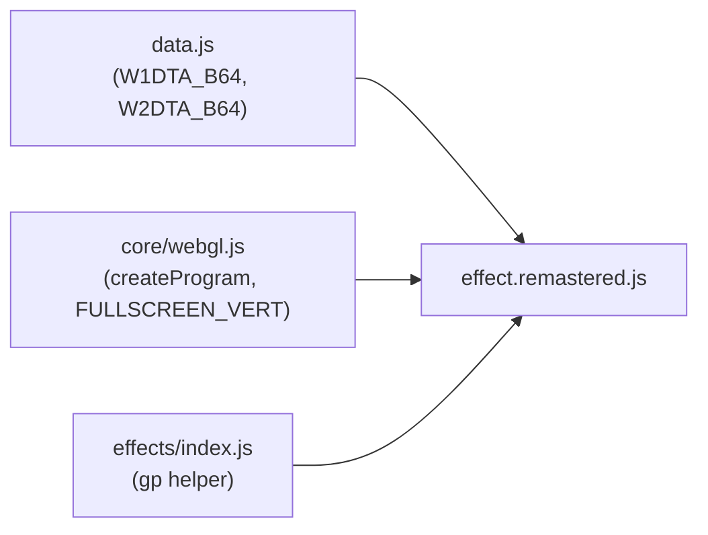
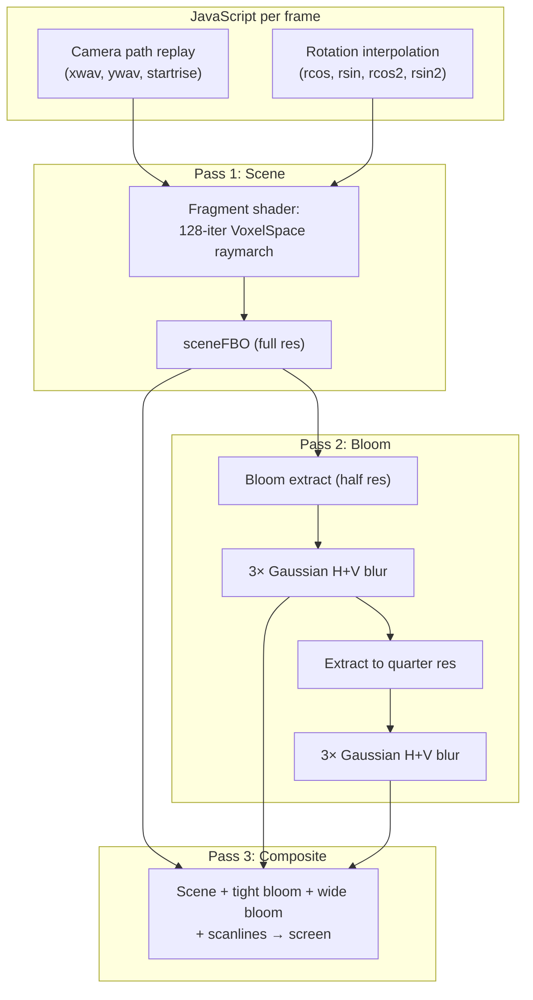

# Part 20 — COMAN Remastered: GPU VoxelSpace Terrain

**Status:** Complete
**Source file:** `src/effects/coman/effect.remastered.js`
**Classic doc:** [20-coman.md](20-coman.md)

## Overview

The remastered COMAN replaces the classic's CPU column-by-column raymarcher with a pure GLSL fragment shader that performs the VoxelSpace terrain march per-pixel at native display resolution. The two 256×128 height maps are uploaded as R32F GPU textures and sampled with manual 1D bilinear interpolation for smooth terrain surfaces. The procedural palette is baked into a 128-entry LUT texture with LINEAR filtering for smooth color gradients.

| Aspect | Classic | Remastered |
|--------|---------|------------|
| Resolution | 160 columns, pixel-doubled to 320×200 | Native display resolution |
| Rendering | CPU software rasterizer → texture upload | GLSL fragment shader per-pixel |
| Height sampling | Integer indexing, nearest-neighbor | Float indexing, bilinear interpolation |
| Palette lookup | Integer index, hard color bands | Float index, LINEAR-filtered smooth gradients |
| Camera rotation | Stepped (quantized to frame/2) | Smoothly interpolated between frames |
| Post-processing | None | Dual-tier bloom, scanlines |
| Color themes | Fixed blue-green palette | 13 palette presets via mat3 color remap |
| Fog | Implicit via distance term in color index | Explicit atmospheric fog with adjustable intensity |

## Architecture



## Rendering Pipeline



| Pass | Program | Target | Resolution |
|------|---------|--------|------------|
| Scene | sceneProg | sceneFBO | Full |
| Bloom extract | bloomExtractProg | bloomFBO1 | Half |
| Blur (tight, 3×) | blurProg | bloomFBO1 ↔ bloomFBO2 | Half |
| Bloom extract (wide) | bloomExtractProg | bloomWideFBO1 | Quarter |
| Blur (wide, 3×) | blurProg | bloomWideFBO1 ↔ bloomWideFBO2 | Quarter |
| Composite | compositeProg | Screen | Full |

## VoxelSpace Raymarching (Shader)

Each fragment determines its column offset (`col = (x/width - 0.5) × 160`) and screen row (in classic 200-row space). A ray is marched forward through the height field for 128 iterations (matching the classic's 64 fine steps + 64 coarse steps):

1. Compute ray direction from camera rotation and column offset
2. At each step, sample both height maps with bilinear interpolation
3. Add z-wave undulation: `amplitude × sin(j × 2π × frequency / 192)`
4. Project terrain height to screen space using the classic perspective formula
5. If the terrain band covers this fragment's row, look up the palette color
6. Apply atmospheric fog based on distance
7. Break on first hit (front-to-back occlusion)

The terrain-band check is analytical (no inner pixel loop), making the shader GPU-friendly:

```
n = (terrainHeight - rayHeight) / (j × PERSP)
bandTop = destRow - n
hit = (pixelRow <= destRow && pixelRow > bandTop)
```

## Height Map Textures

Each height map is a 256×128 R32F texture containing signed 16-bit values converted to float. The shader performs manual 1D bilinear interpolation to correctly handle the row-boundary wrapping that a 2D bilinear filter would break:

```glsl
float sampleWave(sampler2D tex, float pos) {
  float idx = mod(pos * 0.5, 32768.0);
  // ... interpolate between adjacent 1D entries
  // mapped to 2D texture coordinates via (idx & 255, idx >> 8)
}
```

## Palette LUT

The classic procedural palette (blue-green terrain gradient with red highlights) is baked into a 128×1 RGBA8 texture with `gl.LINEAR` filtering. The shader computes a continuous color index from terrain height and distance, producing smooth color transitions instead of the classic's hard bands.

## Beat Reactivity

| Effect | Formula | Parameter |
|--------|---------|-----------|
| Terrain brightness | `color *= 1.0 + pow(1.0 - beat, 4.0) × reactivity` | beatReactivity |
| Tight bloom pulse | `tight × (str + pow(1.0 - beat, 6.0) × beatBloom)` | beatBloom |
| Wide bloom pulse | `wide × (str + pow(1.0 - beat, 6.0) × beatBloom × 0.6)` | beatBloom |

## Editor Parameters

| Key | Label | Type | Range | Default | Description |
|-----|-------|------|-------|---------|-------------|
| palette | Theme | select | 0–12 | 0 (Classic) | Color remap preset |
| terrainScale | Height Scale | float | 0.3–3.0 | 1.0 | Multiplier on combined height map values |
| zwaveAmp | Z-Wave Amplitude | float | 0–48 | 16.0 | Intensity of sine undulation along rays |
| zwaveFreq | Z-Wave Frequency | float | 0.5–10 | 3.0 | Number of sine cycles across ray depth |
| horizonY | Horizon | float | 0.15–0.60 | 0.35 | Horizon position (0 = top, 1 = bottom) |
| fogIntensity | Fog Intensity | float | 0–1 | 0.3 | Atmospheric fog strength at max distance |
| beatReactivity | Beat Reactivity | float | 0–1 | 0.2 | Terrain brightness pulse on beat |
| bloomThreshold | Bloom Threshold | float | 0–1 | 0.35 | Luminance threshold for bloom extraction |
| bloomTightStr | Bloom Tight | float | 0–3 | 0.3 | Half-res bloom intensity |
| bloomWideStr | Bloom Wide | float | 0–3 | 0.2 | Quarter-res bloom intensity |
| beatBloom | Beat Bloom | float | 0–1.5 | 0.3 | Additional bloom on beat |
| scanlineStr | Scanlines | float | 0–0.5 | 0.03 | CRT scanline overlay intensity |

## Shader Programs

| Program | Vertex | Fragment | Purpose |
|---------|--------|----------|---------|
| sceneProg | FULLSCREEN_VERT | SCENE_FRAG | VoxelSpace terrain raymarching |
| bloomExtractProg | FULLSCREEN_VERT | BLOOM_EXTRACT_FRAG | Bright pixel extraction |
| blurProg | FULLSCREEN_VERT | BLUR_FRAG | 9-tap Gaussian blur |
| compositeProg | FULLSCREEN_VERT | COMPOSITE_FRAG | Final scene + bloom + scanlines |

## GPU Resources

| Resource | Type | Size | Purpose |
|----------|------|------|---------|
| wave1Tex | R32F texture | 256×128 | Height map 1 |
| wave2Tex | R32F texture | 256×128 | Height map 2 |
| paletteTex | RGBA8 texture | 128×1 | Palette LUT |
| sceneFBO | RGBA8 FBO | Full res | Scene render target |
| bloomFBO1/2 | RGBA8 FBO | Half res | Tight bloom ping-pong |
| bloomWideFBO1/2 | RGBA8 FBO | Quarter res | Wide bloom ping-pong |
| 4 programs | Program | — | Scene, bloom extract, blur, composite |
| 1 VAO | Fullscreen quad | 4 vertices | Shared across all passes |

## What Changed From Classic

| Aspect | Classic | Remastered |
|--------|---------|------------|
| Height sampling | `wave1[(xw >> 1) & 32767]` integer lookup | Bilinear interpolation between adjacent entries |
| Column count | 160 columns, pixel-doubled | Continuous: one ray per screen pixel column |
| Color index | Integer `((h+140-j/8) & 0xFF) >> 1` | Continuous float with smooth palette LUT |
| Ray direction | Integer truncated, LSB cleared | Floating-point, continuous |
| Camera rotation | Stepped at frame/2 rate | Linearly interpolated per display frame |
| Fog | Implicit: `j/8` darkens color index at distance | Explicit: smoothstep blend to fog color |
| Post-processing | None | Dual-tier bloom with beat reactivity |
| Color variety | Single blue-green palette | 13 themes via mat3 color remapping |

## Remaining Ideas

- **Texture mapping**: Apply procedural textures to the terrain surface
- **Dynamic lighting**: Sun direction with per-fragment normal-based shading
- **Water plane**: Reflective water at low elevations
- **Shadow casting**: Distance-field soft shadows from terrain peaks

## References

- [Classic doc](20-coman.md) — original algorithm details and data format
- [Remastered standards](../../.cursor/rules/remastered-effects.mdc) — resolution independence and parameterization
