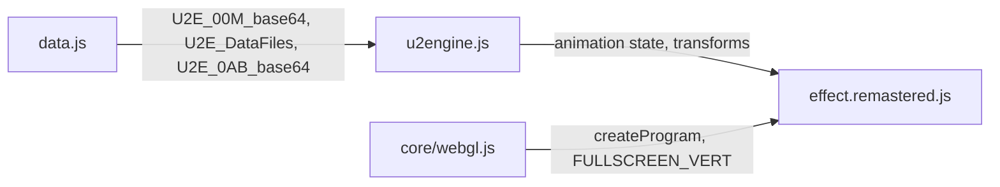
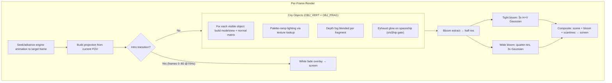
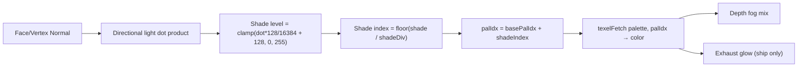

# Part 22 — U2E Remastered: GPU 3D City Flyover

**Status:** Complete  
**Source file:** `src/effects/u2e/effect.remastered.js`  
**Shared engine:** `src/effects/u2e/u2engine.js`  
**Classic doc:** [22-u2e.md](22-u2e.md)

---

## Overview

The remastered U2E replaces the classic's CPU software rasterizer with
native WebGL polygon rendering while reusing the original U2 engine
exclusively for animation playback. All 42 city objects (buildings, trees,
tunnels, roads, spaceship) are extracted into GPU VAOs at init time;
per-frame rendering uses the engine only to advance transforms, visibility,
camera, and FOV. The spaceship uses the same exhaust glow system as the
U2A remastered for visual consistency across the demo.

Key upgrades over classic:

| Classic | Remastered |
|---------|------------|
| CPU software rasterizer (320×200) | Native WebGL vertex pipeline at display resolution |
| Flat/Gouraud shading via palette ramps | GPU-lit polygon shading with palette-ramp texture lookup |
| 256-color indexed framebuffer | Full RGBA rendering |
| No depth buffer (painter's algorithm) | Hardware depth buffer |
| No atmosphere | Depth-based atmospheric fog |
| Spaceship rendered like any object | Exhaust glow with pulse/hue-shift (consistent with U2A) |
| No post-processing | Dual-tier bloom |
| No audio reactivity | Beat-reactive bloom |
| No parameterization | 13 editor-tunable parameters |

---

## Architecture



The shared `u2engine.js` is the single source of truth for choreography —
frame-by-frame animation decoding, object transforms, camera matrices, FOV
changes, and object visibility. The remastered module extends the engine
API with `bakeAnimation()` / `seekFrame()` for efficient editor scrubbing,
plus property getters (`camera`, `fov`, `objectCount`, `getObject()`) for
direct access to object state.

---

## Rendering Pipeline



### Pass breakdown

| Pass | Program | Target | Resolution |
|------|---------|--------|------------|
| Intro transition | `FULLSCREEN_VERT` + `TRANSITION_FRAG` | Default FB | Full |
| 3D city objects | `OBJ_VERT` + `OBJ_FRAG` | Scene FBO (depth) | Full |
| Bloom extract | `FULLSCREEN_VERT` + `BLOOM_EXTRACT_FRAG` | Bloom FBO 1 | Half |
| Tight blur (×3) | `FULLSCREEN_VERT` + `BLUR_FRAG` | Bloom FBO 1↔2 | Half |
| Wide downsample | `FULLSCREEN_VERT` + `BLOOM_EXTRACT_FRAG` | Wide FBO 1 | Quarter |
| Wide blur (×3) | `FULLSCREEN_VERT` + `BLUR_FRAG` | Wide FBO 1↔2 | Quarter |
| Final composite | `FULLSCREEN_VERT` + `COMPOSITE_FRAG` | Default FB | Full |

---

## Lighting/Shading Model

The object fragment shader replicates the original's palette-ramp lighting
using a 256×1 palette texture:



- **Light direction**: `[12118, 10603, 3030] / 16384` — same fixed directional
  light as the original engine
- **Shade divisions**: Per-polygon material flag controls the palette ramp
  width (8, 16, or 32 shades)
- **Gouraud vs flat**: Polygons flagged as Gouraud use per-vertex normals;
  others use the face normal — determined at geometry extraction time

### Exhaust Glow (Spaceship Only)

The spaceship exhaust uses the same color-based detection as U2A:

```
redness = color.r - max(color.g, color.b)
isExhaust = smoothstep(0.15, 0.35, redness) * smoothstep(0.2, 0.4, color.r)
```

Gated by a `uIsShip` uniform (1.0 for objects matching name pattern `*s01*`,
0.0 for all other objects). Parameters and defaults match U2A exactly for
cross-effect consistency.

---

## Atmospheric Fog

Depth-based fog adds depth perception to the city flyover:

```
fogFactor = smoothstep(fogNear, fogFar, viewZ) * fogDensity
color = mix(color, fogColor, fogFactor)
```

Default fog color is a dark blue-violet `(0.02, 0.01, 0.04)` that
naturally fades distant buildings into the dark background.

---

## Post-Processing

Same dual-tier bloom pipeline as other remastered effects:

1. Brightness extraction at half-res with `smoothstep` threshold
2. 3 iterations of separable 9-tap Gaussian at half-res (tight bloom)
3. Downsample to quarter-res, 3 iterations of Gaussian (wide bloom)
4. Composite: scene + tight + wide, beat-reactive intensity, scanlines

---

## Beat Reactivity

| Effect | Formula | Visual result |
|--------|---------|---------------|
| Bloom boost | `tight × (bloomStr + pow(1 - beat, 4) × beatReactivity × 0.15)` | Glow halo flares on beat |
| Wide bloom | `wide × (bloomStr × 0.5 + pow(1 - beat, 4) × beatReactivity × 0.1)` | Broad glow pulses |

---

## Editor Parameters

| Key | Label | Range | Default | Controls |
|-----|-------|-------|---------|----------|
| `fogDensity` | Fog Density | 0–1 | 0.32 | Strength of distance fog |
| `fogNear` | Fog Near | 0–50000 | 3000 | Distance where fog begins |
| `fogFar` | Fog Far | 1000–200000 | 80000 | Distance where fog is fully opaque |
| `fogR` | Fog Red | 0–1 | 0.02 | Red component of fog color |
| `fogG` | Fog Green | 0–1 | 0.01 | Green component of fog color |
| `fogB` | Fog Blue | 0–1 | 0.04 | Blue component of fog color |
| `exhaustGlow` | Glow Intensity | 0–5 | 2.05 | Spaceship exhaust brightness (matches U2A) |
| `exhaustPulse` | Pulse Amount | 0–1 | 0.60 | Exhaust pulse intensity (matches U2A) |
| `exhaustHueShift` | Hue Shift | -0.5–0.5 | 0.29 | Exhaust hue rotation (matches U2A) |
| `bloomThreshold` | Bloom Threshold | 0–1 | 0.25 | Brightness cutoff for bloom extraction |
| `bloomStrength` | Bloom Strength | 0–2 | 0.04 | Intensity of the bloom overlay |
| `beatReactivity` | Beat Reactivity | 0–1 | 0.20 | Strength of beat-driven bloom pulse |
| `scanlineStr` | Scanlines | 0–0.5 | 0.01 | CRT scanline overlay intensity |

---

## Shader Programs

| Program | Vertex | Fragment | Purpose |
|---------|--------|----------|---------|
| `objProg` | `OBJ_VERT` (custom) | `OBJ_FRAG` | 3D city meshes with palette lighting + fog + exhaust |
| `transitionProg` | `FULLSCREEN_VERT` | `TRANSITION_FRAG` | White fade overlay for intro phases |
| `bloomExtractProg` | `FULLSCREEN_VERT` | `BLOOM_EXTRACT_FRAG` | Bright-pixel extraction |
| `blurProg` | `FULLSCREEN_VERT` | `BLUR_FRAG` | Separable 9-tap Gaussian |
| `compositeProg` | `FULLSCREEN_VERT` | `COMPOSITE_FRAG` | Scene + bloom + scanlines composite |

The custom `OBJ_VERT` transforms `aPosition` and `aNormal` through
`uModelView` and `uProjection` matrices, passing the interpolated normal,
base palette index, shade divisor, and view-space Z (for fog) to the
fragment shader.

---

## GPU Resources

| Resource | Count | Notes |
|----------|-------|-------|
| Shader programs | 5 | Object, transition, bloom extract, blur, composite |
| VAOs | 42 | One per city object (buildings, trees, tunnels, roads, spaceship) |
| Textures | 6 | Palette (256×1) + scene FBO + 2 tight bloom + 2 wide bloom |
| Framebuffers | 5 | Scene (with depth) + bloom1 + bloom2 + wide1 + wide2 |
| Renderbuffers | 1 | Depth attachment on scene FBO |

All resources are properly cleaned up in `destroy()`.

---

## What Changed From Classic

| Aspect | Classic approach | Remastered approach |
|--------|-----------------|---------------------|
| Rendering | CPU software rasterizer to 320×200 indexed buffer | GPU vertex pipeline at native resolution |
| Shading | Palette ramp lookup in software scanline filler | Palette texture lookup in fragment shader |
| Depth ordering | Painter's algorithm + special-case ordering | Hardware depth buffer |
| Floor objects | Forced to back by setting dist = 1000000000 | Depth buffer handles naturally |
| Spaceship ordering | Forced last in frames 900–1100 | Depth buffer handles naturally |
| Atmosphere | None | Depth-based fog with tunable color/distance |
| Ship exhaust | Rendered like any polygon | Glow + pulse + hue-shift (consistent with U2A) |
| Post-processing | None | Dual-tier bloom with scanlines |
| Audio sync | None | Beat-reactive bloom intensity |
| Scrubbing | State cached every 100 frames, replay from checkpoint | Full animation bake, instant seekFrame() |
| Parameterization | None | 13 tunable params for editor UI |

---

## Remaining Ideas (Not Yet Implemented)

From the classic doc's "Remastered Ideas" section:

- **Real-time shadow mapping**: Buildings casting shadows from directional light
- **Normal-mapped surfaces**: Add surface detail to flat building faces
- **Volumetric fog**: Raymarched fog volumes instead of per-fragment distance fog
- **Reflective windows**: Emissive/specular highlights on glass-like surfaces
- **Smooth camera interpolation**: Hermite/Catmull-Rom interpolation between animation frames

---

## References

- Classic doc: [22-u2e.md](22-u2e.md)
- U2A remastered doc: [02-u2a-remastered.md](02-u2a-remastered.md)
- Remastered rule: `.cursor/rules/remastered-effects.mdc`
- Shared engine: `src/effects/u2e/u2engine.js`
